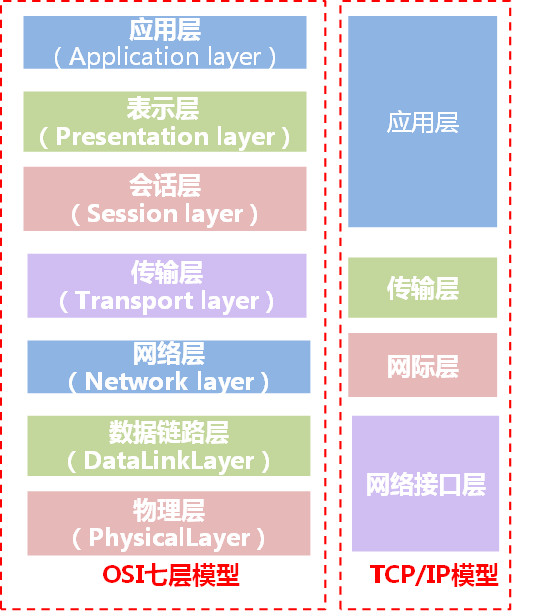
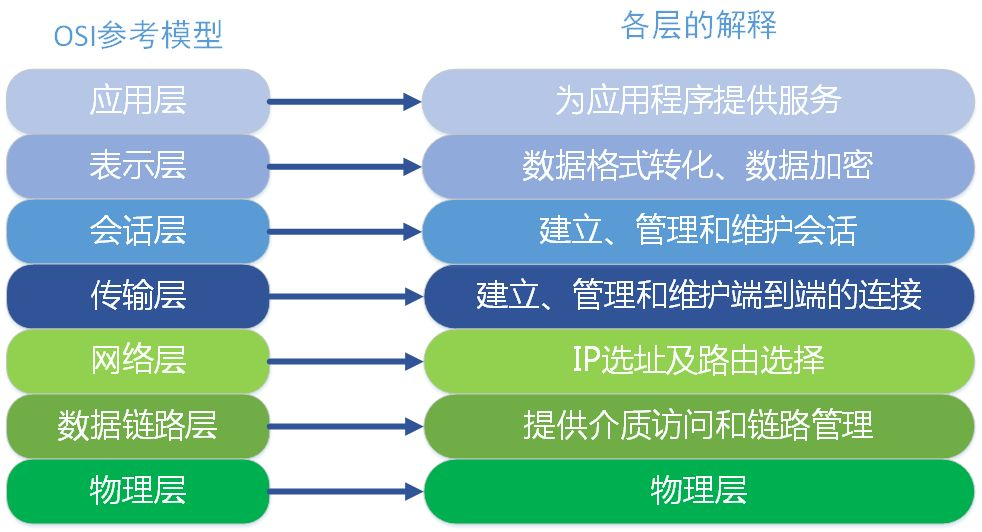

## OSI七层模型

### 应用层

应用软件使用的协议，主要是规定应用软件如何进行通信

* 邮箱使用的POP3、SMTP
  
* 远程登录使用的Telnet

* 获取IP地址的DHCP

* 域名解析的DNS

* 网页浏览的http协议

### 表示层

决定数据的展现(编码)形式，如电影可以采样、量化、编码为RMVB、AVI，
一张图片能够是JPEG、BMP、PNG等

### 会话层

为两端通信实体建立连接(会话)，中间有认证鉴权以及检查点记录(供会话意外中断的时候可以继续，类似断点续传)

三次握手四次挥手在这个过程中完成

### 传输层

TCP、UDP

### 网络层

路由选择，选择本次通信使用的写(http、ftp等)，指定路由策略及访问控制策略

IP

### 数据链路层
### 物理层
