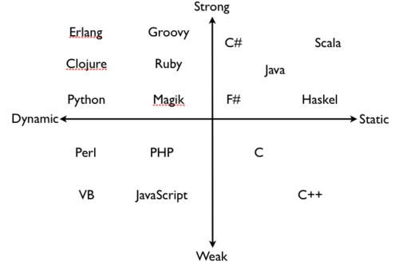

### 弱类型、强类型、动态类型、静态类型语言的区别是什么？

***1. 基础概念***

**Program Errors**

* trapped errors：导致程序终止执行。如除0，Java中数组越界。
* untrapped errors：出错后继续执行，但可能出现意外行为。如C里的缓冲区溢出，Jump到错误地址。

**Forbidden Behaviors**

语言设计时，可以定义一组forbidden behaviors。它必须包括所有的untrapped errors，但可能包括trapped errors。

**Well behaved、ill behaved**

* well behaved：如果程序执行不可能出现forbidden behaviors，则为well behaved。
* ill behaved：否则为ill behaved。

***2. 强、弱类型，静态、动态类型***

**强、弱类型**

* 强类型(strongly typed)：如果一种语言的所有程序都是well behaved-即不可能出现forbidden behaviors，则改语言为strongly typed
* 弱类型(weakly typed)：否则为weakly typed。比如C语言的缓冲区溢出，属于untrapped errors，即属于forbidden behaviors，故C是弱类型。

弱类型语言，类型检查更不严格，如偏向于容忍隐式类型转换。譬如C语言的int可以变成double。这样的结果是：容易产生forbidden behaviors，所以是弱类型的。

**动态、静态类型**

* 静态类型statically：如果在编译时拒绝ill behaved程序，则是statically typed。
* 动态类型dynamically：如果在运行时拒绝ill behaved程序，则是dynamically typed。

***3. 误区***

大家觉得C语言要写int a, int b之类的，Python不用写(可以直接写a, b)，所以C是静态，Python是动态。这么理解是不够准确的。譬如Ocaml是静态类型的，但是也可以不用明确地写出来。。 Ocaml是静态隐式类型

*静态类型可以分为两种*

* 如果类型是语言语法的一部分，在是explicitly typed显式类型；
* 如果类型通过编译时推导，是implicitly typed隐式类型, 比如ML和Haskell

***4.下面是些例子无类型***

* 汇编弱类型、静态类型 ： C/C++
* 弱类型、动态类型检查： Perl/PHP
* 强类型、静态类型检查 ：Java/C#
* 强类型、动态类型检查 ：Python, Scheme
* 静态显式类型 ：Java/C
* 静态隐式类型 ：Ocaml, Haskell

