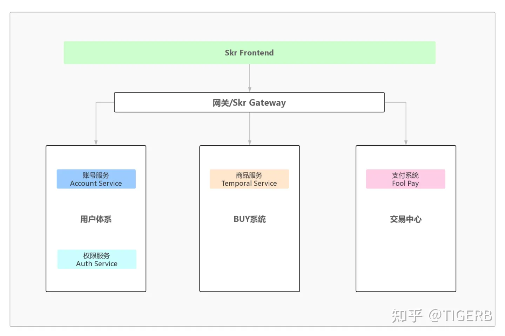
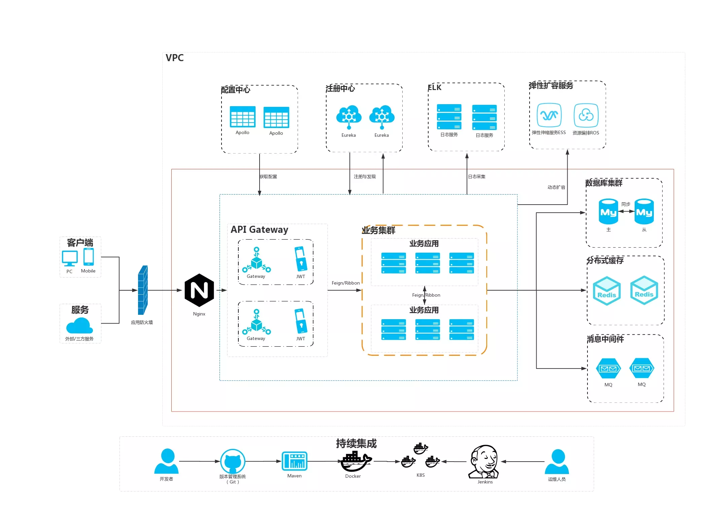

## 商品系统设计

1. 需求分析
2. 架构设计
3. Spu和Sku设计
4. 数据模型设计
5. 接口设计

电商平台B2C构建自己的基础商品信息步骤

1. 商家摆放商品到货架

2. 客户从货架挑选商品

3. 客户把挑选好的商品放入购物车

4. 客户去收银台结账

### 需求分析

对上述业务抽象出如下功能

1. 商家是谁：电商平台
2. 摆放意思：上架
3. 摆放位置(货架)：前台系统(web/app...)
4. 挑选商品：浏览前台系统
5. 放入购物车：点击前台系统(加入购物车) -> 订单系统
6. 收银结账：结算系统/支付系统/交易中心

需求点|功能点|项目命名|技术栈
---|---|---|---
商品后台系统|1.创建商品；2.发布商品到前台系统|Temporal Backend|Java/PHP
前台系统|1.商品列表；2.商品详情|Skr Frontend|Vue
接口网关|企业总线|Skr Gateway|kong
商品服务|1.创建商品接口；2.商品状态变更接口；3.商品列表接口；4. 商品详情接口|Temporal Service|Golang/Java

* 接口网关

    对外统一提供服务能力，企业总线

### 架构设计

通过需求分析并进行技术选型，总结出架构设计

### 数据模型设计

从数据库设计层面描述商品功能

1. 创建商品功能：商品表goods_id，如商品存在父子关系，parent_id
2. 商品列表接口：商品表分页查询商品
3. 商品详情接口：goods_id索引查询商品信息

goods_id进行细分:颜色和大小为销售属性

名称|概念|解释
---|---|---
Spu|standard product unit标准产品单位|goods_id剥离销售属性的部分，例如：小米8。商品列表我们展示Spu列表。
Sku|stock keeping unit库存量单位|就是你想买的那个商品真正的编号，这个编号对应的库存就是你想买的那个商品的库存量。一个Spu对应多个Sku，一或多个销售属性对应一个Sku，例如：小米8黑128G，其中黑和128G就是销售属性，小米8就是一个Spu。

数据库模型

表名称|表名
---|---
品牌表|product_brands
类别表|product_category
spu表|product_spu
sku表|product_sku
销售属性表|product_attr
销售属性值|product_attr_value
sku库存表|product_sku_stock
关系冗余表|product_spu_sku_attr_map

关系冗余表功能：
* spu下 有哪些sku
* spu下 有那些销售属性
* spu下 每个销售属性对应的销售属性值(一对多)
* spu下 每个销售属性值对应的sku(一对多)

### 接口设计

主要功能：列表和详情

采用动静分离，库存的动态数据单独提供接口；其他列表和详情数据完全静态化，把流量打到CDN去

1. spu详情 GET {version}/product/spu/{spu_id}
2. 获取spu下所有skus库存 GET {version}/stock/spu/{spu_id}
3. sku详情 GET {version}/product/sku/{sku_id}
4. spu列表 GET {version}/product/spu/list