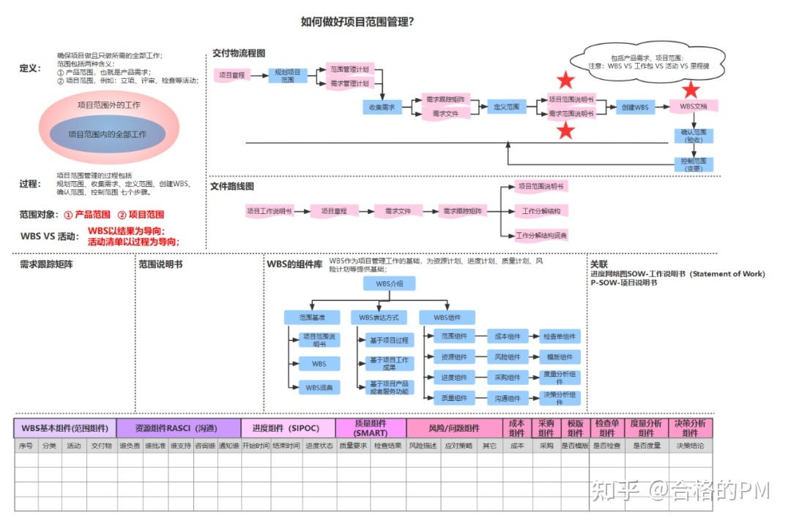
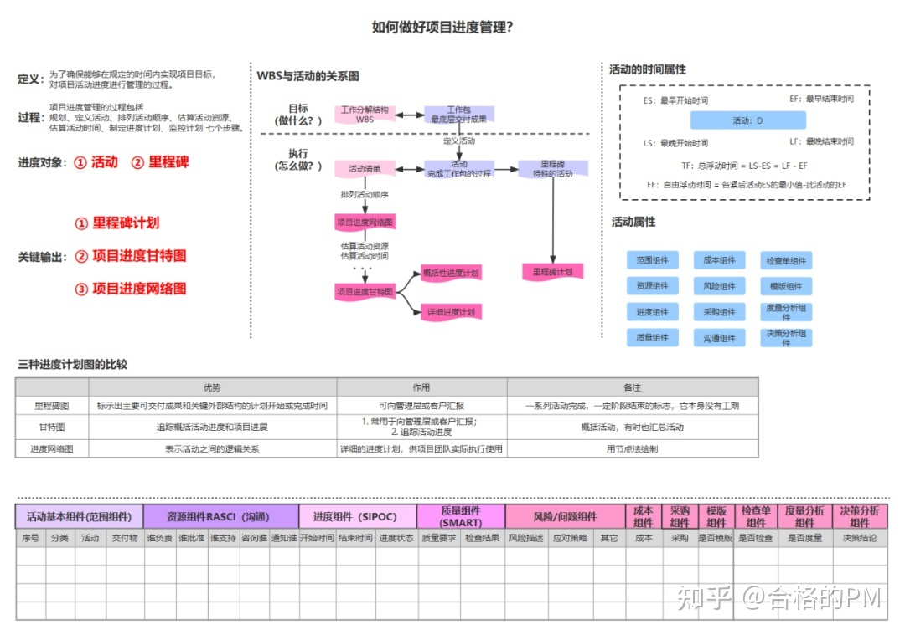
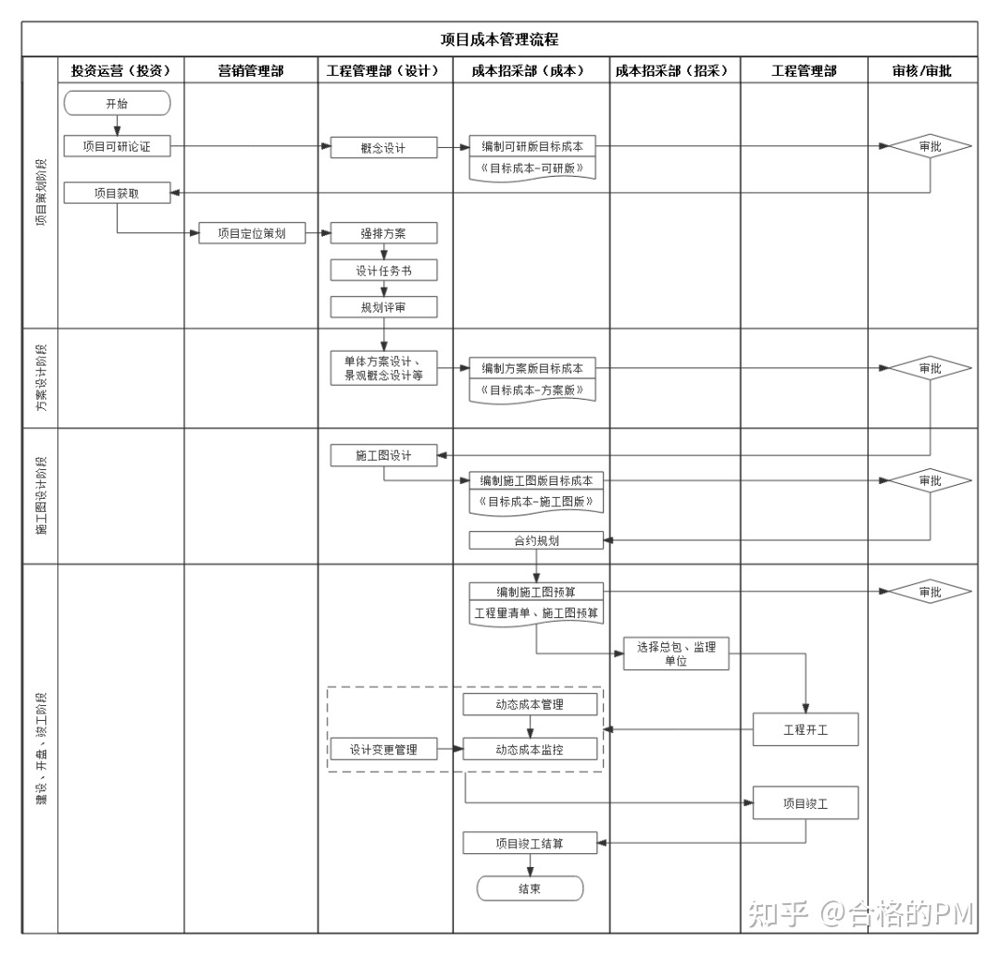
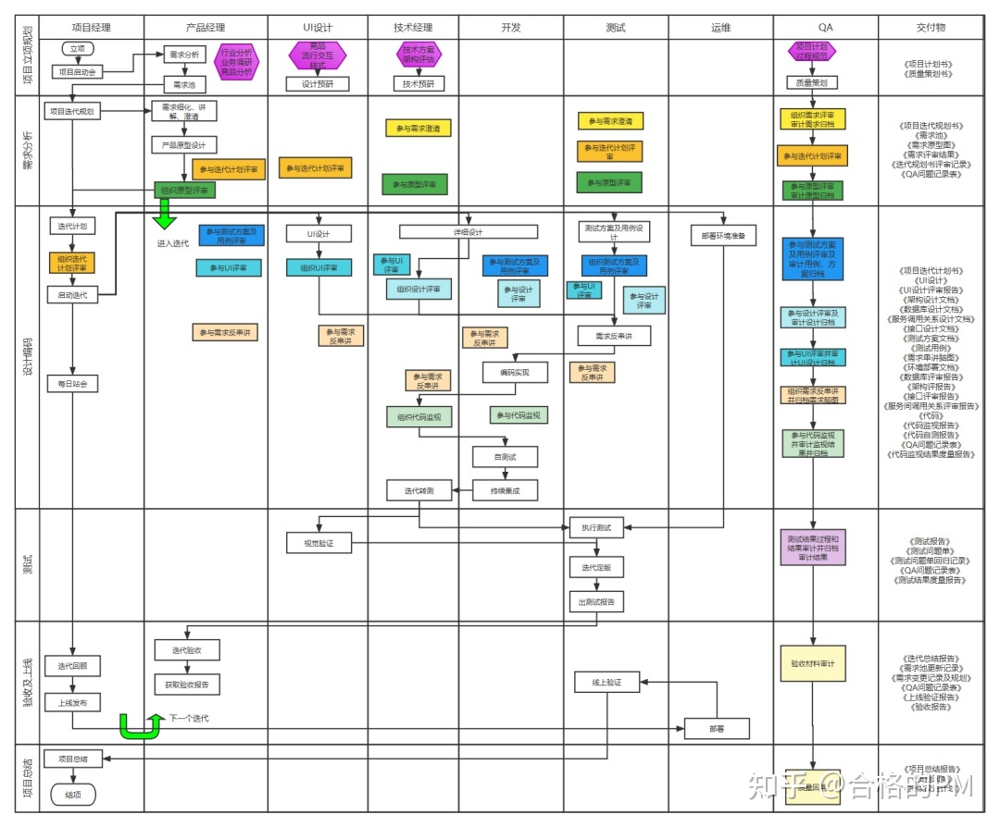
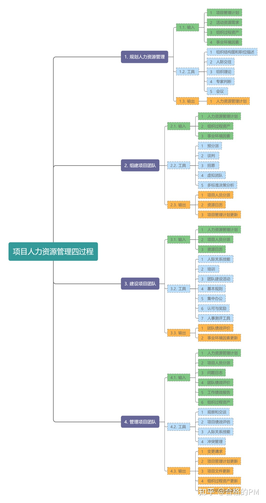
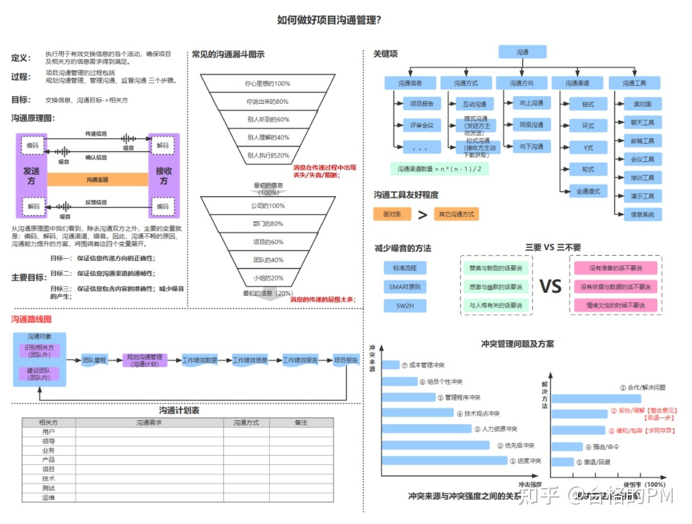
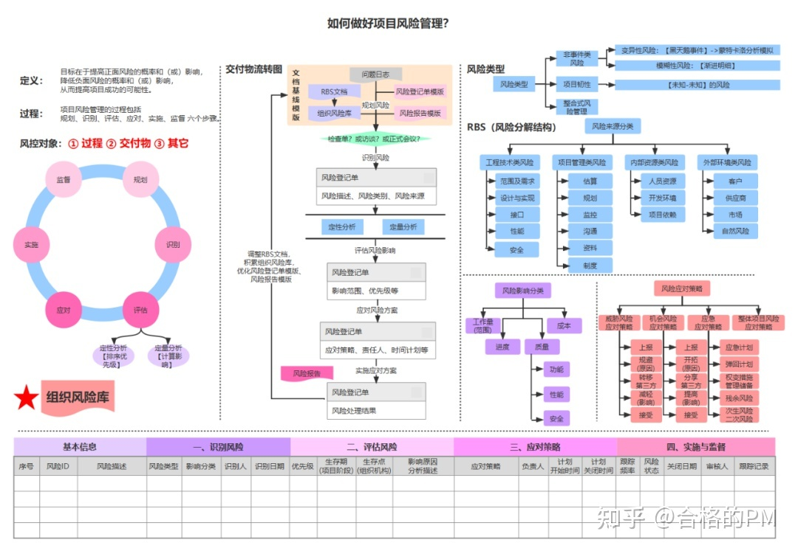

## 项目管理

### 软件

* Redmine

    * 多项目和子项目支持
    
### 项目范围管理

只做该做的事，不做不该做的事

WBS:Work BreakDown Structure工作分解结构

### 项目进度管理

* 主要工作

    1. 定义项目范围，注重工作分解
    
    2. 对项目工作进行优先排序
    
    3. 项目供其估算
    
    4. 制定项目进度表
    
    5. 进行进度控制
    
    6. 工具使用

* 输出

    * 里程碑计划milestone
    
    * 甘特图
    
    * 进度网络图

### 项目成本管理

成本管理是指尽量让项目实际进行中的成本控制在预算范围之内，确保在预算之内完成项目，分为以下：

* 规划成本管理
  
* 估算成本
  
* 制定预算
  
* 控制成本

### 项目质量管理

主要包含以下

* 规划质量管理

* 管理质量

* 控制质量

### 项目人力管理

主要包含以下

* 制定人力资源计划

* 组件项目团队

* 建设项目团队

* 管理项目团队

### 项目沟通管理

### 项目风险管理

