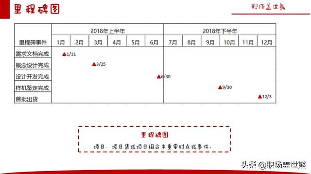
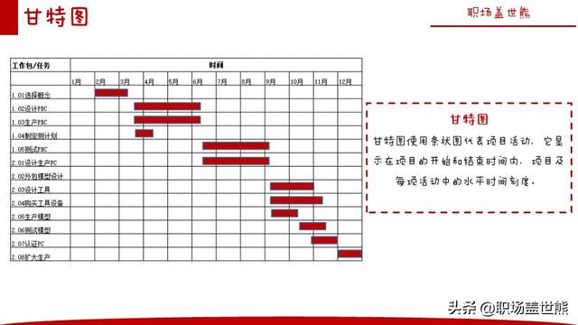
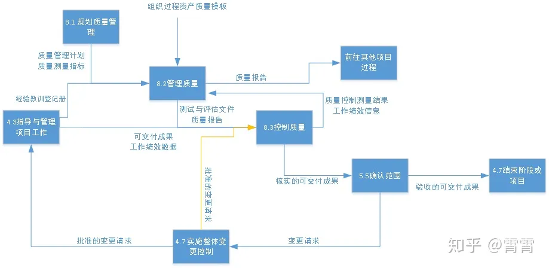
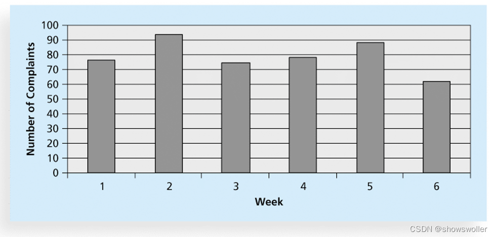
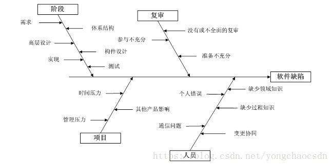

## 项目管理

### 项目管理软件

* Jira
* Redmine
* MSP：MicrosoftProject
* Excel

### 项目管理常见问题、难点 、痛点

1. 需求变更解决方案

    * 项目延期
    * 下一版本
    * 高优先级变更进行优先处理

2. 技术难点

    * 通常都能解决
    * 必须上线？下一版本实施？
    * 一定的替代方案：成员控制/工数增加

3. 工作量评估失误

    考虑到理想时长和实际时长。如外部工作插入，人员变动

4. 划水问题/项目延迟/代码质量

   1. 质量不过关或延期交付人员：行政方式+质量考核+技术手段(工作内容变更：编写测试代码、自动化脚本)

   2. 解决方案：
      
      1. 投入更多人
         
      2. 更多工数(加班等)
      
      3. 组内成员任务变更(工作效率更高的人去做)
   
      4. 改进方法和工具，提高工作效率
   
         1. 开发阶段调整微服务心跳检测时间等
   
      5. 缩小项目范围或降低活动质量要求(不推荐)

5. 处理现场/线上问题

   * 做计划时不能太理想化，要留有余地，安排一定的时间规划

6. 项目粒度太小问题

   * 晨会：昨天进度情况，今天进度安排，开发过程中的难点

   * 周会：一周的进展情况，向上汇报

7. 开发风险

    * 分版本发布
    
    * 根据优先级安排工作
    
    * 变更影响降到最低(优先主要业务功能)
    
    * 其他组的资源共享
    
    * 晨会及时跟进

### 项目管理难点

1. 人：干系人

   客户：

2. 事：项目规划，起点错后面错

   * 困难
   
      1. 寻求直属领导帮忙协调，协同其他部门做方案设计，梳理关键需求
   
      2. 执行实施：任务拆分->里程碑->项目详细进程图
   
      3. 复盘：哪部分可以优化

1. 进度控制

   * 制定可行的开发计划
   
   * 考虑开发外意外或难点(留有余量)

   * 早晚进度
   
   * 提前解决不确定困难
   
### 如何带领好团队/团队管理

受项目类型、管理者特点、公司组织架构等因素影响，每个项目都有其特点和流程，结合我之前的项目经验来说下项目团队管理的流程，团队管理或者说项目管理大致上分为项目启动、规划、执行、监控、收尾等过程
1. 项目启动：PM独自或者带领TL进行相关调研
   1. 主要内容
      1. 明确项目需求(客户沟通需求，项目所需资源等)
      2. 确定项目目标
      3. 描述基本的项目范围
      4. 定义项目相关方/客户的期望值(明确可量化、具体化的关键过程指标,如缺陷率、画面响应时间等)
      5. 选择基本的项目组成员(项目经理、开发组长、团队成员)
      5. 确定要交付的文档
2. 项目计划：制定项目管理计划
   1. 主要内容
      1. 任务分解
      2. 任务工期的估算
      3. 时间进度安排
      4. 风险与沟通计划
         1. 完成目标的方法指导，通过流程图、相关技术调研并进行文档化。节省沟通的时间消耗，避免语言表达的要点遗漏
         2. 成员划水、风险逃避等问题
      5. 项目整体计划
   2. 实现方式
      1. 通常通过milestone/里程碑、甘特图等文档与客户进行沟通
         1. 里程碑：标出主要可交付的成果物和关键外部结构的计划开始或完成时间
            
            1. 需求文档、概念文档、设计开发完成、测试完成、部署完成等
         2. 甘特图：追踪概述活动进度和项目进展
            
            1. 需求设计、详细设计(接口、数据库等)、开发、测试、部署等
      2. 项目进度网络图：确定成员职责、范围，可用于监控项目进度
         1. 每个模块有明确责任人，出问题负责人相应承担责任(加班解决等)，做得好有相应奖励。利益上
   3. 常见问题
      1. 工作任务分解不充分
      2. 风险意识不强
      3. 没有沟通计划：计划通常由个人指定，项目组应该达成共识。避免团队成员水平的差异导致项目进度的延迟
3. 项目实施：指导和管理项目的执行活动
   1. 通过沟通、会议等指导和管理项目的执行活动，如项目讨论会、(成员)进度汇报(早会、周会)等
   2. 会议
      1. 会前
         1. 明确开会目标，预期获得效果
         2. 是否可以取消
         3. 会议时间、参会人数、会议室等
      2. 会中
         1. 会议目的、议题议程
         2. 每个成员都有发言机会
         3. 会议口头总结
      3. 会后
         1. 会议记录给每位参与者
         2. 会议必须产生明确的决定(不明确应及时调研解决)
         3. 决定必须立即付诸行动
4. 项目监控
   1. 识别计划的偏离
      1. 计划实行的理想时长和实际时长，通常由外部工作插入、成员水平、人员变动等因素导致
   2. 评估客户的项目变更需求
   3. 必要时调整项目活动/资源水平并进行记录
   4. 监控项目进度，把握项目实施进程
      1. 涉及到项目延迟、项目质量等问题，参见项目管理问题4
5. 收尾：评估与验收
   1. 交付文档整理(部署文档等)
6. 题外话，项目管理主要在于人和事，对于团队成员而言
   1. 自我价值感：成员在工作中有收获，积极性高
   2. 成员归属感，调动团队成员热情，感情上形成团队精神

### 项目质量控制

简单说使开发出的软件满足客户的需求的过程

主要包含这么几个点

1. 制定质量管理计划：确定项目质量标准以及如何满足这些标准
   1. 明确项目质量标准
      1. 功能性：所有功能可以正常使用
      2. 系统输出
      3. 性能要求、可靠性要求、可维护性要求等
      4. 缺陷密度千分之5等
   2. 明确质量管人员和相关参与者职责
      1. 需求分析：PM/TL
         1. 成果物：项目计划书、质量策划书、项目迭代计划书、QA问题记录等
         2. 内容：需求细化、讲解、澄清，参与需求评审、迭代计划的评审
      2. 设计编码：UI、开发、测试
         1. 成果物：
            1. UI设计文档、架构设计文档、数据库设计文档、服务调用关系文档、接口文档
            2. 测试用例等
   3. 技术评审计划
   4. 软件测试计划
   5. 缺陷跟踪工具
   3. 可以应用的工具和技术
      1. Redmine的bug跟踪管理
   3. 需要哪种类型的测试环境
   4. 团队何时、如何衡量质量
      1. 缺陷率
   5. 有哪些需要检查和测试的
   6. 如何验证可交付成果
2. 评审
   1. 技术评审
      1. 需求和设计文档、代码、测试计划、用户手册等
         1. 程序是否符合规范
         2. 程序结构是否合理
         3. 算法和程序逻辑是否正确
         4. 程序性能等
3. 测试
   1. 测试用例、脚本、数据等
4. 软件改进过程
   1. 软件开发过程中的偏差和不足进行不断优化的过程
5. 缺陷跟踪
2. 执行质量管理：定期评估项目整体绩效，以确保项目符合相关质量标准
   1. 把质量政策应用于项目，将质量管理计划转化为可执行的质量活动的过程
   2. 质量审计：对特定质量活动进行结构化审计，可帮助取得的经验教训，以改进目前或未来的项目实施情况
3. 执行质量控制：监控项目结果，以确保项目符合相关质量标准
   1. 确保项目输出完整、正确，并满足客户期望。关注工作成果与质量要求的比较，确保结果可以接受
   2. 可通过相关工具和技术来展开
   
4. 相关工具
   1. 直方图：变量分布的条形图
      1. 条形图：表示问题或情况的属性
      2. 高度：频率
      
   2. 流程图
      1. 流程逻辑和流程的图形显示，帮助分析问题发生的方式以及如何改进流程
   3. 鱼骨图/因果图：缺陷原因分析工具
      
5. 质量成本
   1. 预防成本：防止将缺陷引入软件而进行的预防工作所消耗的成本
   2. 评估成本：检查软件是否包含缺陷的工作所消耗的成本
   3. 失效成本：修复缺陷工作所消耗的成本
6. 软件质量常用度量
   1. 初期故障率：软件交付后单位时间内故障数，100小时故障数为单位
   2. 平均失效时间：软件失效前正常工作时间
   3. 平均修复时间：软件失效后，使其恢复正常工作所需时间
   4. 缺陷密度：单位数量的代码的缺陷数量
   
### 工作中怎么评价工作的指标

我觉得可以这几个方面入手
1. 工作态度(工作任务的参与程度：积极主动、被动的参与到这个项目中)
2. 工作能力的评估(可以考察执行力、工作效率/成效、表达能力、发现问题/解决问题的能力)
3. 团队协作意识：比如说团队成员水平可能参差不齐(每个成员都有自己的亮点或者说相对擅长的方向)、高能力团队成员应该在力所能及的范围内适当对能力相对较低的团队成员提供决绝问题的思路指导
4. 把握成员的亮点和不足
   1. 每个成员都有亮点，以日常观察来评价，鼓励为主
   2. 指出具体事件中做的不足需要改善的地方
   
### 项目加班看法

赶项目、冲进度或者临时任务调整的时候，加班肯定在所难免。以前项目比较忙的时候，连续几个月每月200+h的工时，还算比较能适应高强度工作。按照以前的经验来看，我会优先选择提高工作效率(工具的使用、任务的合理安排、环境搭建SpringCloud服务心跳时间设置)，这样既能保证项目进度，也能让自己或者团队成员维持一个比较好的精神状态
1. 前期充分的需求调研 -> 避免后期设计和开发阶段造成的返工
2. 制定合理的工作计划 -> 避免工作评估过于乐观
3. 制定合理项目的优先级
4. 客户充分的沟通 -> 需求模糊的地方明确化、清晰化
5. 团队成员的合理利用 -> 明确团队成员的职责、范围、交互
   
### 新公司适应时间

3-4周，1周熟悉组织架构和团队成员，2周熟悉业务，3-4周跟踪实践

### 领导不重视汇报的风险问题

自己先做到极致，再继续保持和领导沟通
   
