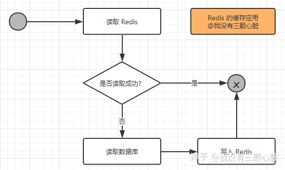
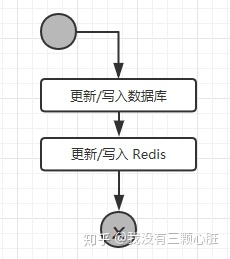
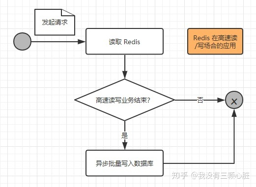
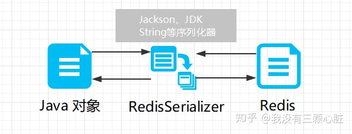

## Redis

Redis是一个开源的高性能键值对(key-value)的内存数据库，可用作数据库、缓存、消息中间件等，
是一种NoSQL(not only sql，泛指非关系型数据库)的数据库
特点：
   1. 性能优秀、读写速度快
   2. 单进程单线程，线程安全，采用IO多路复用机制
      
      IO多路复用：单进程或单线程同时监视多个文件描述符是否可以执行IO操作的能力
      
   3. 丰富数据类型，支持String、散列hash、列表list、集合set、有序集合sorted set等
   4. 支持数据持久化：将内存数据保存在磁盘，重启时加载
   5. 主从复制、高可用
   6. 可用作分布式锁
   7. 可作为消息中间件，支持发布订阅 
   8. 不支持事务回滚：discard放弃事务执行，把暂存命令队列清空，起不到回滚效果
        

### 适用场景

* 业务数据常用，且命中率高
* 读操作多：写操作多则没有必要使用缓存(写操作通常需要多个Redis操作)
* 业务数据相对较小：如存储文件很大则没有必要使用缓存
* 高速读写：需要高速读写的场合使用它进行快速读写

### Redis读写

#### Redis读逻辑



1. 第一次读取Redis失败(此时内存没有数据)，从数据库读取数据并写入Redis
2. 第二次直接从Redis读取数据

#### Redis写逻辑



更新或写入操作需要多个Redis操作，即如果业务数据写次数远大于读次数则没有必要使用Redis

#### 高速读写请求操作


1. Redis读写：请求到达服务器，只是将业务数据在Redis进行读写
2. 持久化：请求操作完Redis读写后，判断高速读写业务是否结束(通常在秒杀商品为0/红包金额为0时成立)
    * 业务结束：Redis缓存数据以批量形式一次性写入数据库
    * 业务未结束：不操作数据库

#### 对象转换

普通连接无法将对象直接存入Redis，替代方案：

1. 将对象序列化(继承Serializable接口)
2. 序列化对象存入Redis缓存
3. 取出时，通过转换器将序列化之后对象反序列化回对象



#### Redis为何这么快

    内存是其他硬件(如本地磁盘)和CPU沟通的桥梁，即如果内存容量和性能存在瓶颈，CPU再快也是枉然
    Redis基于内存操作，CPU不是瓶颈，Redis瓶颈可能是内存大小和网络带宽。
    既然单线程可以实现且CPU不是瓶颈，顺理成章使用单线程(多线程上下文切换等耗费资源)

    1. Redis基于内存操作，非常迅速。
       数据存储在内存中，类似HashMap，查找和操作的时间复杂度是O(1)
    2. 数据结构简单，对数据操作也简单
    3. 单线程，避免上下文切换和竞争条件，不用考虑加锁/释放锁，没有死锁
    4. 采用多路复用IO模型，非阻塞IO

#### Redis和Memcached区别

1. 存储方式
   
   Redis：部分数据存储在磁盘上，保证数据持久性
   
   Memcached：数据存放在内存，断电丢失，数据不能超过内存大小
2. 数据类型
   
   Redis：多种数据类型
   
   Memcache：只支持简单key-value

3. 底层模型不同

   Redis：redis直接自己构建了VM机制，因为一般的系统调用系统函数的话，会浪费一定的时间去移动和请求。

   Memcached：它们之间底层实现方式以及与客户端之间通信的应用协议不一样。

4. value大小

   Redis：最大1GB

   Memcache：最大1MB

#### Redis持久化机制

Redis会周期性将更新的数据写入磁盘或者把修改操作写入记录文件

##### 持久化策略、实现数据不丢失

Redis实现了数据持久化机制，会把数据存储到磁盘，在Redis重启后能够从磁盘恢复原有数据

* RDB快照(默认策略)

  快照形式是直接把内存中的数据保存到一个dump的文件中，定时保存，保存策略。

* AOF(Append Only File)

  把所有的对Redis的服务器进行修改的命令都存到一个文件里，命令的集合。

  当Redis重启的时候，它会优先使用AOF文件来还原数据集，因为AOF文件保存的数据集通常比RDB文件所保存的数据集更完整。

* 混合模式

    继承了RDB和AOF的优点

### Redis常用场景

1. 实现下拉框，搜索自动补全和热门搜索排序

    1. 搜索自动补全

        1. 使用zset(sorted set)：带权重的set，按照权重进行排序
        
            1. zadd:添加
        
                1. zadd 表名 权重score member
        
                2. zadd sorted_set 1 kaven 2 java 3 docker 4 redis 5 k8s
    
            2. zrank:查询某一成员位置
        
                1. zrange sorted_set 0 100
                   
                2. zrange sorted_set 0 -1 withscores // 查询所有
        
            3. zrange：查询范围内成员
               
                1. zrange sorted_set 0 100
    
                2. zrange sorted_set 0 -1 // 查询所有
                   
                2. zrange sorted_set 0 -1 withscores // 查询所有并带权重(升序)
               
        2. zrank定位元素位置，zrange获取范围元素，返回自动补全结果 

   2. 热搜排序
    
        1. 设置成员权重增量值：可根据用户点击次数增加

            ```redis
            zincrby hotTable 1 AA
            zincrby hotTable 1 BB
            zincrby hotTable 1 AA
            zrevrange hotTable 0 -1 withscores
            ```    

        2. 设置过期时间
           
        3. 通过索引区间获取带权重的成员(降序)
    
    3. redis请求数据，没有缓存数据则从普通数据库查询，并将查询结果更新到redis缓存
    
2. 秒杀系统

    1. 提前预热数据放入Redis
    
    2. 商品列表放入Redis list
    
    3. 商品的详情放入Redis hash保存，设置过期时间
    
    4. 商品库存数据Redis zsort保存
    
    5. 用户地址信息Redis set保存
    
    6. 订单产生扣库存通过Redis制造分布式锁，库存同步扣除
    
    7. 订单产生后发货的数据，产生Redis list，通过消息队列处理或者MQ处理
    
    8. 秒杀结束后，把Redis数据和数据库进行同步