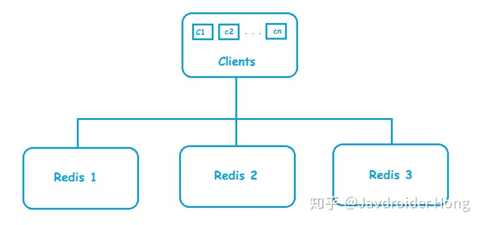
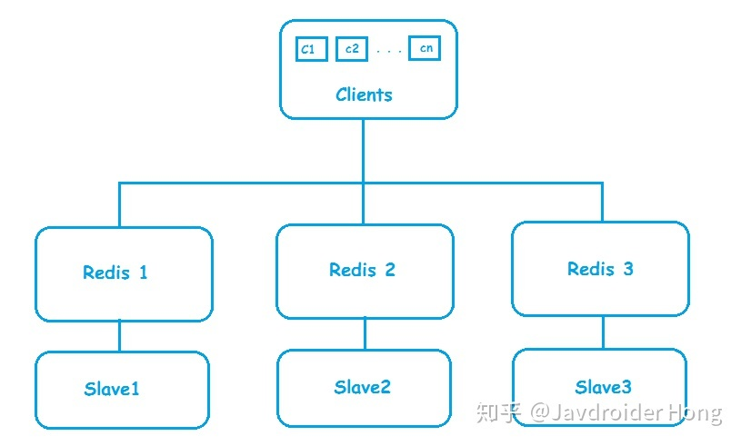
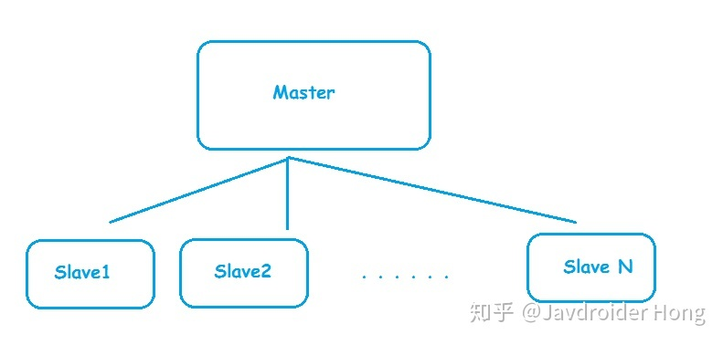
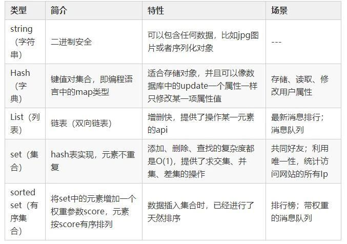

## Redis

Redis是一个开源的高性能键值对(key-value)的内存数据库，可用作数据库、缓存、消息中间件等，
是一种NoSQL(not only sql，泛指非关系型数据库)的数据库
特点：
   1. 性能优秀、读写速度快
   2. 单进程单线程，线程安全，采用IO多路复用机制
      
      IO多路复用：单进程或单线程同时监视多个文件描述符是否可以执行IO操作的能力
      
   3. 丰富数据类型，支持String、散列hash、列表list、集合set、有序集合sorted set等
   4. 支持数据持久化：将内存数据保存在磁盘，重启时加载
   5. 主从复制、高可用
   6. 可用作分布式锁
   7. 可作为消息中间件，支持发布订阅

### 适用场景

* 业务数据常用，且命中率高
* 读操作多：写操作多则没有必要使用缓存(写操作通常需要多个Redis操作)
* 业务数据相对较小：如存储文件很大则没有必要使用缓存
* 高速读写：需要高速读写的场合使用它进行快速读写

### Redis读写

#### Redis读逻辑


1. 第一次读取Redis失败(此时内存没有数据)，从数据库读取数据并写入Redis
2. 第二次直接从Redis读取数据

#### Redis写逻辑


更新或写入操作需要多个Redis操作，即如果业务数据写次数远大于读次数则没有必要使用Redis

#### 高速读写请求操作


1. Redis读写：请求到达服务器，只是将业务数据在Redis进行读写
2. 持久化：请求操作完Redis读写后，判断高速读写业务是否结束(通常在秒杀商品为0/红包金额为0时成立)
    * 业务结束：Redis缓存数据以批量形式一次性写入数据库
    * 业务未结束：不操作数据库

#### 对象转换

普通连接无法将对象直接存入Redis，替代方案：

1. 将对象序列化(继承Serializable接口)
2. 序列化对象存入Redis缓存
3. 取出时，通过转换器将序列化之后对象反序列化回对象


### Redis构建

#### 集群



* 扩大缓存容量
* 提升吞吐量 

#### 主从复制

##### 一主一从



* 数据高可用
  
   Master负责接收客户写请求，并同步到Slave实现数据备份；当Master挂了提升Slave为Master
  
* 提高查询效率
  
   忙碌时可将部分查询转发给Slave，即Master负责读写或者只负责写，Slave负责读

##### 一主多从



* Master进行数据备份工作量变大

##### Master/slave chains架构


### Redis数据类型


* String

   String类型是Redis的基本类型，是二进制安全的
  
   即String类型可包含任何数据，如数字、jpg图片、序列化的对象，String类型最大存储512M

* Hash

   String的key和value映射表，适合存储对象

    hash对象保存的键和值字符串长度都小于64字节
 
   常用命令：hget、hset、hgetall

* list

   list列表是简单的字符串列表，按照插入顺序排序，可从左或从右添加
  
   常用命令：lpush、rpush、lpop、rpop、lrange(获取列表片段)
  
   应用场景：关注列表、粉丝列表、消息队列
  
   redis list实现为双向链表，支持反向查询和遍历，带来额外开销

* set

   String类型的无序(自动去重)集合，集合通过hashTable实现。
  
   常用命令：sdd、spop、smembers(判断成员是否在set集合中)、sunion等
  
   应用场景：同list，但set无序且自动去重

* zset 
   
   String类型的有序没有重复的集合

   有序集合保存元素数量默认小于128个，所有元素长度默认小于64字节
  
   常用命令：zadd、zrange、zrem、zcard等
  
   sorted set可通过用户提供一个优先级(score)的参数来为成员排序，并且时插入有序的即自动排序。
  
   内部实现：内部使用HashMap和跳跃表skipList保证数据的存储和有序

   

##### Hash/String

* String

    * 每次需要访问大量的字段
    
    * 存储的结构具有多层嵌套的时候
    
* Hash
  
    * 大多数情况中只需要访问少量的字段
    
    * 自己始终知道哪些字段可用，防止mget时获取不到想要的数据

#### Redis缓存

创建方式

* RedisTemplate

* SpringCache继承redis，即注解方式

### Redis常见问题

#### 缓存和数据库一致性问题

    分布式环境下非常容易出现缓存和数据库间数据一致性问题。
    如果对缓存要求强一致性，那么就不要使用缓存。
    只能采取合适的策略来降低缓存和数据库间数据不一致的概率，而无法保证两者强一致性。
    合适的缓存更新策略，更新数据库后及时更新缓存、缓存失败时增加重试机制。

#### Redis雪崩

定义：缓存服务器重启或者key某一时间段大面积失效，所有请求落在后端系统如DB，导致数据库宕机的现象

    电商首页及热点数据都会去做缓存。 缓存更新时机：
    1. 定时任务刷新
    2. 查不到数据去更新
    定时刷新问题：假如首页所有Key失效时间是12小时，中午12点已经刷新过一次，0点所有Key失效；
    如果有活动导致大量用户(6000qps)涌入，缓存5000qps(query per second)，此时key失效，
    6000请求全部落在数据库上，导致数据库宕机，重启再次宕机，称雪崩现象
         (setRedis(key, value, time+Math.random()*10000);) 

解决方案：

1. 每个key的失效时间加个时间戳，可保证数据不会同一时间大面积失效

    ```java
    // 随机值伪代码
    public object GetProductListNew() {
        int cacheTime = 30;
        String cacheKey = "product_list";
        // 缓存标记
        String cacheSign = cacheKey + "_sign";
        
        String sign = CacheHelper.Get(cacheSign);
        // 获取缓存值
        String cacheValue = CacheHelper.Get(cacheKey);
        if (sign != null) {
            // 未过期，直接返回
            return cacheValue;
        } else {
            CacheHelper.Add(cacheSign, "1", cacheTime);
            ThreadPool.QueueUserWorkItem(() ->
                // DB查询
                cacheValue = GetProductListFromDB();
                // 失效时间设为缓存时间的2倍，用于脏读
                CacheHelper.Add(cacheKey, cacheValue, cacheTime * 2);
            );
            return cacheValue;
        }
    }
    ```
   * 缓存标记：记录缓存数据是否过期，过期则触发通知另外的线程在后台去更新时机key的缓存
    
2. 加锁或队列方式保证不会有大量线程对数据库一次性进行读写，减轻数据库压力

    1. 这种方式并未提高系统吞吐量，大量用户请求被阻塞，用户体验不好
    
        ```java
        public object GetProductListNew() {
            int cacheTime = 30;
            String cacheKey = "produce_list";
            String lockKey = cacheKey;
            
            String cacheValue = CacheHelper.Get(cacheKey);
            if (cacheValue == null) {
                return cacheValue;
            } else {
                synchonized(lockKey) {
                    if (cacheValue != null) {
                        return cacheValue;     
                    } else {
                        // sql查询数据
                        cacheValue = GetProductListFromDB();
                        CacheHelper.Add(cacheKey, cacheValue);
                    }   
                }
            }
            return cacheValue;
        }
        ```
       
3. 集群部署Redis：将热点数据分布在不同Redis库
   
4. 热点数据设置永不过期，有更新操作就更新缓存

#### 缓存穿透

定义：key对应的数据在数据源不存在，每次请求都会先从缓存获取，获取不到则继续从数据源DB获取，高并发请求下数据源压力大，从而导致压垮数据源的一种现象

解决方案：

1. 布隆过滤器：常用

    将所有可能存在的数据哈希到一个足够大的bitmap中，一个一定不存在的数据会被bitmap拦截掉，避免了对底层存储系统的压力。可快速判断key是否存在于DB

2. 接口校验

    1. 用户鉴权
    
    2. 参数校验
    
    3. id做基础校验：负数直接拦截
    
3. 简单粗暴方式：空结果缓存并设置较短过期时间，一般不超过5分钟：简单常用

    ```java
    public object getProductListNew() {
        // 当key不存在时，缓存key并设置key过期时间
        int cacheTime = 30;
        String cacheKey = "product_list";
        
        // 缓存存在
        String cacheValue = CacheHelper.Get(cacheKey);
        if (cacheValue != null) {
            return cacheValue;    
        }
    
        // 二次查询，避免其他地方更新缓存
        cacheValue = CacheHelper.Get(cacheKey);
        if (cacheValue != null) {
            return cacheValue;
        // 缓存不存在
        } else {
            // 数据库获取
            cacheValue = GetProductListFromDB();
            if (cacheValue == null) {
                // 数据库也不存在，设置空值
                cacheValue = string.Empty;
            }
            // 更新缓存值并设置过期时间：缓存值可能为DB获取，也可能为上面设置的空值
            CacheHelper.Add(cacheKey, cacheValue, cacheTime);
            return cacheValue;
        }
    }
    ```

#### 缓存击穿

定义：热点Key接收大量请求，大并发集中对这一个点进行访问，当Key失效瞬间持续大并发数据落在数据库上，就在这个Key的点上击穿了缓存

对策：

1. 设置热点数据永不过期
   
2. 使用互斥锁

    1. mutex key
       
        Redis分布式锁的setnx：set if not exists可以实现锁的效果
    
        ```java
        public String get(key) {
            String value = redis.get(key);
            // 缓存过期
            if (value == null) {
                // 设置3min的超时，防止del操作失败的时候，下次缓存过期一致不能load db
                if (redis.setnx(key_mutex, 1, 3 * 60) == 1) {
                    // 互斥锁设置成功
                    value = db.get(key);
                    redis.set(key, value, expire_secs);
                    // 删除互斥锁
                    redis.del(key_mutex);
                } else {
                    // 同一时间点其他线程已经load db并回设到缓存
                    get(key);
                }
            } else {
                return value;
            }
        }
        ```
    
    2. ReentryLock

        ```java
        // 缓存穿透、击穿对策
        public static String getData(String key) throws InterruptedException {
                //从Redis查询数据
                String result = getDataByKV(key);
                //参数校验
                if (StringUtils.isBlank(result)) {
                    try {
                        //获得锁
                        if (reenLock.tryLock()) {
                            //去数据库查询
                            result = getDataFromDB(key);
                            //校验
                            if (StringUtils.isNotBlank(result)) {
                                //插进缓存
                                setDataToKV(key, result);
                            }
                        } else {
                            //睡一会再拿
                            Thread.sleep(100L);
                            result = getData(key);
                        }
                    } finally {
                        //释放锁
                        reenLock.unlock();
                    }
                }
                return result;
            }
        ```

#### Redis为何这么快

    内存是其他硬件(如本地磁盘)和CPU沟通的桥梁，即如果内存容量和性能存在瓶颈，CPU再快也是枉然
    Redis基于内存操作，CPU不是瓶颈，Redis瓶颈可能是内存大小和网络带宽。
    既然单线程可以实现且CPU不是瓶颈，顺理成章使用单线程(多线程上下文切换等耗费资源)

    1. Redis基于内存操作，非常迅速。
       数据存储在内存中，类似HashMap，查找和操作的时间复杂度是O(1)
    2. 数据结构简单，对数据操作也简单
    3. 单线程，避免上下文切换和竞争条件，不用考虑加锁/释放锁，没有死锁
    4. 采用多路复用IO模型，非阻塞IO

#### Redis和Memcached区别

1. 存储方式
   
   Redis：部分数据存储在磁盘上，保证数据持久性
   
   Memcached：数据存放在内存，断电丢失，数据不能超过内存大小
2. 数据类型
   
   Redis：多种数据类型
   
   Memcache：只支持简单key-value

3. 底层模型不同

   Redis：redis直接自己构建了VM机制，因为一般的系统调用系统函数的话，会浪费一定的时间去移动和请求。

   Memcached：它们之间底层实现方式以及与客户端之间通信的应用协议不一样。

4. value大小

   Redis：最大1GB

   Memcache：最大1MB

#### Redis淘汰策略

客户端发起需要更多内存的申请时，Redis检查内存使用情况，当实际使用内存超出maxmemory时，Redis会根据用户配置的淘汰策略选出无用的key,
最后确认选中的数据没有问题则成功执行淘汰任务


Redis4.0加入了LFU(least frequency use)淘汰策略，包括volatile-lfu和allKeys-lfu，通过统计访问频率，将访问频率最少，即最不经常使用的KV淘汰

1. 如何选用合适的淘汰策略

    * 无法预测数据的使用频率或者一部分数据访问频率高，一部分访问频率低：allKeys-lru
    
    * 所有数据访问频率大致相等：allKeys-random
      
    * 设置不同ttl来判断数据过期的先后顺序：volatile-ttl
      
    * 希望一些数据被长期保存，一些数据可以被淘汰：volatile-lru或volatile-random
      
    * 设置过期时间expire会消耗额外内存，避免内存损耗：allKeys-lru
    
2. 淘汰策略底层原理

    1. LRU淘汰
    
        1. 根据历史的访问记录进行数据淘汰，核心思想：如果数据近期被访问过，那么将来被访问的几率也更高
    
        2. 服务器保存lru计数器(server.lrulock)定时更新(redis定时程序serverCorn())，根据server.unixtime进行排序，选择最近使用时间最久的数据删除
    
        3. 每个对象都会设置相应的lru，每次访问数据都会更新redisObject.lru
    
        4. 近似算法，随机挑选5个键，从中选择一个最久未使用的key淘汰
    
    2. ttl淘汰
    
        1. Redis数据结构保存键值对过期时间表redisDb.expires
    
        2. 先随机挑选几个，从中选择最小的键值淘汰(ttl值越小越先被淘汰)
    
            1. 并不是面向所有过期时间表中最快过期的键值对，而是随机挑选
    
    3. 随机淘汰
    
        1. 随机找hash桶，再次hash指定位置的dictEntry即可

#### Redis持久化机制

Redis会周期性将更新的数据写入磁盘或者把修改操作写入记录文件

##### 持久化策略

* RDB快照(默认策略)

  快照形式是直接把内存中的数据保存到一个dump的文件中，定时保存，保存策略。

* AOF(Append Only File)

  把所有的对Redis的服务器进行修改的命令都存到一个文件里，命令的集合。

  当Redis重启的时候，它会优先使用AOF文件来还原数据集，因为AOF文件保存的数据集通常比RDB文件所保存的数据集更完整。

### Redis常用场景

1. 实现下拉框，搜索自动补全和热门搜索排序

    1. 搜索自动补全

        1. 使用zset(sorted set)：带权重的set，按照权重进行排序
        
            1. zadd:添加
        
                1. zadd 表名 权重score member
        
                2. zadd sorted_set 1 kaven 2 java 3 docker 4 redis 5 k8s
    
            2. zrank:查询某一成员位置
        
                1. zrange sorted_set 0 100
                   
                2. zrange sorted_set 0 -1 withscores // 查询所有
        
            3. zrange：查询范围内成员
               
                1. zrange sorted_set 0 100
    
                2. zrange sorted_set 0 -1 // 查询所有
                   
                2. zrange sorted_set 0 -1 withscores // 查询所有并带权重(升序)
               
        2. zrank定位元素位置，zrange获取范围元素，返回自动补全结果 

   2. 热搜排序
    
        1. 设置成员权重增量值：可根据用户点击次数增加

            ```redis
            zincrby hotTable 1 AA
            zincrby hotTable 1 BB
            zincrby hotTable 1 AA
            zrevrange hotTable 0 -1 withscores
            ```    

        2. 设置过期时间
           
        3. 通过索引区间获取带权重的成员(降序)
    
    3. redis请求数据，没有缓存数据则从普通数据库查询，并将查询结果更新到redis缓存