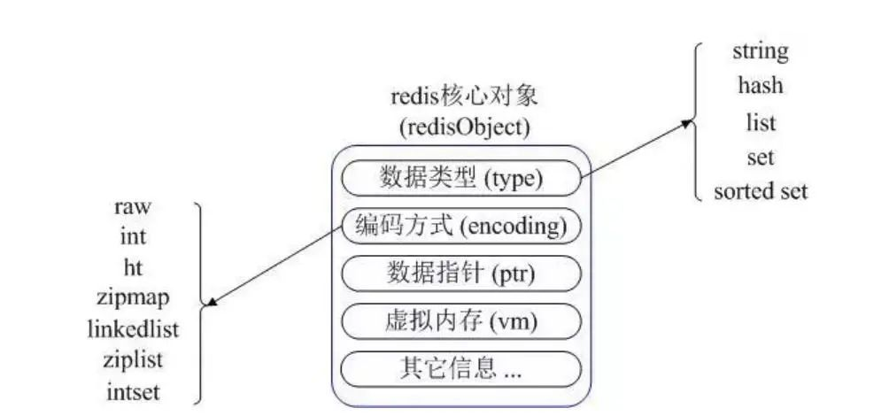

## Redis

Redis是一个开源的高性能键值对(key-value)的内存数据库，可用作数据库、缓存、消息中间件等，
是一种NoSQL(not only sql，泛指非关系型数据库)的数据库
特点：
   1. 性能优秀、读写速度快
   2. 单进程单线程，线程安全，采用IO多路复用机制
      
      IO多路复用：单进程或单线程同时监视多个文件描述符是否可以执行IO操作的能力
      
   3. 丰富数据类型，支持String、散列hash、列表list、集合set、有序集合sorted set等
   4. 支持数据持久化：将内存数据保存在磁盘，重启时加载
   5. 主从复制、高可用
   6. 可用作分布式锁
   7. 可作为消息中间件，支持发布订阅

### 适用场景

* 业务数据常用，且命中率高
* 读操作多：写操作多则没有必要使用缓存(写操作通常需要多个Redis操作)
* 业务数据相对较小：如存储文件很大则没有必要使用缓存
* 高速读写：需要高速读写的场合使用它进行快速读写

### Redis读写

#### Redis读逻辑


1. 第一次读取Redis失败(此时内存没有数据)，从数据库读取数据并写入Redis
2. 第二次直接从Redis读取数据

#### Redis写逻辑


更新或写入操作需要多个Redis操作，即如果业务数据写次数远大于读次数则没有必要使用Redis

#### 高速读写请求操作


1. Redis读写：请求到达服务器，只是将业务数据在Redis进行读写
2. 持久化：请求操作完Redis读写后，判断高速读写业务是否结束(通常在秒杀商品为0/红包金额为0时成立)
    * 业务结束：Redis缓存数据以批量形式一次性写入数据库
    * 业务未结束：不操作数据库

#### 对象转换

普通连接无法将对象直接存入Redis，替代方案：

1. 将对象序列化(继承Serializable接口)
2. 序列化对象存入Redis缓存
3. 取出时，通过转换器将序列化之后对象反序列化回对象


### Redis构建

#### 集群


* 扩大缓存容量
* 提升吞吐量 

#### 主从复制

##### 一主一从


* 数据高可用
  
   Master负责接收客户写请求，并同步到Slave实现数据备份；当Master挂了提升Slave为Master
  
* 提高查询效率
  
   忙碌时可将部分查询转发给Slave，即Master负责读写或者只负责写，Slave负责读

##### 一主多从


* Master进行数据备份工作量变大

##### Master/slave chains架构


### Redis数据类型



* String

   String类型是Redis的基本类型，是二进制安全的
  
   即String类型可包含任何数据，如数字、jpg图片、序列化的对象，String类型最大存储512M

* Hash

   String的key和value映射表，适合存储对象
 
   常用命令：hget、hset、hgetall

* list

   list列表是简单的字符串列表，按照插入顺序排序，可从左或从右添加
  
   常用命令：lpush、rpush、lpop、rpop、lrange(获取列表片段)
  
   应用场景：关注列表、粉丝列表、消息队列
  
   redis list实现为双向链表，支持反向查询和遍历，带来额外开销

* set

   String类型的无序(且没有重复)集合，集合通过hashTable实现。
  
   常用命令：sdd、spop、smembers(判断成员是否在set集合中)、sunion等
  
   应用场景：同list，但set无序且自动去重

* zset 
   
   String类型的没有重复的集合
  
   常用命令：zadd、zrange、zrem、zcard等
  
   sorted set可通过用户提供一个优先级(score)的参数来为成员排序，并且时插入有序的即自动排序。
  
   内部实现：内部使用HashMap和跳跃表skipList保证数据的存储和有序

   

#### Redis缓存

创建方式

* RedisTemplate

* SpringCache继承redis，即注解方式

### Redis常见问题

#### 缓存和数据库一致性问题

    分布式环境下非常容易出现缓存和数据库间数据一致性问题。
    如果对缓存要求强一致性，那么就不要使用缓存。
    只能采取合适的策略来降低缓存和数据库间数据不一致的概率，而无法保证两者强一致性。
    合适的缓存更新策略，更新数据库后及时更新缓存、缓存失败时增加重试机制。

#### Redis雪崩

    电商首页及热点数据都会去做缓存。
    缓存更新时机：
      1. 定时任务刷新
      2. 查不到数据去更新
    定时刷新问题：假如首页所有Key失效时间是12小时，中午12点已经刷新过一次，0点所有Key失效；
    如果有活动导致大量用户(6000qps)涌入，缓存5000qps(query per second)，此时key失效，
    6000请求全部落在数据库上，导致数据库宕机，重启再次宕机，称雪崩现象
    解决方案：
      1. 每个key的失效时间加个时间戳，可保证数据不会同一时间大面积失效
         (setRedis(key, value, time+Math.random()*10000);) 
      2. 集群部署Redis：将热点数据分布在不同Redis库
      3. 热点数据设置永不过期，有更新操作就更新缓存

#### 缓存穿透

    缓存穿透指缓存和数据库都没有的数据，而用户对此数据不断发出请求，
    导致数据库压力大，甚至击穿数据库
    对策：接口处增加校验，比如用户鉴权、参数做校验、id做基础校验(负数直接拦截)等
         布隆过滤器：利用高效的结构和算法快速判断Key是否存在于DB，
           不存在，return
           存在，刷新缓存KV在return

#### 缓存击穿

    类似雪崩(大面积缓存失效，打崩DB)。
    热点Key接收大量请求，大并发集中对这一个点进行访问，当Key失效瞬间持续大并发数据
    落在数据库上，就在这个Key的点上击穿了缓存
    对策：设置热点数据永不过期、加上互斥锁

```java
// 缓存穿透、击穿对策
public static String getData(String key) throws InterruptedException {
        //从Redis查询数据
        String result = getDataByKV(key);
        //参数校验
        if (StringUtils.isBlank(result)) {
            try {
                //获得锁
                if (reenLock.tryLock()) {
                    //去数据库查询
                    result = getDataByDB(key);
                    //校验
                    if (StringUtils.isNotBlank(result)) {
                        //插进缓存
                        setDataToKV(key, result);
                    }
                } else {
                    //睡一会再拿
                    Thread.sleep(100L);
                    result = getData(key);
                }
            } finally {
                //释放锁
                reenLock.unlock();
            }
        }
        return result;
    }
```

#### Redis为何这么快

    内存是其他硬件(如本地磁盘)和CPU沟通的桥梁，即如果内存容量和性能存在瓶颈，CPU再快也是枉然
    Redis基于内存操作，CPU不是瓶颈，Redis瓶颈可能是内存大小和网络带宽。
    既然单线程可以实现且CPU不是瓶颈，顺理成章使用单线程(多线程上下文切换等耗费资源)

    1. Redis基于内存操作，非常迅速。
       数据存储在内存中，类似HashMap，查找和操作的时间复杂度是O(1)
    2. 数据结构简单，对数据操作也简单
    3. 单线程，避免上下文切换和竞争条件，不用考虑加锁/释放锁，没有死锁
    4. 采用多路复用IO模型，非阻塞IO

#### Redis和Memcached区别

1. 存储方式
   
   Redis：部分数据存储在磁盘上，保证数据持久性
   
   Memcached：数据存放在内存，断电丢失，数据不能超过内存大小
2. 数据类型
   
   Redis：多种数据类型
   
   Memcache：只支持简单key-value

3. 底层模型不同

   Redis：redis直接自己构建了VM机制，因为一般的系统调用系统函数的话，会浪费一定的时间去移动和请求。

   Memcached：它们之间底层实现方式以及与客户端之间通信的应用协议不一样。

4. value大小

   Redis：最大1GB

   Memcache：最大1MB

#### Redis淘汰策略


Redis4.0加入了LFU(least frequency use)淘汰策略，包括volatile-lfu和allkeys-lfu，通过统计访问频率，将访问频率最少，即最不经常使用的KV淘汰

#### Redis持久化机制

Redis会周期性将更新的数据写入磁盘或者把修改操作写入记录文件

##### 持久化策略

* RDB快照(默认策略)

  快照形式是直接把内存中的数据保存到一个dump的文件中，定时保存，保存策略。

* AOF(Append Only File)

  把所有的对Redis的服务器进行修改的命令都存到一个文件里，命令的集合。

  当Redis重启的时候，它会优先使用AOF文件来还原数据集，因为AOF文件保存的数据集通常比RDB文件所保存的数据集更完整。
