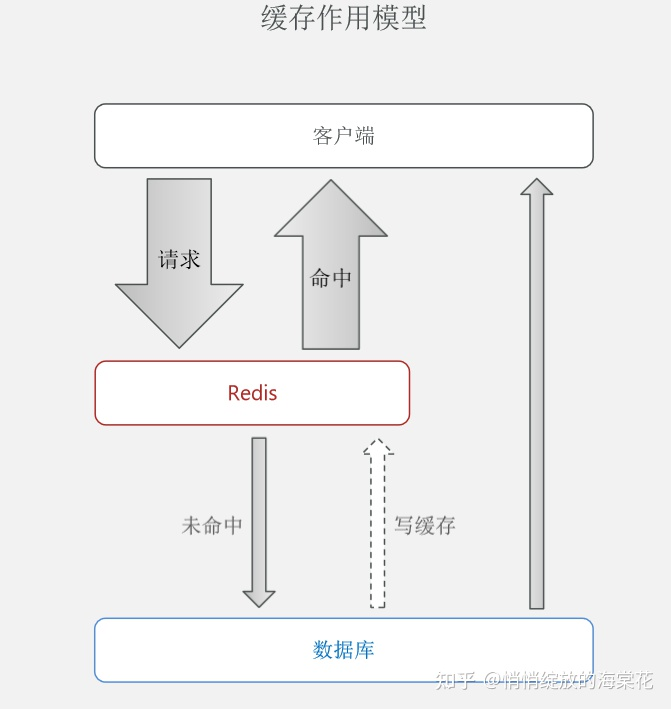
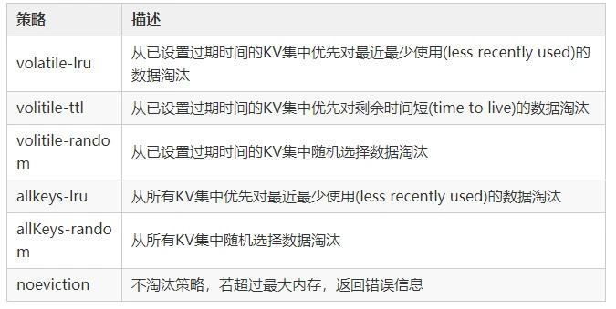
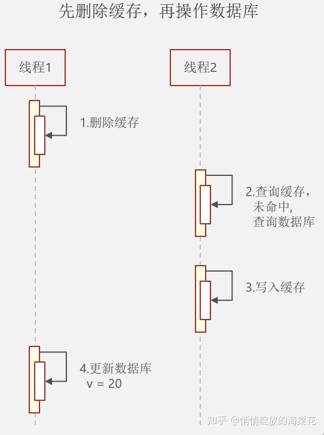
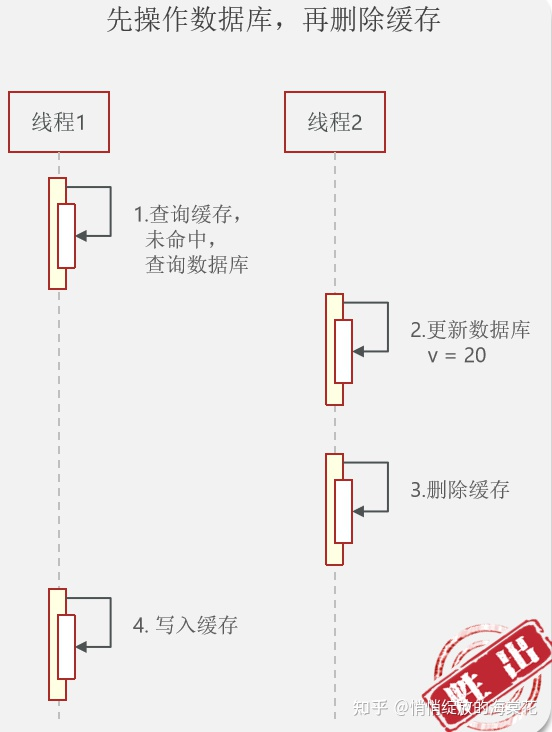

## Redis缓存

Redis缓存模型


### Redis缓存更新策略

1. 内存淘汰策略

2. 超时删除

3. 主动更新

区别|内存淘汰|超时删除|主动更新
---|---|---|---
特点|不用自己维护，利用Redis内存淘汰策略自动淘汰部分数据，下次查询时更新缓存|缓存加TTL时间，到期后自动删除，下次查询时更新缓存|编写业务逻辑时，在修改数据库的同时更新缓存
一致性|低|一般|高
维护成本|无|低|高
适用场景|低一致性需求，如店铺类型的查询|-|高一致性需求应使用主动更新并以超时删除兜底，如店铺详情

#### Redis(内存)淘汰策略

客户端发起需要更多内存的申请时，Redis检查内存使用情况，当实际使用内存超出maxmemory时，Redis会根据用户配置的淘汰策略选出无用的key,
最后确认选中的数据没有问题则成功执行淘汰任务



Redis4.0加入了LFU(least frequency use)淘汰策略，包括volatile-lfu和allKeys-lfu，通过统计访问频率，将访问频率最少，即最不经常使用的KV淘汰

1. 如何选用合适的淘汰策略

    * 无法预测数据的使用频率或者(冷热数据之分)一部分数据访问频率高，一部分访问频率低：allKeys-lru

    * 所有数据访问频率大致相等：allKeys-random

    * 设置不同ttl来判断数据过期的先后顺序：volatile-ttl

    * 希望一些数据被长期保存，一些数据可以被淘汰：volatile-lru或volatile-random

    * 设置过期时间expire会消耗额外内存，避免内存损耗：allKeys-lru

2. 淘汰策略底层原理

    1. LRU淘汰

        1. 根据历史的访问记录进行数据淘汰，核心思想：如果数据近期被访问过，那么将来被访问的几率也更高

        2. 服务器保存lru计数器(server.lrulock)定时更新(redis定时程序serverCorn())，根据server.unixtime进行排序，选择最近使用时间最久的数据删除

        3. 每个对象都会设置相应的lru，每次访问数据都会更新redisObject.lru

        4. 近似算法，随机挑选5个键，从中选择一个最久未使用的key淘汰

    2. ttl淘汰

        1. Redis数据结构保存键值对过期时间表redisDb.expires

        2. 先随机挑选几个，从中选择最小的键值淘汰(ttl值越小越先被淘汰)

            1. 并不是面向所有过期时间表中最快过期的键值对，而是随机挑选

    3. 随机淘汰

        1. 随机找hash桶，再次hash指定位置的dictEntry即可

创建方式

* RedisTemplate

* SpringCache继承redis，即注解方式

### 操作缓存和数据库时注意事项

1. 删除缓存还是更新缓存

    1. 更新缓存：每次更新数据库时都更新缓存，无效写操作比较多
    
    2. 删除缓存：更新数据库时让缓存失效，查询时在更新缓存（更优方案）
    
2. 如何保证缓存与数据库的操作同时成功或失败

    1. 单体系统：将缓存与数据库操作放在一个事务
    
    2. 分布式系统：利用TCC等分布式事务方案
    
3. 先操作缓存还是先操作数据库

    1. 先删除缓存，在操作数据库：并发时容易出现数据异常
        
        1. 线程1想更新v=20，并发时，线程2重新写入v=10到缓存，导致线程1更新完后数据库v=20和缓存v=10不一致
        
            
    
    2. 先操作数据库，再删除缓存：更优方案
    
        

### Redis缓存常见问题

#### 缓存和数据库一致性问题

    分布式环境下非常容易出现缓存和数据库间数据一致性问题。
    如果对缓存要求强一致性，那么就不要使用缓存。
    只能采取合适的策略来降低缓存和数据库间数据不一致的概率，而无法保证两者强一致性。
    合适的缓存更新策略，更新数据库后及时更新缓存、缓存失败时增加重试机制。

#### Redis雪崩

定义：缓存服务器重启或者key某一时间段大面积失效，所有请求落在后端系统如DB，导致数据库宕机的现象

    电商首页及热点数据都会去做缓存。 缓存更新时机：
    1. 定时任务刷新
    2. 查不到数据去更新
    定时刷新问题：假如首页所有Key失效时间是12小时，中午12点已经刷新过一次，0点所有Key失效；
    如果有活动导致大量用户(6000qps)涌入，缓存5000qps(query per second)，此时key失效，
    6000请求全部落在数据库上，导致数据库宕机，重启再次宕机，称雪崩现象
         (setRedis(key, value, time+Math.random()*10000);) 

解决方案：

1. 每个key的失效时间加个时间戳，可保证数据不会同一时间大面积失效

    ```java
    // 随机值伪代码
    public object GetProductListNew() {
        int cacheTime = 30;
        String cacheKey = "product_list";
        // 缓存标记
        String cacheSign = cacheKey + "_sign";
        
        String sign = CacheHelper.Get(cacheSign);
        // 获取缓存值
        String cacheValue = CacheHelper.Get(cacheKey);
        if (sign != null) {
            // 未过期，直接返回
            return cacheValue;
        } else {
            CacheHelper.Add(cacheSign, "1", cacheTime);
            ThreadPool.QueueUserWorkItem(() ->
                // DB查询
                cacheValue = GetProductListFromDB();
                // 失效时间设为缓存时间的2倍，用于脏读
                CacheHelper.Add(cacheKey, cacheValue, cacheTime * 2);
            );
            return cacheValue;
        }
    }
    ```
    * 缓存标记：记录缓存数据是否过期，过期则触发通知另外的线程在后台去更新时机key的缓存

2. 加锁或队列方式保证不会有大量线程对数据库一次性进行读写，减轻数据库压力

    1. 这种方式并未提高系统吞吐量，大量用户请求被阻塞，用户体验不好

        ```java
        public object GetProductListNew() {
            int cacheTime = 30;
            String cacheKey = "produce_list";
            String lockKey = cacheKey;
            
            String cacheValue = CacheHelper.Get(cacheKey);
            if (cacheValue == null) {
                return cacheValue;
            } else {
                synchonized(lockKey) {
                    if (cacheValue != null) {
                        return cacheValue;     
                    } else {
                        // sql查询数据
                        cacheValue = GetProductListFromDB();
                        CacheHelper.Add(cacheKey, cacheValue);
                    }   
                }
            }
            return cacheValue;
        }
        ```

3. 集群部署Redis：将热点数据分布在不同Redis库

4. 热点数据设置永不过期，有更新操作就更新缓存

#### 缓存穿透

定义：key对应的数据在数据源不存在，每次请求都会先从缓存获取，获取不到则继续从数据源DB获取，高并发请求下数据源压力大，从而导致压垮数据源的一种现象

解决方案：

1. 布隆过滤器：常用

   将所有可能存在的数据哈希到一个足够大的bitmap中，一个一定不存在的数据会被bitmap拦截掉，避免了对底层存储系统的压力。可快速判断key是否存在于DB

2. 接口校验

    1. 用户鉴权

    2. 参数校验

    3. id做基础校验：负数直接拦截

3. 简单粗暴方式：空结果缓存并设置较短过期时间，一般不超过5分钟：简单常用

    ```java
    public object getProductListNew() {
        // 当key不存在时，缓存key并设置key过期时间
        int cacheTime = 30;
        String cacheKey = "product_list";
        
        // 缓存存在
        String cacheValue = CacheHelper.Get(cacheKey);
        if (cacheValue != null) {
            return cacheValue;    
        }
    
        // 二次查询，避免其他地方更新缓存
        cacheValue = CacheHelper.Get(cacheKey);
        if (cacheValue != null) {
            return cacheValue;
        // 缓存不存在
        } else {
            // 数据库获取
            cacheValue = GetProductListFromDB();
            if (cacheValue == null) {
                // 数据库也不存在，设置空值
                cacheValue = string.Empty;
            }
            // 更新缓存值并设置过期时间：缓存值可能为DB获取，也可能为上面设置的空值
            CacheHelper.Add(cacheKey, cacheValue, cacheTime);
            return cacheValue;
        }
    }
    ```

#### 缓存击穿

定义：热点Key接收大量请求，大并发集中对这一个点进行访问，当Key失效瞬间持续大并发数据落在数据库上，就在这个Key的点上击穿了缓存

对策：

1. 设置热点数据永不过期

2. 使用互斥锁

    1. mutex key

       Redis分布式锁的setnx：set if not exists可以实现锁的效果

       SET lock_key unique_value NX PX 10000
    
        1. lock_key:key键
        2. unique_value:客户端生成的唯一编码，区分来自不同客户端的锁的操作
        3. nx：lock_key不存在时，才对lock_key进行设置操作
        4. px:设置过期时间(毫秒单位)

        ```java
        public String get(key) {
            String value = redis.get(key);
            // 缓存过期
            if (value == null) {
                // 设置3min的超时，防止del操作失败的时候，下次缓存过期一致不能load db
                if (redis.setnx(key_mutex, 1, 3 * 60) == 1) {
                    // 互斥锁设置成功
                    value = db.get(key);
                    redis.set(key, value, expire_secs);
                    // 删除互斥锁
                    redis.del(key_mutex);
                } else {
                    // 同一时间点其他线程已经load db并回设到缓存
                    get(key);
                }
            } else {
                return value;
            }
        }
        ```

    2. ReentryLock

        ```java
        // 缓存穿透、击穿对策
        public static String getData(String key) throws InterruptedException {
                //从Redis查询数据
                String result = getDataByKV(key);
                //参数校验
                if (StringUtils.isBlank(result)) {
                    try {
                        //获得锁
                        if (reenLock.tryLock()) {
                            //去数据库查询
                            result = getDataFromDB(key);
                            //校验
                            if (StringUtils.isNotBlank(result)) {
                                //插进缓存
                                setDataToKV(key, result);
                            }
                        } else {
                            //睡一会再拿
                            Thread.sleep(100L);
                            result = getData(key);
                        }
                    } finally {
                        //释放锁
                        reenLock.unlock();
                    }
                }
                return result;
            }
        ```
