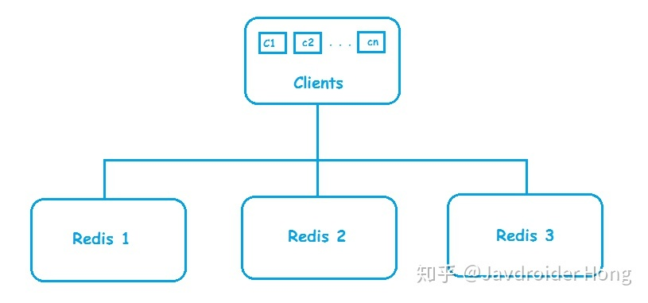
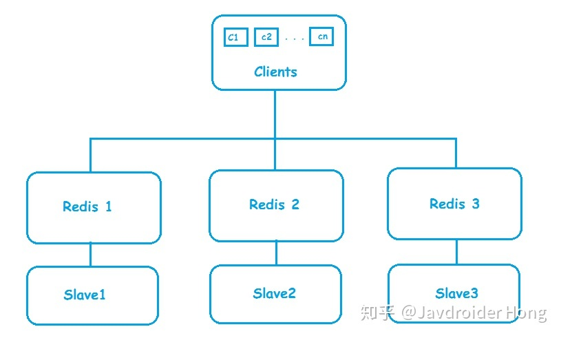
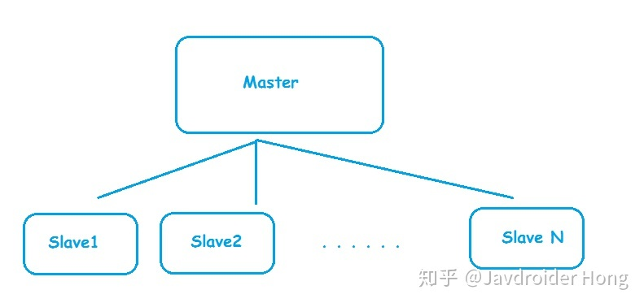
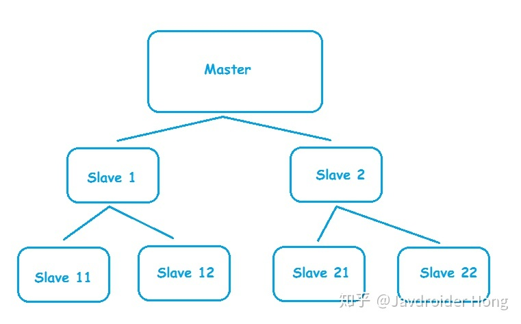
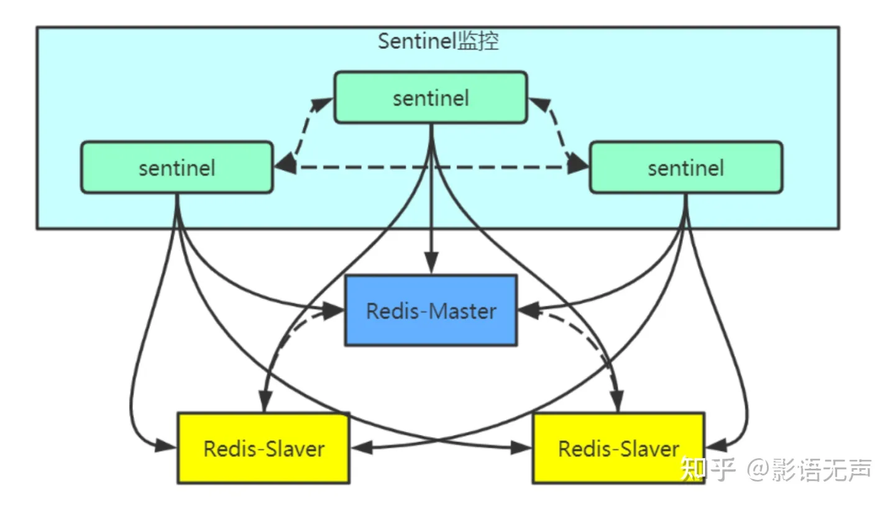

## Redis集群



### 主从复制架构

master负责写请求，然后异步同步给slave节点，从节点负责读请求

master宕机，需要手动将从节点晋升为主节点，并且要切换客户端的连接数据源

#### 一主一从



* 数据高可用
  
  Master负责接收客户写请求，并异步同步到Slave实现数据备份；哨兵模式下当Master挂了提升Slave为Master

* 提高查询效率

  忙碌时可将部分查询转发给Slave，即Master负责读写或者只负责写，Slave负责读

#### 一主多从



* Master进行数据备份工作量变大

#### Master/slave chains架构



### 哨兵模式架构



* 哨兵是Redis的高可用性的解决方案：由一个或多个sentinel实例组成sentinel集群，可以监视一个或多个主服务器和多个从服务器

* 当主服务器进入下线状态时，sentinel可以将该主服务器下的某一从服务器升级为主服务器继续提供服务，从而保证高可用性

* 哨兵节点是特殊的redis服务，不提供读写服务，主要用来监控redis实例节点

#### 哨兵模式工特点

1. Redis client端第一次从哨兵找出redis的主节点，后续就直接访问redis主节点

    1. 不会每次都通过sentinel代理访问redis的主节点
    
2. 当主节点挂掉时，哨兵会第一时间感知到，并且在slave节点中重新选出新的master并将新的master信息通知给client

3. Redis client一般通过订阅sentinel发布的节点变动消息来实现主节点切换

#### 哨兵主要工作任务

1. 监控：哨兵会不断检查master和slave是否运作正常

2. 提醒(通知)：当被监控的某个redis节点出现问题时，哨兵可以通过api向管理员或其他应用程序发送通知

3. 故障自动转移：
   
    1. 当一个master不能正常工作时，哨兵会进行自动故障迁移操作，将失效master的其中一个slave升级为新的master，并将失效master下的其他slave同步方式改为复制新的master
    2. 当客户端试图连接失效master时，集群向客户端返回新的master地址，使得集群可以用新的master代替失效的master

### 哨兵模式工作原理

1. 心跳检测机制

    通过以下两部所有的sentinel节点以及它们与所有的Redis节点能相互感知，之后sentinel节点向主节点、从节点和其他sentinel结点定时发送ping命令作为心跳检测，确认节点是否可达

    1. sentinel感知Redis node
       
        1. Redis Sentinel是一个特殊的Redis节点，哨兵模式创建时指定sentinel和Redis master node之间的关系
    
        2. sentinel从主节点上获取所有从节点的信息
    
        3. sentinel定时向主节点和从节点发送info命令获取节点的拓扑结构和状态信息
    
    2. sentinel感知sentinel关系：从节点sentinel通过主节点sentinel:hello频道发送自己信息来相互了解和各自对于主节点的判断
    
        1. 基于Redis的订阅发布功能，每个从节点的sentinel都订阅主节点的sentinel:hello频道
    
        2. 每个sentinel节点向主节点的sentinel:hello频道发送该sentinel对于主节点的判断和当前节点的信息
    
        3. 每个sentinel通过主节点sentinel:hello频道来获取其他sentinel节点信息以及它们对主节点的判断
    
2. 判断master节点是否下线

    1. 心跳检测每秒ping判断主从服务器的网络连接状态
    
    2. 如果master节点回复ping命令时间超过down-after-milliseconds设定的域值(默认30s)，master被标记为主观下线，flags状态设为SRI_R_DOWN
    
    3. master被标记后，向其他sentinel发送sentinel is-master-down-by-addr消息，并询问其他sentinel是否同意该master下线
    
    4. 其他sentinel收到命令后根据发送过来的(master)ip和port自行判断，回复是否认为该master下线
    
    5. (最初发现的)sentinel收到回复后，如果同意下线的sentinel数量大于等于quorum(创建sentinel集群时设置的数量)，则master被标记为客观下线，即认为该节点不可用
    
    6. master下线后
    
        1. 下线前：每个sentinel隔10s向其他master、slave发送info命令
    
        2. 下线后：每个sentinel隔1s向其他master、slave发送info命令以发现最新的集群拓扑结构
    
3. 基于Raft协议的哨兵leader选举

    1. 判断出客观下线的sentinel节点向其他结点发送以下命令

       ```java
       // runid:自己的run id，每个sentinel节点都有一个自己的运行时id
       SENTINEL is-master-down-by-addr ip port current_epoch runid
       ```
       
    2. master下线后，选择领头sentinel的过程符合先到先得原则
    
        1. sentinel1判断客观下线，向sentinel2发送上述命令，sentinel2回复sentinel1说选你为领头
    
        2. sentinel3向sentinel2发送上述命令，sentinel2拒绝回复
    
        3. 选择同一sentinel的其他节点个数超过majority，则成为领头节点
    
        4. 否则，过段时间重新选举
    
4. 故障转移：选择哪一个slave作为master

    1. 选择前剔除掉不满足条件的slaver
    
        1. 剔除列表中已经下线的从服务
    
        2. 剔除有5s没有回复sentinel的info命令的slave
           
        3. 剔除与已经下线的主服务器连接断开时间超过down-after-milliseconds * 10 + master宕机时长的slaver

    2. 选主
    
        1. 选择优先级最高的节点

           1. 通过sentinel配置文件中的replica-priority配置项，这个参数越小，表示优先级越高
    
        2. 优先级相同，选择offset最大的
    
            1. offset：主节点向从节点同步数据的偏移量，越大表示同步越多
    
        3. offset相同，选择run id较小的
    
    3. 故障转移
    
        1. leader sentinel对下线的主服务器执行故障转移操作
    
            1. 通过上述选主，将失效master下的一个slave升级为新的master，并让失效master的其他slave改为复制新的master
    
            2. 客户端连接失效master时，集群返回新的master地址
    
            3. master和slave切换后，master的redis.conf、slave的redis.conf、sentinel.conf的配置文件自动更新

               1. Master 主服务器的 redis.conf配置文件中会多一行 replicaof 的配置， sentinel.conf 的监控目标会随之调换
    

