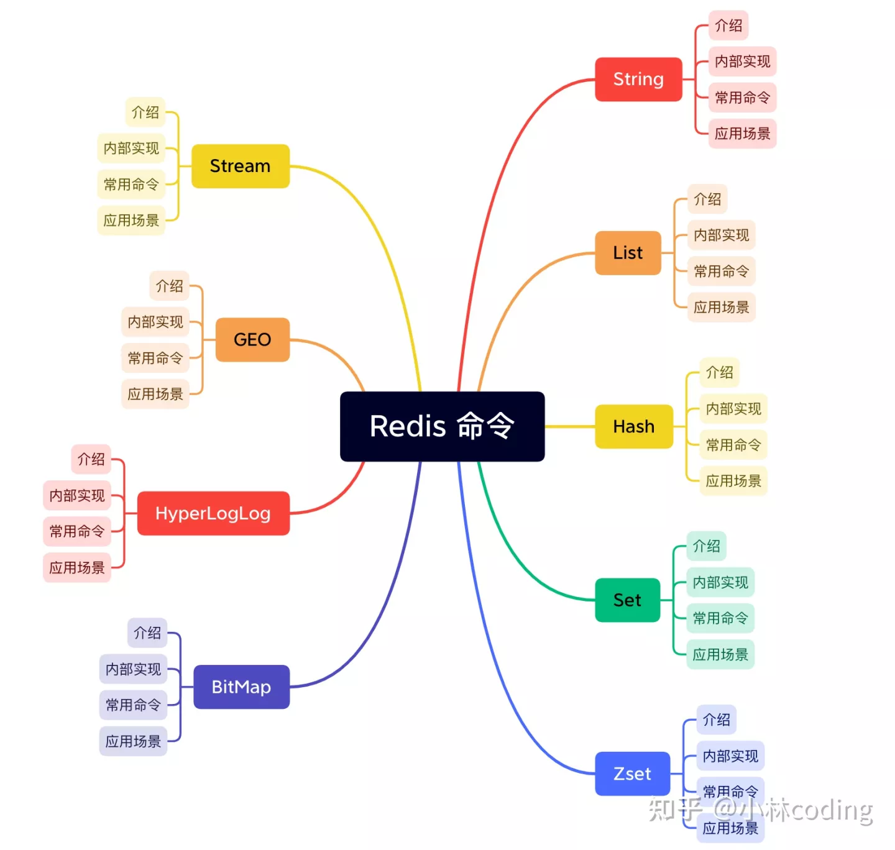

## Redis数据类型

### Redis数据类型




#### String

* String类型是Redis的基本类型，是二进制安全的
  
* String类型可包含任何数据，如数字、jpg图片、序列化的对象
  
* String类型最大存储512M

应用场景

1. 缓存对象

    1. 缓存整个对象的JSON
       
        ```json
        SET user:1 '{"name":"xiaolin", "age":18}'
        ```
       
    2. key进行分离为user:对象ID:属性，采用MSET存储，MGET获取:key=user:1:name
    
        ```json
        MSET user:1:name xiaolin user:1:age 18 user:2:name xiaomei user:2:age 20
        ```
        
2. 常规计数：访问次数、点赞次数、转发次数、库存数量等

    ```json
    # 初始化文章的阅读量
    > SET aritcle:readcount:1001 0
    OK
    #阅读量+1
    > INCR aritcle:readcount:1001
    (integer) 1
    #阅读量+1
    > INCR aritcle:readcount:1001
    (integer) 2
    #阅读量+1
    > INCR aritcle:readcount:1001
    (integer) 3
    # 获取对应文章的阅读量
    > GET aritcle:readcount:1001
    "3"
    ```
   
3. 分布式锁

    1. set命令的nx参数可实现分布式锁（不存在才插入key）

       * 如果 key 不存在，则显示插入成功，可以用来表示加锁成功
       * 如果 key 存在，则会显示插入失败，可以用来表示加锁失败
    
    2. 一般会对分布式锁加上过期时间

        ```json
        SET lock_key unique_value NX PX 10000
        ```
       
        * lock_key：key键
        * unique_value：客户端生成的唯一标识
        * NX：lock_key不存在时，才对lock_key进行设置操作
        * PX：过期时间，避免客户端发生异常而无法释放锁
    
4. 共享session信息

    1. 单体系统用户的会话(登录)状态session保存在服务器端，重复登录OK
    
    2. 分布式系统时，用户请求随机分配到服务器，导致session保存的服务器和下次请求分配的服务器不同而无法复用session
    
        
    
    3. 分布式系统+Redis缓存session
    
        
    
#### Hash

* String的key和value映射表，适合存储对象，即使用key：field+value结构

    ```json
    // value形式
    value=[{field1，value1}，...{fieldN，valueN}]
    ```

* hash对象保存的键和值字符串长度都小于64字节
  
* 常用命令：hget、hset、hgetall
  
应用场景

1. 缓存对象

    1. Hash类型结构：（key，field， value）
    
    2. 对象结构：（对象id， 属性， 值）
       
    3. 用户信息在关系型数据库中的结构
    
        

    4. 存储Hash对象
            
        ```json
        # 存储一个哈希表uid:1的键值
        > HSET uid:1 name Tom age 15
        2
        # 存储一个哈希表uid:2的键值
        > HSET uid:2 name Jerry age 13
        2
        # 获取哈希表用户id为1中所有的键值
        > HGETALL uid:1
        1) "name"
        2) "Tom"
        3) "age"
        4) "15"
        ```
       

2. 购物车

    1. 用户id为key，商品id为field，商品数量为value
    
        
    
    2. 购物车常用命令
    
        ```json
        // key=cart:{用户id}, field = {商品id}, value = 1
        添加商品：HSET cart:{用户id} {商品id} 1
        添加数量：HINCRBY cart:{用户id} {商品id} 1
        商品总数：HLEN cart:{用户id}
        删除商品：HDEL cart:{用户id} {商品id}
        获取购物车所有商品：HGETALL cart:{用户id}
        ```
       
    3. 当前仅仅是将商品ID存储到了Redis中，在回显商品具体信息的时候，还需要拿着商品id查询一次数据库，获取完整的商品的信息

#### list

* list列表是简单的字符串列表，按照插入顺序排序，可从头部或尾部添加

* 常用命令：lpush、rpush、lpop、rpop、lrange(获取列表片段)

应用场景

1. 关注列表
   
2. 粉丝列表
   
3. 消息队列

   List 不支持多个消费者消费同一条消息

#### set

* 通过HashTable实现的无序去重的键值集合：无序存储

*  常用命令：sdd、spop、smembers(判断成员是否在set集合中)、sunion等

应用场景

1. 点赞

2. 共同关注

3. 抽奖活动


* zset

  String类型的有序没有重复的集合

  有序集合保存元素数量默认小于128个，所有元素长度默认小于64字节

  常用命令：zadd、zrange、zrem、zcard等

  sorted set可通过用户提供一个优先级(score)的参数来为成员排序，并且时插入有序的即自动排序。

  内部实现：内部使用HashMap和跳跃表skipList保证数据的存储和有序

  

##### Hash/String


* String+JSON：一般使用

    * 每次需要访问大量的字段

    * 存储的结构具有多层嵌套的时候

* Hash：对象中某些频繁变化的属性可以抽出来用Hash类型存储

    * 大多数情况中只需要访问少量的字段

    * 自己始终知道哪些字段可用，防止mget时获取不到想要的数据