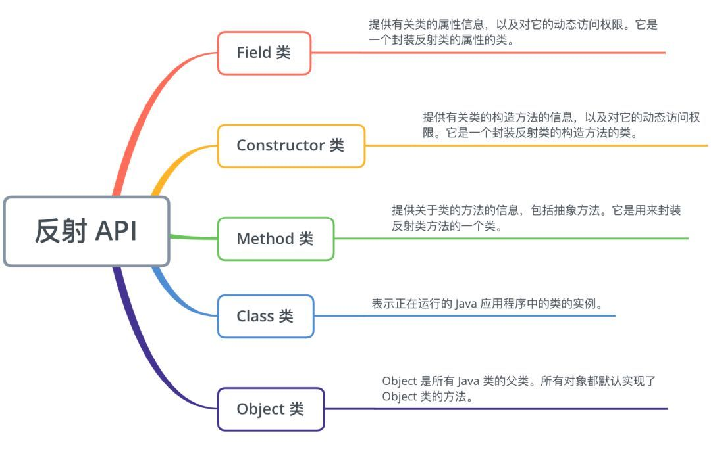

## 反射

    程序在运行期间动态获取类的属性和方法的功能
    简而言之，程序可以访问、检测和修改它本身状态或行为的一种能力

### 应用场景

* jdbc中加载数据库的驱动程序

* spring中的xml配置模式

* aop中创建目标对象的代理类

* 让开发人员可以通过外部类的全路径名创建对象，并使用这些类实现一些扩展的功能

* 让开发人员可以枚举出类的全部成员，包括构造函数、属性、方法。以帮助开发者写出正确的代码

* 测试时可以利用反射API访问类的私有成员，以保证测试代码覆盖率

### 反射API

#### Object类

Object是所有Java类的父类。所有对象都默认实现了Object类的方法

#### Class类

表示正在运行的 Java 应用程序中的类的实例

获取Class对象方法

1. 通过类实例即clazz = instance.getClass();

2. clazz = Class.forName("完整类路径")

3. 类名T.class

#### Field类
  
提供有关类的属性信息，以及对它的动态访问权限。它是一个封装反射类的属性的类

获取成员变量方法

1. getFields

    获取公有字段(包含超类)

2. getDeclaredFields

    获取所有声明的字段，包括公有和私有字段(不包含超类)

#### Constructor类
  
提供有关类的构造方法的信息，以及对它的动态访问权限。它是一个封装反射类的构造方法的类

* getConstructors

* getDeclaredConstructors

#### Method类
  
提供关于类的方法的信息，包括抽象方法。它是用来封装反射类方法的一个类

* getMethods

* getDeclaredFields
