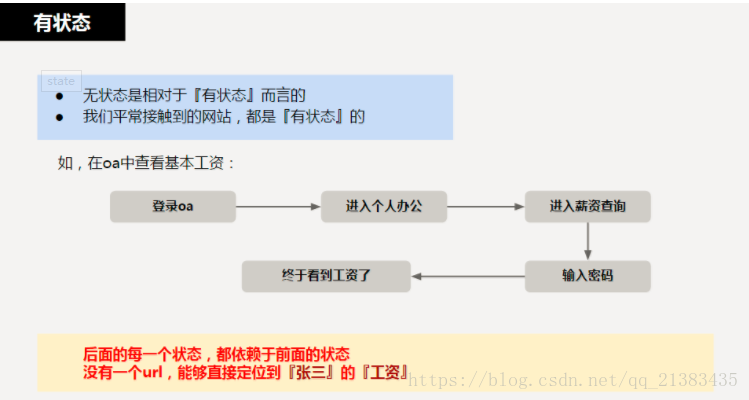
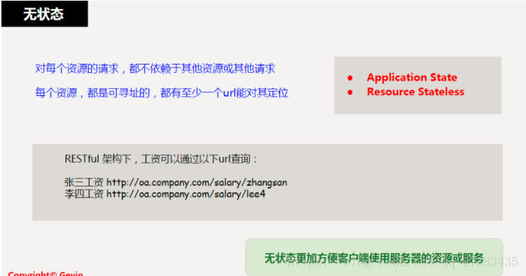
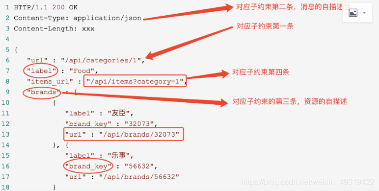

## Rest

### 传统API接口

* 删除

    delete/{id}

* 更新

    * update/{id}

    * article/{id}?method=update
    
### 缺点

1. 资源表示混乱

    ```http request
    https://localhost:8080/myweb/getUserById?id=1
    https://localhost:8080/myweb/user/getById?id=1
    https://localhost:8080/myweb/x/y?id=1
    ```

2. 有状态和无状态混在一起

3. 返回结果

    每个人可以自己定义返回类型，很随意，需要我们自己去解析

## RestFul

(资源)表现层状态转化Representational State Transfer

是一种标准、规范，遵循Rest风格可以使开发的接口通用，便于调用者理解接口的作用

核心是面向资源

### 资源Resource

网络上的一个实体，或者网络上的一个具体信息。可以是一段文本、一张图片、一种服务，是一个具体的实在

可以用一个URI(统一资源定位符Uniform Resource Identifier)指向它，每种资源对应一个特定的URI，可通过URI获取特定的资源

资源例子：

* 商品加入购物车：购物车

* 提交订单：订单

* 创建用户：用户

### 表现层Representational

资源是一种信息实体，可以有多种外在表现形式。把资源具体呈现出来的形式，叫做它的表现层

如文本可以用txt格式表现，也可以用html、xml、json格式表现

URI只代表资源实体，不代表它的形式

* 网址(通常为资源URI)后面的html没有必要，它表示格式，属于表现层范畴，URI应只代表资源位置

* 资源的具体表现形式，应该在HTTP请求头信息中用Accept和Content-Type字段指定,这两个字段为表现层的描述

### 状态转化State Transfer

访问一个网站，代表了客户端和服务器的一个互动过程，这个过程中涉及到数据和状态的变化

互联网通信协议HTTP协议，是一个无状态协议。意味着所有的状态都保存在服务器端。

如果客户端想要操作服务器，必须通过某种手段，让服务器端发生状态转化，而这种转化建立在表现层之上的，所以就是表现层状态转化

客户端手段(只能是HTTP协议)：四个表示操作方式的动词

### HTTP特征

1. HTTP动词

    1. GET：用于获取资源(不支持大数据传输)
    2. POST：用于新建资源(也可以用于更新资源)
    3. PUT：用于更新资源
    4. DELETE：用于删除资源
    
2. HTTP状态码


3. HTTP报头

    1. Authorization：认证报头 
    2. Cache-Control：缓存报头
    3. Content-Type：消息体类型报头

### RestFul架构

#### 架构

1. 每一个URI代表一种资源

2. 客户端和服务器中间，传递这种资源的某种表现层

3. 客户端通过四个HTTP动词，对服务器端资源进行操作，实现表现层状态转化

#### REST系统特征/原则

1. 客户-服务器(Client-Server)

    1. 提供服务的服务器和使用服务的客户端需要被隔离对待

2. 无状态(Stateless)

    1. 来自客户的每个请求必须包含服务器处理该请求所需要的所有信息
    
    2. 服务器不能存储来自某个客户的某个请求中的信息，并在该客户的其他请求中使用
    
    无状态定义：所有的资源都可以通过URI定位，这个定位与其他资源无关，也不会因为其他资源的变化而改变

    有状态定义：请求的资源需要依赖其他资源或状态

    样例：

    1. 有状态查询工资：如果有登录系统，进入工资查询页面，进行相应操作，获取工资
    
    2. 无状态查询工资：输入一个url即可得到指定员工工资，不依赖于其他资环或状态
    
        1. 员工工资是一个资源，由一个URI与之对应，可通过HTTP的GET方法获取资源
    
            
    
            
    
3. 可缓存(Cacheable)

    1. 服务器必须让客户端知道请求是否可以被缓存
    
4. 分层系统(Layered System)

    1. 服务器和客户之间的通信必须被这样初始化：
    
        1. 允许服务器和客户之间的中间层(代理、网关等)可以代替服务器对客户进行回应，这些对客户来说不需要特别支持
    
4. 一致的数据格式

    1. 服务端返回的数据格式要么是xml，要么是json(获取数据)，或者直接返回状态码

5. 统一接口

    1. 客户和服务器之间通信的方法必须是统一化的(GET、POST、PUT、DELETE等)
    
6. 支持按需代码(Code-On-Demand，可选)
   
    1. 服务器可以提供一些代码或者脚本，并在客户端运行环境中执行(如在客户端下载脚本生成密码访问服务器) 

#### REST约束

1. 统一接口

    1. 每个资源都有一个URI，作为唯一地址表明该资源
    
    2. 消息的自描述性
   
    3. 资源的自描述性
   
    4. 超媒体作为应用状态引擎
    
        
       
        ```json
        // 1. 状态码：作成功或者失败的状态码
        HTTP/1.1 200 OK
        // 2. 返回类型：资源表现形式(表现层的体现) -> 约束2.消息的自描述性
        Content-Type: application/json
        // 3. 内容长度
        Content-Length: xxx
         
        // 4. 返回内容
        {
           "url" : "/api/categories/1",  // -> 约束1. URI唯一地址
           "label" : "Food",
           "items_url" : "/api/items?category=1", // -> 约束4. 超媒体作为应用状态引擎
           "brands" : [ // -> 3. 资源的自描述性
                 {
                    "label" : "友臣",
                    "brand_key" : "32073",
                    "url" : "/api/brands/32073"
                 }, {
                    "label" : "乐事",
                    "brand_key" : "56632",
                    "url" : "/api/brands/56632"
                 }
                 ...
           ]
        }
        ```

#### REST优缺点

优点

1. 对URI进了限制，只用于定义资源，对简单的对象的CRUD(增删改查)，很好理解

缺点

1. 这种限制，导致设计URI变得复杂。使得复杂的关系、操作、资源集合使用rest原则设计非常困难

2. Rest基础上的HHATEOAS(超媒体作为应用状态引擎)，返回的JSON里增加了相应的关系和URL，对简单关系可以处理；复杂的关系和操作无法胜任


### 实例

```json
1、获取文章

请求：
GET /blog/post/{postId} HTTP/1.1

响应：
HTTP/1.1 200 OK
{
"title": "foobar",
"content": "foobar",
"comments": ["", "", ""]
}

2、发布文章

请求：
POST /blog/post HTTP/1.1
{
"title": "foobar",
"content": "foobar",
"comments": ["", "", ""]
}

响应：
HTTP/1.1 201 CREATED
```

### 注解

* @PathVariable

    形参注解，绑定路径参数和形参(名称要对应)，{参数名称}描述路径参数
  
* @RequestBody

    接收json数据

    ```java
    //设置当前请求方法为PUT，表示REST风格中的修改操作
    @RequestMapping(value = "/users", method = RequestMethod.PUT)
    @ResponseBody
    public String update(@RequestBody User user){
        System.out.println("user update..."+user);
        return"{'module':'user update'}";
    }
    ```
  
* RequestParam

    接收url地址传参或表单传参
  
* @GetMapping @PostMapping @PutMapping @DeleteMapping

    方法注解
  
    ```java
    // 方式1：
    //    @RequestMapping( method = RequestMethod.POST)
    // 方式2：使用@PostMapping简化Post请求方法对应的映射配置
    @PostMapping
    public String save(@RequestBody Book book){
        System.out.println("book save..." + book);
        return "{'module':'book save'}";
    }
```

* RestController

    设置当前控制器为RestFul风格，等同于@Controller和@ResponseBody两个注解