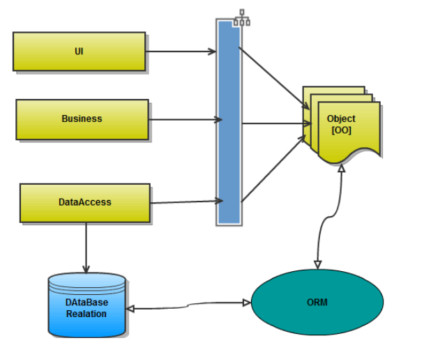
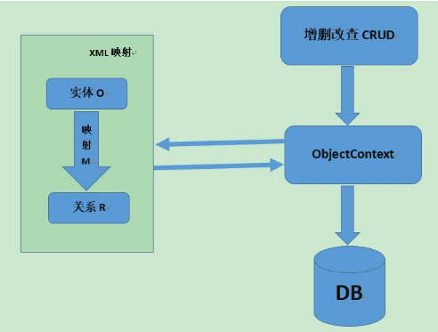

#### 概念

#### ORM

对象关系映射Object Relation Mapping

* 定义
  
      在mysql模块(数据库客户端工具内嵌，如MySQL客户端)之上进行了封装，无需编写原生sql

* 作用

      用于实现面向对象编程语言里不同类型系统的数据之间的转换

        1. 通过使用描述对象和数据库之间映射的元数据，将程序中对象与关系数据库相互映射。
        2. 解决数据库与程序间的异构性。如java中String表示字符串，Oracle中可用varchar2，
           MySql中可用varchar，SQLServer可用nvarchar。

#### 原生sql映射

* 不使用ORM时，对象与关系数据库之间的映射：
    ```java
        // 1.获取连接
        DataSource dataSource;
        connection = dataSource.getConnection();
        // 1.1 自动提交设置为false。true：每一次数据更新认定为一个事务并自动提交
        connection.setAutoCommit(false);
        // 将执行的sql
        String sql = "SELECT name, id, age, password FROM users";
        // 2.创建命令对象
        preparedStatement = connection.prepareStatement(sql);
        // 3.执行并获得结果集
        resultSet = preparedStatement.executeQuery();
        // 4.遍历结果集，将数据库中的数据转换成Java中的对象
        while(resultSet.next()){
            String name = resultSet.getString("name");
            int id = resultSet.getInt("id");
            int age = resultSet.getInt("age");
            String password = resultSet.getString("password");
            User entity= new User(name,id,age,password);
            Users.add(entity);
        }
    ```
#### 对象关系映射ORM


#### ORM结构


#### Java典型ORM

* hibernate
  
      全自动的框架，强大、复杂、笨重、学习成本较高
  
* MyBatis

      半自动的框架(懂数据库的人才能操作)，必须要自己写sql
  
* JPA

      JPA全称Java Persistence API、JPA通过JDK 5.0注解或XML描述对象－关系表的映射关系，是Java自带的框架

#### ORM方法论核心原则

* 简单：以最基本的形式建模数据。

* 传达性：数据库结构被任何人都能理解的语言文档化。

* 精确性：基于数据模型创建正确标准化了的结构。

