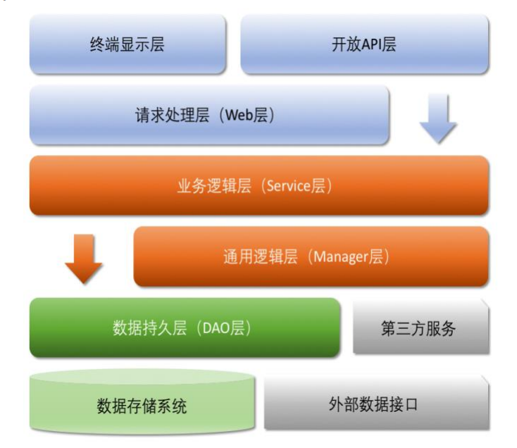
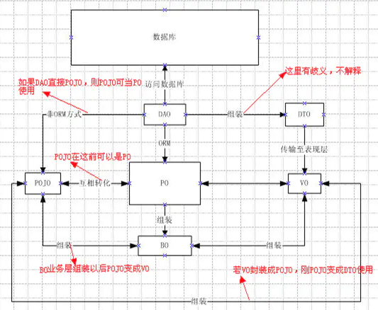

## entity、bo、vo、po、dto、pojo区别

### 应用分层

* 开放 API 层：可直接封装 Service 接口暴露成 RPC 接口；通过 Web 封装成 http 接口；网关控制层等。
  * RPC(Remote Procedure Call Protocol)：远程过程调用协议。客户端在不知道调用细节的情况下，调用远程计算机上的某个对象
  * RPC只是协议，并非实现
* 终端显示层：各个端的模板渲染并执行显示的层。当前主要是 velocity 渲染，JS 渲染，JSP 渲染，移 动端展示等。
* Web 层：主要是对访问控制进行转发，各类基本参数校验，或者不复用的业务简单处理等。
* Service 层：相对具体的业务逻辑服务层。
* Manager 层：通用业务处理层，它有如下特征：

        1） 对第三方平台封装的层，预处理返回结果及转化异常信息，适配上层接口。
        2） 对 Service 层通用能力的下沉，如缓存方案、中间件通用处理。
        3） 与 DAO 层交互，对多个 DAO 的组合复用。
  
* DAO 层：数据访问层，与底层 MySQL、Oracle、Hbase、OB 等进行数据交互。
* 第三方服务：包括其它部门 RPC 服务接口，基础平台，其它公司的 HTTP 接口，如淘宝开放平台、支 付宝付款服务、高德地图服务等。
* 外部数据接口：外部（应用）数据存储服务提供的接口，多见于数据迁移场景中。

### Entity

      实体类，基本和数据表一一对应，一个实体一张表。
      基本实体类包都以entity(MyBatis)、domain(JPA)或者model来命名，也有以Bo、Vo命名。

### Bo(business object)

> 代表业务对象。由Service层输出的封装**业务逻辑**对象，这个对象可以包括一个或多个其他对象。
>
> 通过调用Dao方法，结合Po或Vo进行业务操作。
>
> 可描述为一个对象的行为和动作，也涉及到其他多个对象的一些行为和动作。
>
> > 如处理一个人的业务逻辑，该人会睡觉，吃饭，工作，上班等等行为，还有可能和别人发关系的行为，处理这样的业务逻辑时，我们就可以针对BO去处理。
>
> > 如投保人是一个Po，被保险人是一个Po，险种信息也是一个Po等等，他们组合起来就是一张保单的Bo。

### Vo(value/view object)

> 代表值对象/显示层对象。通常是Web向模板渲染引擎层传输的对象。
>
> 主要体现在视图的对象，对于一个WEB页面将整个页面的属性封装成一个对象，然后用一个VO对象在控制层与视图层进行传输交换。

#### Pojo(Plain ordinary java object)

> 代表简单java对象。即指只有setter、getter和toString的简单类。
>
> 包括DO/DTO/BO/VO等。

### Po(persistence object)

> 代表持久层对象。对应数据库中表的字段，数据库表中的记录在java对象中的状态。
>
> 可理解为一个PO就是数据库中的一条记录。
>
> 好处是可以把一条记录作为一个对象处理，可以方便的转为其它对象。Vo和Po，都是属性加上属性的get和set方法；表面看没什么不同，但代表的含义是完全不同的。

### DO(data object)

> 数据库表--对应的POJO类，可简单理解为PO。
>
> 与数据库表结构一一对应。通过DAO层向上传输数据源对象（介于DAO和数据库/数据存储系统之间）。

### DTO(data transfer object)

> 代表数据传输对象（Service或Manager向外传输的对象）。接口之间传递的数据封装。
>
> > 如表里面有十几个字段：id，name，gender（M/F)，age……
>
> > 页面需要展示三个字段：name，gender(男/女)，age
>
> DTO由此产生，一是能提高数据传输的速度(减少了传输字段)，二能隐藏后端表结构

#### Dao(data access object)

> 代表数据访问对象。
>
> 负责持久层操作。用于封装对数据的访问，而非对数据库的访问。

#### ORM(object relation mapping)

> 对象映射关系。对象领域模型与底层数据之间的交换。泛指MyBatis,JPA，Hibernate等框架的实现。

#### Controller

> 代表控制层，主要是Action/Servlet等构成。
>
> 业务层和视图层打交道的中间层。负责传输VO对象和调用BO层的业务方法，负责视图层请求的数据处理后响应给视图层。

#### View

> 代表视图层。主要指JSP、HTML等文件形成的显示层。

### 实际项目应用

> 控制层(controller-action)，业务层/服务层(bo-manager-service)，实体层(po-entity)，
> dao(dao)，视图对象(Vo-)，视图层(view-jsp/html)

### Alibaba领域模型命名规约

* 1） 数据对象：xxxDO，xxx 即为数据表名。
* 2） 数据传输对象：xxxDTO，xxx 为业务领域相关的名称。
* 3） 展示对象：xxxVO，xxx 一般为网页名称。
* 4） POJO 是 DO/DTO/BO/VO 的统称，禁止命名成 xxxPOJO。
