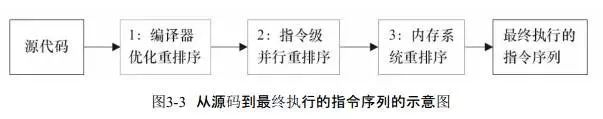
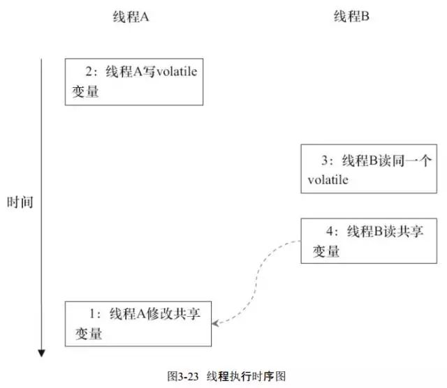

## as-if-serial/happens-before

### as-if-serial

不管指令怎么重排，单线程执行结果不能改变

处理器不会对存在数据依赖关系的操作进行重排，避免结果发生改变

### happens-before

先行发生原则，一个操作happen-before另外的一个操作，那第一个操作的结果将对第二个操作可见，而且第一个操作执行顺序优先于第二个操作

### 区别

as-if-serial保证单线程执行结果不变，happens-before保证正确同步的多线程程序执行结果不变

两者都是为了在不改变程序执行结果的前提下尽可能提高程序执行并行度

## 内存屏障

Cpu指令load barrier和store barrier构成了内存屏障，内存屏障的作用可以防止指令重排序以及在多线程中使用共享变量的时候，一个线程发先缓存中的数据在被另外一个线程更改，那么内存屏障会强制把改的数据加载到主内存，并且将第二个线程的缓存行失效

## 指令重排

为了提高性能，编译器和处理器通常会对指令进⾏重排序，重排序指从源代码到指令序列的重排序

* 重排序分类

    * 编译器优化的重排序

      编译器在不改变单线程程序语义的前提下，可以重新安排语句的执行顺序

    * 指令级并行的重排序

      现代处理器采用了指令级并行技术来将多条指令重叠执行。
      如果不存在数据依赖(单个处理器中的依赖)，处理器可以改变语句对应机器指令的执行顺序

    * 内存系统的重排序

      由于处理器使用缓存和读/写缓冲区，使得加载和存储操作看上去是在乱序执行

      

* 重排序对内存可见性影响

  

    * 语句1、2之间没有数据依赖关系，语句1、2可能被重排

    * 语句3、4之间没有数据依赖关系，语句3、4可能被重排

    * 读线程B执行4时，不一定能读取到线程A执行语句1对变量的修改