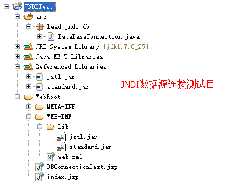
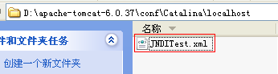

## 数据源

### 操作数据库步骤

1. 加载数据库驱动程序(Class.forName("数据库驱动类"))

2. 连接数据库(Connection conn =  DriverManager.getConnection())

3. 操作数据库(PreparedStatement stat = conn.prepareStatement(sql)); stat.executeQuery();

4. 关闭数据库(conn.close())
   
    * 不使用ORM时，对象与关系数据库之间的映射
        ```java
        // 0.加载数据库驱动程序
        DataSource dataSource;
        // 1.获取连接
        connection = dataSource.getConnection();
        // 1.1 自动提交设置为false。true：每一次数据更新认定为一个事务并自动提交
        connection.setAutoCommit(false);
        // 将执行的sql
        String sql = "SELECT name, id, age, password FROM users";
        // 2.创建命令对象
        preparedStatement = connection.prepareStatement(sql);
        // 3.执行并获得结果集
        resultSet = preparedStatement.executeQuery();
        // 4.遍历结果集，将数据库中的数据转换成Java中的对象
        while(resultSet.next()){
            String name = resultSet.getString("name");
            int id = resultSet.getInt("id");
            int age = resultSet.getInt("age");
            String password = resultSet.getString("password");
            User entity= new User(name,id,age,password);
            Users.add(entity);
        }
        ```

### 使用数据源


Tomcat4.1.27后在服务器上增加了数据源配置选项

* 在J2EE服务器上保存着一个数据库的多个连接，每一个连接通过DataSource可以找到

* DataSource被绑定在JNDI树上(为每一个DataSource提供一个名字)

* 客户端通过名称找到JNDI树上绑定的DataSource，再由DataSource找到一个连接

## 常用连接池

### C3p0

使用该连接池的开源项目：Hibernate、Spring等

优缺点：单线程、性能较差，适用于小型系统

### DBCP

Database Connection Pool，Apache开发的Java数据库连接池项目。Jakarta commons-pool对象池机制，Tomcat、MyBatis默认使用的连接池组件

单独使用Jdbc需要3个包：common-dbcp.jar,common-pool.jar,common-connections.jar，预先将数据库连接放在内存中，应用程序需要使用时直接到连接池申请，用完再放回

优缺点：单线程(保证线程安全会锁整个连接池)、并发量低，性能较差，适用于小型系统

### Tomcat Jdbc Pool

Tomcat7.0前使用common-dbcp.jar作为连接池组件，7.0后使用新连接池模块Tomcat jdbc pool，基于Tomcat JULI，使用Tomcat日志框架

优缺点：兼容dbcp、通过异步方式获取连接，支持高并发、JMX、XA Connection

### BoneCP

### Druid

优缺点：为分析监控设计、快速的交互式查询，高可用，可扩展，支持高并发


## JNDI+Tomcat配置数据源

### 全局JNDI配置

1. server.xml中配置数据源

    1. Tomcat服务器的lib目录下加入数据库连接的驱动jar包
    
        
    
    2. 修改Tomcat服务器的conf目录下的server.xml配置文件
    
        
    
        * Tomcat默认全局JNDI配置
    
            
    
        * 修改Tomcat默认全局JNDI配置
        
            ```xml
            <!-- Global JNDI resources
                   Documentation at /docs/jndi-resources-howto.html
              -->
              <GlobalNamingResources>
                <!-- Editable user database that can also be used by
                     UserDatabaseRealm to authenticate users
                -->
                <Resource name="UserDatabase" auth="Container"
                          type="org.apache.catalina.UserDatabase"
                          description="User database that can be updated and saved"
                          factory="org.apache.catalina.users.MemoryUserDatabaseFactory"
                          pathname="conf/tomcat-users.xml" />
            <!--
              |- name：表示以后要查找的名称。通过此名称可以找到DataSource，此名称任意更换，但是程序中最终要查找的就是此名称，
                       为了不与其他的名称混淆，所以使用jdbc/oracle，现在配置的是一个jdbc的关于oracle的命名服务。
              |- auth：由容器进行授权及管理，指的用户名和密码是否可以在容器上生效
              |- type：此名称所代表的类型，现在为javax.sql.DataSource
              |- maxActive：表示一个数据库在此服务器上所能打开的最大连接数
              |- maxIdle：表示一个数据库在此服务器上维持的最小连接数
              |- maxWait：最大等待时间。10000毫秒
              |- username：数据库连接的用户名
              |- password：数据库连接的密码
              |- driverClassName：数据库连接的驱动程序
              |- url：数据库连接的地址
            -->
            <!--配置Oracle数据库的JNDI数据源-->
            <Resource
                    name="jdbc/oracle"
                    auth="Container"
                    type="javax.sql.DataSource"
                    maxActive="100"
                    maxIdle="30"
                    maxWait="10000"
                    username="lead_oams"
                    password="p"
                    driverClassName="oracle.jdbc.driver.OracleDriver"
                    url="jdbc:oracle:thin:@192.168.1.229:1521:lead"/>
            
            <!--配置MySQL数据库的JNDI数据源-->
            <Resource
                    name="jdbc/mysql"
                    auth="Container"
                    type="javax.sql.DataSource"
                    maxActive="100"
                    maxIdle="30"
                    maxWait="10000"
                    username="root"
                    password="root"
                    driverClassName="com.mysql.jdbc.Driver"
                    url="jdbc:mysql://192.168.1.144:3306/leadtest?useUnicode=true&characterEncoding=utf-8"/>
            
            <!--配置SQLServer数据库的JNDI数据源-->
            <Resource
                    name="jdbc/sqlserver"
                    auth="Container"
                    type="javax.sql.DataSource"
                    maxActive="100"
                    maxIdle="30"
                    maxWait="10000"
                    username="sa"
                    password="p@ssw0rd"
                    driverClassName="com.microsoft.sqlserver.jdbc.SQLServerDriver"
                    url="jdbc:sqlserver://192.168.1.51:1433;DatabaseName=demo"/>
              </GlobalNamingResources>
            ```
2. 测试

    1. web.xml添加JNDI配置的资源引用

        
    
    2. web.xml设置
    
        ```xml
        <?xml version="1.0" encoding="UTF-8"?>
        <web-app version="2.5"
            xmlns="http://java.sun.com/xml/ns/javaee"
            xmlns:xsi="http://www.w3.org/2001/XMLSchema-instance"
            xsi:schemaLocation="http://java.sun.com/xml/ns/javaee
            http://java.sun.com/xml/ns/javaee/web-app_2_5.xsd">
          <welcome-file-list>
            <welcome-file>index.jsp</welcome-file>
          </welcome-file-list>
        
          <!--
          JNDI配置的资源引用：
          • res-ref-name：表示引用资源的名称
          • res-type：此资源对应的类型为javax.sql.DataSource
          • res-auth：容器授权管理
           -->
           <!--Oracle数据库JNDI数据源引用 -->
          <resource-ref>
              <description>Oracle DB Connection</description>
              <res-ref-name>oracleDataSource</res-ref-name>
              <res-type>javax.sql.DataSource</res-type>
              <res-auth>Container</res-auth>
         </resource-ref>
        
          <!--MySQL数据库JNDI数据源引用 -->
          <resource-ref>
              <description>MySQL DB Connection</description>
              <res-ref-name>mysqlDataSource</res-ref-name>
              <res-type>javax.sql.DataSource</res-type>
              <res-auth>Container</res-auth>
          </resource-ref>
        
          <!--SQLServer数据库JNDI数据源引用 -->
          <resource-ref>
              <description>SQLServer DB Connection</description>
              <res-ref-name>sqlserverDataSource</res-ref-name>
              <res-type>javax.sql.DataSource</res-type>
              <res-auth>Container</res-auth>
          </resource-ref>
        
        </web-app>
        ```

    3. 映射测试项目的虚拟目录
    
        * Tomcat的/conf/Catalina/localhost下新建和项目相同名称的xml文件
    
            
    
        * 配置映射文件
    
            ```xml
            <?xml version="1.0" encoding="UTF-8"?>
            <!--
                jndi配置方法（tomcat）：
                将此文件放置在tomcat\conf\Catalina\localhost下（没有目录就新建）
             -->
            <!--映射JNDITest项目的虚拟目录-->
            <Context docBase="D:/MyEclipse8.5/workspace/JNDITest/WebRoot" debug="0" reloadable="false">
                <!--引用Oracle数据库的JNDI数据源-->
                <ResourceLink name="oracleDataSource" global="jdbc/oracle" type="javax.sql.DataSource"/>
                <!--引用mysql数据库的JNDI数据源-->
                <ResourceLink name="mysqlDataSource" global="jdbc/mysql" type="javax.sql.DataSource"/>
                <!--引用sqlserver数据库的JNDI数据源-->
                <ResourceLink name="sqlserverDataSource" global="jdbc/sqlserver" type="javax.sql.DataSource"/>
            </Context>
            ```
          
    4. 测试从JNDI数据源获取数据库连接

        * 初始化名称查找上下文
        * 通过JNDI名称找到DataSource
        * 通过DataSource取得一个连接
        * 操作数据库
        * 关闭数据库，关闭的时候是将连接放回到连接池中

            ```javascript
            <%@ page language="java" import="java.util.*" pageEncoding="UTF-8"%>
            <%@ page import="java.sql.*,javax.sql.*,javax.naming.*" %>
            
            <!DOCTYPE HTML>
            <html>
              <head>
                <title>JNDI数据源测试</title>
              </head>
            
              <body>
                    <%
                        Connection connOracle = null;
                        try {
                            //1、初始化名称查找上下文
                            Context ctx = new InitialContext();
                            //InitialContext ctx = new InitialContext();亦可
                            //2、通过JNDI名称找到DataSource,对名称进行定位java:comp/env是必须加的,后面跟的是DataSource名
                            /*
                            DataSource名在web.xml文件中的<res-ref-name>oracleDataSource</res-ref-name>进行了配置
                             <!--Oracle数据库JNDI数据源引用 -->
                             <resource-ref>
                                  <description>Oracle DB Connection</description>
                                  <res-ref-name>oracleDataSource</res-ref-name>
                                  <res-type>javax.sql.DataSource</res-type>
                                  <res-auth>Container</res-auth>
                             </resource-ref>
                            */
                            DataSource ds = (DataSource)ctx.lookup("java:comp/env/oracleDataSource");
                            //3、通过DataSource取得一个连接
                            connOracle = ds.getConnection();
                            out.println("Oracle Connection pool connected !!");
                            //4、操作数据库
                        } catch (NamingException e) {
                            System.out.println(e.getMessage());
                        } catch (SQLException e) {
                            e.printStackTrace();
                        } finally {
                            //5、关闭数据库，关闭的时候是将连接放回到连接池之中
                            connOracle.close();
                        }
                    %>
                    <hr/>
                    <%
                        Connection connMySQL = null;
                        try {
                            //1、初始化名称查找上下文
                            Context ctx = new InitialContext();
                            //InitialContext ctx = new InitialContext();亦可
                            //2、通过JNDI名称找到DataSource,对名称进行定位java:comp/env是必须加的,后面跟的是DataSource名
                            /*
                            DataSource名在web.xml文件中的<res-ref-name>mysqlDataSource</res-ref-name>进行了配置
                              <!--MySQL数据库JNDI数据源引用 -->
                              <resource-ref>
                                  <description>MySQL DB Connection</description>
                                  <res-ref-name>mysqlDataSource</res-ref-name>
                                  <res-type>javax.sql.DataSource</res-type>
                                  <res-auth>Container</res-auth>
                              </resource-ref>
                            */
                            DataSource ds = (DataSource)ctx.lookup("java:comp/env/mysqlDataSource");
                            //3、通过DataSource取得一个连接
                            connMySQL = ds.getConnection();
                            out.println("MySQL Connection pool connected !!");
                            //4、操作数据库
                        } catch (NamingException e) {
                            System.out.println(e.getMessage());
                        } catch (SQLException e) {
                            e.printStackTrace();
                        } finally {
                            //5、关闭数据库，关闭的时候是将连接放回到连接池之中
                            connMySQL.close();
                        }
                    %>
                    <hr/>
                    <%
                        Connection connSQLServer = null;
                        try {
                            //1、初始化名称查找上下文
                            Context ctx = new InitialContext();
                            //InitialContext ctx = new InitialContext();亦可
                            //2、通过JNDI名称找到DataSource,对名称进行定位java:comp/env是必须加的,后面的是DataSource名
                            /*
                            DataSource名在web.xml文件中的<res-ref-name>sqlserverDataSource</res-ref-name>进行了配置
                            <!--SQLServer数据库JNDI数据源引用 -->
                              <resource-ref>
                                  <description>SQLServer DB Connection</description>
                                  <res-ref-name>sqlserverDataSource</res-ref-name>
                                  <res-type>javax.sql.DataSource</res-type>
                                  <res-auth>Container</res-auth>
                              </resource-ref>
                            */
                            DataSource ds = (DataSource)ctx.lookup("java:comp/env/sqlserverDataSource");
                            //3、通过DataSource取得一个连接
                            connSQLServer = ds.getConnection();
                            out.println("SQLServer Connection pool connected !!");
                            //4、操作数据库
                        } catch (NamingException e) {
                            System.out.println(e.getMessage());
                        } catch (SQLException e) {
                            e.printStackTrace();
                        } finally {
                            //5、关闭数据库，关闭的时候是将连接放回到连接池之中
                            connSQLServer.close();
                        }
                    %>
                </body>
            </html>
            ```

      * 测试结果

        

    5. 测试从JNDI数据源获取数据库连接(JSTL)

        ```javascript
        <%@ page language="java" import="java.util.*" pageEncoding="UTF-8"%>
        <%--引入JSTL标签库 --%>
        <%@ taglib uri="http://java.sun.com/jsp/jstl/core" prefix="c"%>
        <%@ taglib uri="http://java.sun.com/jsp/jstl/sql" prefix="sql"%>
        <!DOCTYPE HTML>
        <html>
          <head>
            <title>JNDI数据源连接测试</title>
          </head>
        
          <body>
                  <h3>Oracle JNDI数据源测试</h3>
                  <%--使用sql:query标签发送SQL语句去数据库查询数据，查询的结果集保存到rs变量当中，dataSource属性指明使用的数据源--%>
                <sql:query var="rs" dataSource="oracleDataSource">
                    <%--Oracle JNDI数据源测试 SQL--%>
                    SELECT * FROM LEAD_OAMS_DBSOURCES
                </sql:query>
                <%--使用c:forEach标签遍历查询结果集rs中的每一行--%>
                <c:forEach var="row" items="${rs.rows}">
                    <%--${row.字段名}获取字段的值--%>
                    ${row.RESOURCEID}---${row.DBSOURCE_NAME}---${row.DBSOURCE_TYPE}<br/>
                </c:forEach>
                <hr/>
                <h3>MySQL JNDI数据源测试</h3>
                <%--使用sql:query标签发送SQL语句去数据库查询数据，查询的结果集保存到rs变量当中，dataSource属性指明使用的数据源--%>
                <sql:query var="rs" dataSource="mysqlDataSource">
                    <%--MySQL JNDI数据源测试 SQL--%>
                     select * from ld_user
                </sql:query>
                <%--使用c:forEach标签遍历查询结果集rs中的每一行--%>
                <c:forEach var="row" items="${rs.rows}">
                    <%--${row.字段名}获取字段的值--%>
                    ${row.id}---${row.username}---${row.password}<br/>
                </c:forEach>
                <hr/>
                <h3>SQLServer JNDI数据源测试</h3>
                <%--使用sql:query标签发送SQL语句去数据库查询数据，查询的结果集保存到rs变量当中，dataSource属性指明使用的数据源--%>
                <sql:query var="rs" dataSource="sqlserverDataSource">
                    <%--SQLServer JNDI数据源测试 SQL--%>
                    select * from t_demo
                </sql:query>
                <%--使用c:forEach标签遍历查询结果集rs中的每一行--%>
                <c:forEach var="row" items="${rs.rows}">
                    <%--${row.字段名}获取字段的值--%>
                    ${row.id}---${row.time}<br/>
                </c:forEach>
          </body>
        </html>
        ```
       
        * 测试结果

            

### 非全局JNDI配置

针对某一个Web项目配置的数据源

1. Tomcat服务器的lib目录下加入数据库连接的驱动jar包

2. 针对具体的web项目映射虚拟目录，然后再虚拟目录映射的配置文件中配置JNDI数据源

    

    * 添加对测试项目的虚拟目录映射和JNDI数据源配置
    
        ```xml
        <?xml version="1.0" encoding="UTF-8"?>
        <!--
            jndi配置方法（tomcat）：
            将此文件放置在tomcat\conf\Catalina\localhost下（没有目录就新建）
         -->
        
        <Context docBase="D:/MyEclipse8.5/workspace/JNDITest/WebRoot" debug="0" reloadable="false">
        <!--
          |- name：表示以后要查找的名称。通过此名称可以找到DataSource，此名称任意更换，但是程序中最终要查找的就是此名称，
                   为了不与其他的名称混淆，所以使用jdbc/oracle，现在配置的是一个jdbc的关于oracle的命名服务。
          |- auth：由容器进行授权及管理，指的用户名和密码是否可以在容器上生效
          |- type：此名称所代表的类型，现在为javax.sql.DataSource
          |- maxActive：表示一个数据库在此服务器上所能打开的最大连接数
          |- maxIdle：表示一个数据库在此服务器上维持的最小连接数
          |- maxWait：最大等待时间。10000毫秒
          |- username：数据库连接的用户名
          |- password：数据库连接的密码
          |- driverClassName：数据库连接的驱动程序
          |- url：数据库连接的地址
        -->
        <!--配置Oracle数据库的JNDI数据源-->
        <Resource
                name="oracleDataSource"
                auth="Container"
                type="javax.sql.DataSource"
                maxActive="100"
                maxIdle="30"
                maxWait="10000"
                username="lead_oams"
                password="p"
                driverClassName="oracle.jdbc.driver.OracleDriver"
                url="jdbc:oracle:thin:@192.168.1.229:1521:lead"/>
        
        <!--配置MySQL数据库的JNDI数据源-->
        <Resource
        name="mysqlDataSource"
        auth="Container"
        type="javax.sql.DataSource"
        maxActive="100"
        maxIdle="30"
        maxWait="10000"
        username="root"
        password="root"
        driverClassName="com.mysql.jdbc.Driver"
        url="jdbc:mysql://192.168.1.144:3306/leadtest?useUnicode=true&characterEncoding=utf-8"/>
        
        <!--配置SQLServer数据库的JNDI数据源-->
        <Resource
        name="sqlserverDataSource"
        auth="Container"
        type="javax.sql.DataSource"
        maxActive="100"
        maxIdle="30"
        maxWait="10000"
        username="sa"
        password="p@ssw0rd"
        driverClassName="com.microsoft.sqlserver.jdbc.SQLServerDriver"
        url="jdbc:sqlserver://192.168.1.51:1433;DatabaseName=demo"/>
        </Context>
        ```

3. web项目中的web.xml文件中引用配置好的JNDI数据源

    ```xml
    <!--
      JNDI配置的资源引用：
      • res-ref-name：表示引用资源的名称
      • res-type：此资源对应的类型为javax.sql.DataSource
      • res-auth：容器授权管理
       -->
       <!--Oracle数据库JNDI数据源引用 -->
      <resource-ref>
          <description>Oracle DB Connection</description>
          <res-ref-name>oracleDataSource</res-ref-name>
          <res-type>javax.sql.DataSource</res-type>
          <res-auth>Container</res-auth>
     </resource-ref>
    
      <!--MySQL数据库JNDI数据源引用 -->
      <resource-ref>
          <description>MySQL DB Connection</description>
          <res-ref-name>mysqlDataSource</res-ref-name>
          <res-type>javax.sql.DataSource</res-type>
          <res-auth>Container</res-auth>
      </resource-ref>
    
      <!--SQLServer数据库JNDI数据源引用 -->
      <resource-ref>
          <description>SQLServer DB Connection</description>
          <res-ref-name>sqlserverDataSource</res-ref-name>
          <res-type>javax.sql.DataSource</res-type>
          <res-auth>Container</res-auth>
      </resource-ref>
    ```
