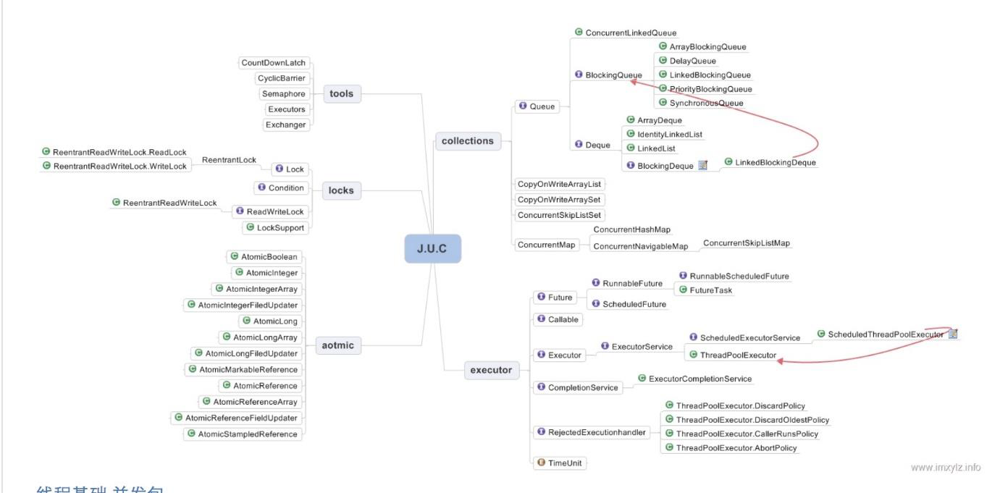
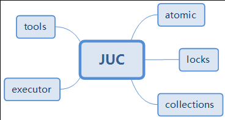
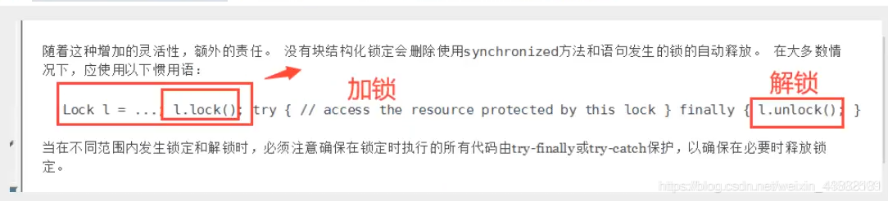
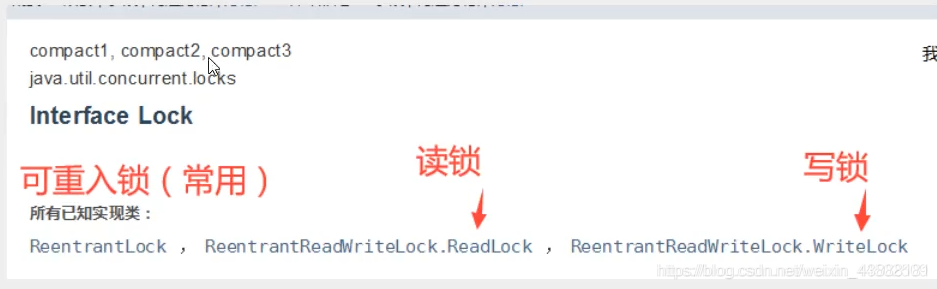
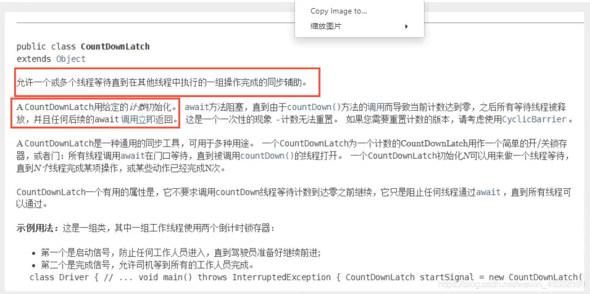
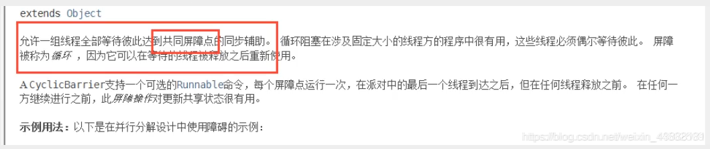
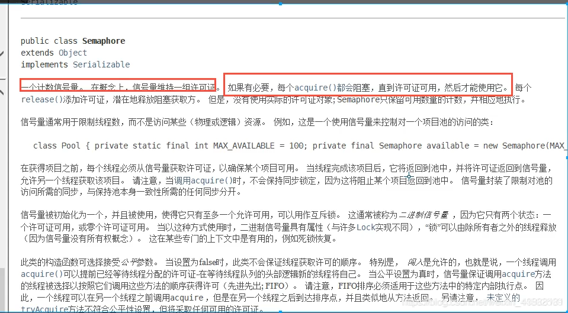

# JUC



## JUC概述

JUC指的是Java并发工具包：

* java.util.concurrent

* java.util.concurrent.atomic:支持原子型操作

* java.util.concurrent.locks:lock锁

### 相关概念

* 线程
  
    操作系统能够进行运算调度的最小单位

* 进程
  
    一个运行中的程序的集合，一个进程至少包含一个线程

* Java默认2个线程：main线程和gc线程

* 并发

    同一时刻，多个线程交替执行(一个CPU交替执行线程)
  
* 并行

    同一时刻，多个线程同时执行(多个CPU同时执行多个线程)

    ```java
    # 获取CPU的核数(cpu密集型：IO密集型)
    System.out.println(Runtime.getRuntime().availableProcessors())
    ```

    * CPU密集型也叫计算密集型，指的是系统的硬盘、内存性能相对CPU要好很多，此时，系统运作大部分的状况是CPU Loading 100%，CPU要读/写I/O(硬盘/内存)，I/O在很短的时间就可以完成，而CPU还有许多运算要处理，CPU Loading很高。

    * IO密集型指的是系统的CPU性能相对硬盘、内存要好很多，此时，系统运作，大部分的状况是CPU在等I/O (硬盘/内存) 的读/写操作，此时CPU Loading并不高。

* 并发变成本质是充分利用CPU资源

* wait/sleep区别

    区别|wait|sleep|await
    ---|---|---|---
    来源|Object类|线程类|-
    锁的释放|释放锁|不释放锁|-
    使用方式|同步代码块中※|任何地方|-
    唤醒方式|obj.notify/all|不需要唤醒(时间到自动退出阻塞)|Condition.signal/all
    使用场景|多线程之间通信|当前线程休眠/轮询暂停操作|-
  
    ※ wait必须和synchronized关键字一起使用

## JUC结构



### tools(工具类)

信号量三组工具类

### executor(执行者)

Java线程池的顶级接口，此处只是一个执行线程的工具。真正的线程池接口是ExecutorService

### atomic(原子性包)

JDK提供的一组原子操作类

### locks(锁包)

JDK提供的锁机制

### collections类

主要提供线程安全的集合

## Lock锁

Lock接口


Lock实现类


### 传统synchronized

Java中的关键字，是一种同步锁。

特点：

1. 原子性

    确保线程互斥地访问同步代码

2. 可见性

    保证共享变量的修改能够及时可见。实现：
   
    1. JMM中变量unlock之前，必须要同步到主内存中
    
    2. 对变量进行lock，先将工作内存中该变量清空
    
    3. 使用变量前，重新从主内存load或assign初始化变量来保证

3. 有序性

    有效解决重排序问题，即"一个unlock操作必然先行发生(happen-before)于后面对同一个锁的lock操作

保证在同一时刻被修饰的代码块或方法只会有一个线程执行，可修饰对象：

1. 代码块

    被修饰的代码块称为同步语句块

    作用范围：大括号{}括起来的代码，作用对象是调用这个代码块的对象

    范例：synchronized (obj) {// 作用范围}
   
2. 方法

    被修饰的方法称为同步方法

    作用范围：整个方法，作用对象是调用这个方法的对象

    范例：public synchronized void transfer() {// 作用范围}
   
3. 静态方法

    作用范围：整个静态方法，作用对象是这个类的所有对象
   
4. 类

    作用范围：synchronized后面括号括起来的部分(内部方法看如何定义而定)，作用对象是这个类的所有对象

### 虚假唤醒

产生：

1. 多线程环境下，多个线程等待在同一条件上，当条件满足时，所有等待线程都被唤醒

2. 同一时刻只有一个线程能竞争到锁，处理完毕后释放锁

3. 其他线程在获取到锁的时间片时最初的条件可能已经不能满足，线程本应继续等待却继续往下执行的一种现象

解决方案：

* 获取到锁后，重新进行判断，如while替换if

### ReentrantLock构造器

```java
public ReentrantLock() {
    sync = new NonfairSync(); //无参默认非公平锁
}
public ReentrantLock(boolean fair) {
    sync = fair ? new FairSync() : new NonfairSync();//传参为true为公平锁
}
```

#### 公平锁

十分公平，可以先来后到，一定要排队

#### 非公平锁

十分不公平，可以插队(默认)

#### synchronized和Lock区别

区别|synchronized|Lock
---|---|---
来源|内置Java关键字|Java类
锁状态|无法判断获取锁的状态|可判断是否获取到了锁lock.tryLock();
锁释放|自动释放|手动释放(不释放产生死锁)
等待|线程1(获得锁，阻塞)线程2(等待)|不一定等待下去(线程2等待足够时间后中断等待做其他事)
其他|可重入/不可中断/非公平|可重入/不可中断/非公平(可自己设置)
场景|适合锁少量的代码同步问题|适合锁大量的同步代码(只有代码块锁)，性能高

#### Condition

精准的通知和唤醒线程，依赖于Lock接口的接口，基本方法await()和signal()

生成Condition：lock.Condition()

调用Condition的await和signal方法必须在lock保护之内，即lock.lock和lock.unlock之间

Condition方法和Object方法

* Condition.await()，对应Object.wait()

* Condition.signal()，对应Object.notify()

* Condition.signalAll()，对应Object.notifyAll()

    

## collections

### list

list不安全

#### ArrayList解决方案

1. 使用Vector
   
2. List<String> l = Collections.synchronizedList(new ArrayList());
   
3. List<String> l = new CopyOnWriteArrayList<>();// 写复制

    原理：

    1. 容器添加元素时，当前容器Object[]进行copy到新容器Object[] newElements
       
    2. 新容器里添加元素
    
    3. 原容器引用指向新容器(并发时读不需加锁/当前容器不会添加元素)

使用场景

    Vector:
    synchronizedList:
    CopyOnWriteArrayList:读多写少(白名单、黑名单、商品类目的访问和更新场景)，集合不大
                         底层使用可重入锁：synchronized和lock区别

### set

set不安全

#### HashSet底层

```java
public HashSet() {
    map = new HashMap<>();
}

// add 的本质就是 map 的 key key是无法重复的
public boolean add(E e) {
    return map.put(e, PRESENT)==null;
}
private static final Object PRESENT = new Object();//这是一个不变的值
```

#### HashSet解决方案

1. Set<String> set = Collections.synchronizeSet(new HashSet<>())

2. Set<String> set = new CopyOnWriteArraySet(new HashSet<>());

#### HashMap不安全

多线程HashMap扩容时产生环，后续get相应元素会产生异常

HashMap死循环常用解决方案

* 使用线程安全容器ConcurrentHashMap替代(推荐使用)

    * 锁分段技术
    
        * JDK1.7：将数据分成Segment数据段，然后给每一个数据段分配一把锁
        多线程时，未被锁住的数据分段可被其他线程访问
          
        * JDK1.8：红黑树
  
* 使用线程安全容器Hashtable替代(性能低，不建议使用)
  
* 使用synchronized或Lock加锁HashMap之后再进行操作，相当于多线程排队(麻烦，不建议使用)

## executors(执行者)

### Callable


## 辅助类

### CountDownLatch

    允许一个或多个线程等待直到在其他线程中执行的一组操作完成
    当计数到达零，所有等待线程被释放，后续的await调用立即返回
    并不要求调用CountDownLatch线程等待计数到达零之前继续，它只是组织任何线程通过await
    计数器只能用一次



### CyclicBarrier

    线程相互等待(每个线程内部调用await)，直到到达共同屏障点(barrier)
    即阻塞线程数(调用await)=parties(新建对象指定的线程数)
    期间线程状态可共享
    可用reset方法重置，相比CountDownLatch，CyclicBarrier可处理更加复杂的业务(如计算错误可重置计数器重新计算)



### Semaphore

    等待阻塞
    信号量用于控制同时访问特定资源的线程数量
    可并发限流/流量控制、控制最大线程数



### Exchanger

    用于线程间数据交换，提供一个同步点，这个同步点两个线程可以交换彼此的数据
    两个线程通过exchange方法交换数据：
      1. 第一个线程执行exchange方法后会阻塞第二个线程执行该方法
      2. 当两个线程都到达同步点时这两个线程就可以交换数据
      3. 将本线程生产的数据传递给对方
    应用场景：遗传算法、校对工作

## Forkjoin

    为CPU密集型任务而建立的线程池，能大大提高CPU密集型任务的执行效率
    主要用于并行(多CPU)执行任务，提高效率，大数据量

原理

    采用分治算法实现，即将一个大任务拆分为若干小任务分发给若干线程去处理，
    然后将若干线程处理好的结果进行汇总，达到提升计算效率的结果

## 异步回调

* Future

    * 对将来某个时间结果进行建模
    
    * 本质就是前端发送Ajax异步请求给后端
    
    * 实现类中CompletableFuture使用较多

* runAsync

    * 没有返回值的异步回调
    
* supplyAsync

    * 有返回值的异步回调

