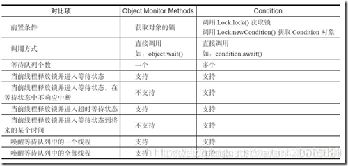

# JUC


## JUC概述

### 相关概念

* 线程
  
    操作系统能够进行运算调度的最小单位

* 进程
  
    一个运行中的程序的集合，一个进程至少包含一个线程

* Java默认2个线程：main线程和gc线程

* 并发

    多线程操作同一个资源，交替执行
  
* 并行

    多个操作同时进行

* wait/sleep区别

    区别|wait|sleep
    ---|---|---
    来源|Object类|线程类
    锁的释放|释放锁|不释放锁
    使用范围|同步代码块中|任何地方

## JUC结构


### tools(工具类)

信号量三组工具类

### executor(执行者)

Java线程池的顶级接口，此处只是一个执行线程的工具。真正的线程池接口是ExecutorService

### atomic(原子性包)

JDK提供的一组原子操作类

### locks(锁包)

JDK提供的锁机制

### collections类

主要提供线程安全的集合

## Lock锁

Lock接口


Lock实现类


### 传统synchronized

Java中的关键字，是一种同步锁。修饰对象：

1. 代码块

    被修饰的代码块称为同步语句块

    作用范围：大括号{}括起来的代码，作用对象是调用这个代码块的对象

    范例：synchronized (obj) {// 作用范围}
   
2. 方法

    被修饰的方法称为同步方法

    作用范围：整个方法，作用对象是调用这个方法的对象

    范例：public synchronized void transfer() {// 作用范围}
   
3. 静态方法

    作用范围：整个静态方法，作用对象是这个类的所有对象
   
4. 类

    作用范围：synchronized后面括号括起来的部分(内部方法看如何定义而定)，作用对象是这个类的所有对象

### ReentrantLock构造器

```java
public ReentrantLock() {
    sync = new NonfairSync(); //无参默认非公平锁
}
public ReentrantLock(boolean fair) {
    sync = fair ? new FairSync() : new NonfairSync();//传参为true为公平锁
}
```

#### 公平锁

十分公平，可以先来后到，一定要排队

#### 非公平锁

十分不公平，可以插队(默认)

#### synchronized和Lock区别

区别|synchronized|Lock
---|---|---
来源|内置Java关键字|Java类
锁状态|无法判断获取锁的状态|可判断是否获取到了锁
锁释放|自动释放|手动释放(不释放产生死锁)
等待|线程1(获得锁，阻塞)线程2(等待)|不一定等待下去
其他|可重入/不可中断/非公平|可重入/不可中断/非公平(可自己设置)
场景|适合锁少量的代码同步问题|适合锁大量的同步代码，性能高

#### Condition

精准的通知和唤醒线程，依赖于Lock接口的接口，基本方法await()和signal()

生成Condition：lock.Condition()

调用Condition的await和signal方法必须在lock保护之内，即lock.lock和lock.unlock之间

Condition方法和Object方法

* Condition.await()，对应Object.wait()

* Condition.signal()，对应Object.notify()

* Condition.signalAll()，对应Object.notifyAll()

    

## collections

### list

list不安全

#### ArrayList解决方案

1. 使用Vector
   
2. List<String> l = Collections.synchronizedList(new ArrayList());
   
3. List<String> l = new CopyOnWriteArrayList<>();// 写复制

    原理：

    1. 容器添加元素时，当前容器Object[]进行copy到新容器Object[] newElements
       
    2. 新容器里添加元素
    
    3. 原容器引用指向新容器(并发时读不需加锁/当前容器不会添加元素)

使用场景

    Vector:
    synchronizedList:
    CopyOnWriteArrayList:读多写少(白名单、黑名单、商品类目的访问和更新场景)，集合不大
                         底层使用可重入锁：synchronized和lock区别

### set

set不安全

#### HashSet底层

```java
public HashSet() {
    map = new HashMap<>();
}

// add 的本质就是 map 的 key key是无法重复的
public boolean add(E e) {
    return map.put(e, PRESENT)==null;
}
private static final Object PRESENT = new Object();//这是一个不变的值
```

#### HashSet解决方案

1. Set<String> set = Collections.synchronizeSet(new HashSet<>())

2. Set<String> set = new CopyOnWriteArraySet(new HashSet<>());

#### HashMap不安全

多线程HashMap扩容时产生环，后续get相应元素会产生异常

HashMap死循环常用解决方案

* 使用线程安全容器ConcurrentHashMap替代(推荐使用)
  
* 使用线程安全容器Hashtable替代(性能低，不建议使用)
  
* 使用synchronized或Lock加锁HashMap之后再进行操作，相当于多线程排队(麻烦，不建议使用)

## executors(执行者)

### Callable


## 辅助类

### CountDownLatch

    当计数到达零，所有等待线程被释放，后续的await调用立即返回


### CyclicBarrier

    线程相互等待(await)，直到到达共同屏障点(barrier)
    即阻塞线程数(调用await)=parties(新建对象指定的线程数)
    期间线程状态可共享


### Semaphore

多个共享资源互斥使用，可并发限流、控制最大线程数

