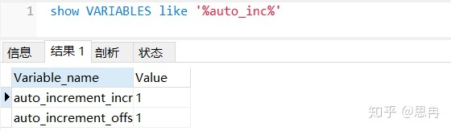
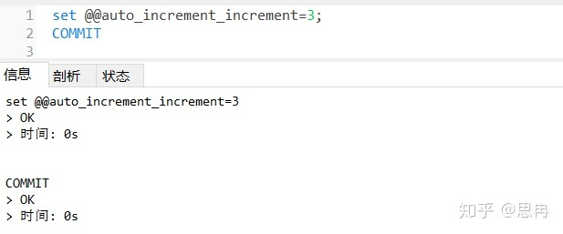
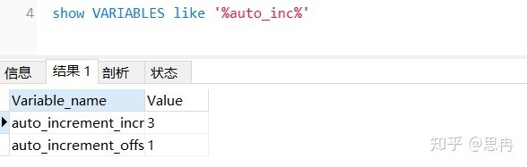
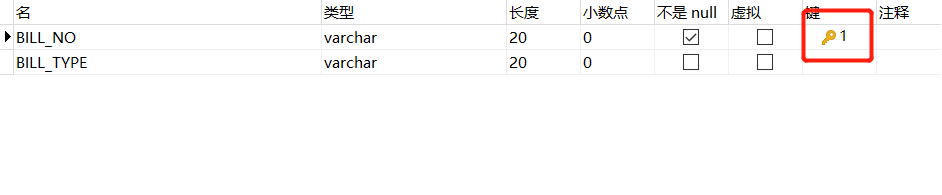
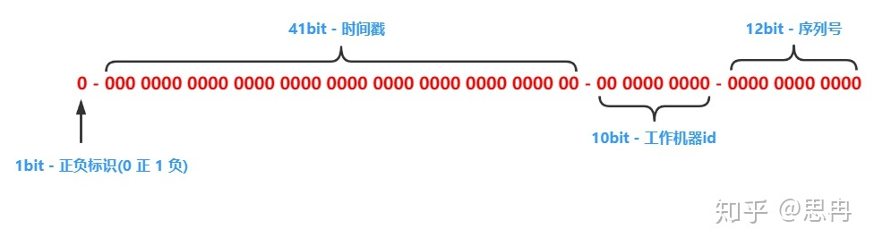
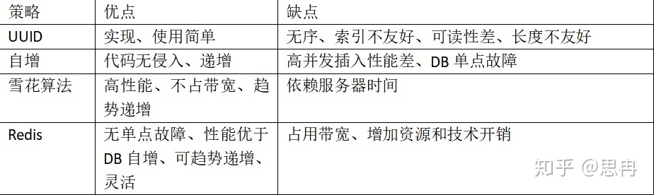

## 高并发下生成订单号

高并发下生成唯一订单号

* UUID

* 数据库自增+存储过程

* 雪花算法

* Redis

* 时间(精确到毫秒)+随机数

### UUID(使用最广最多)

用来生成唯一的标识码，由32位的16进制数字构成，保证在同一时空之中所有机器都是唯一的

*  组成部分

    * 当前的时间和日期
    
    * 时钟序列
    
    * 全局唯一的IEEE机器识别号码
      
        * 若有网卡，从网卡的MAC地址获取
    
        * 没有网卡，别的方式获取
    
* 优缺点

    * 取简单，使用简单
    
    * 可读性差、长度不友好、无序

### 数据库实现

1. 字段自增

    * 自增原理，两个变量

        * 起始位：auto_increment_increment
          
        * 偏移量：auto_increment_offset
        
            
    
    * 设置使用set语法
    
        
    
        
        
    * 优缺点
    
        * 无需编码、性能一般(比UUID略慢)、索引支持有好
    
        * 高并发插入性能低
    
2. 存储过程

    存储过程：生成订单号
    
    表：处理唯一性问题

    1. 建表并设置订单号字段为主键（唯一订单号的关键）
    
        
    
    2. 创建生成订编号的存储过程
    
        ```sql
        -- 1. 创建存储过程
        --    输入为BILL_TYPE（前缀）,输出为BILL_NOP（订单编号）
        CREATE DEFINER = CURRENT_USER PROCEDURE `getbillno`(in BILL_TYPE VARCHAR(3), out BILL_NOP varchar(25))
        BEGIN
            -- 2. 生成年月日和后缀
            --    年月日为当前系统时间，后缀初始值为0
            DECLARE currentDate varCHAR (15);
            DECLARE lastno INT DEFAULT 0;
            SELECT DATE_FORMAT(NOW(), '%Y%m%d') INTO currentDate;
        
            -- 3. 查询表格，获取表格的订单编号
            --    查询表格，获取前缀与自定义内容相关的最新一个订单编号
            SELECT IFNULL(BILL_NO, 'notnull') INTO BILL_NOP
            FROM temp_bill
            WHERE SUBSTRING(BILL_NO, 1, 3) = BILL_TYPE and
                SUBSTRING(BILL_NO, 4, 8) = currentDate
            ORDER BY BILL_NO DESC LIMIT 1;
        
            -- 4. 生成订单号
            --    如果上一步获取的订单编号不为空，新生成的订单号在原订单号上+1
            --    如果上一步获取的订单号为空，新生成的订单号后缀为001
            IF BILL_NOP !='' THEN
                SET lastno = CONVERT(SUBSTRING(BILL_NOP, -3), DECIMAL) ;
                SELECT 
                       CONCAT(BILL_TYPE, currentDate, LPAD((lastno + 1), 3, '0'))
                INTO BILL_NOP;
            ELSE
                SELECT
                       CONCAT(BILL_TYPE, currentDate, LPAD((lastno + 1), 3, '0'))
                INTO BILL_NOP;
            END IF;
            
            -- 5. 将订单号插入表中
            --    如果表中存在相同订单号则插入表失败
            --    如果表中不存在相同订单号则插入表成功
            INSERT INTO temp_bill (BILL_NO, BILL_TYPE) VALUES (BILL_NOP,BILL_TYPE) ;
            
            -- 6. 返回唯一订单号
            --    当订单插入表成功，即可返回唯一的订单编号（如果上一步不成功，即不会运行这一步）
            SELECT BILL_NOP;
        ```

### 雪花算法

snowflake算法是Twitter开源的分布式ID生成算法，结果是一个long长整型的ID。结构如下：



    1.第一位末使用，固定为0，表示正数。
    2、接下来的41位为毫秒级时间，41位的长度可以使用69年。
    3、然后是10位节点ID，最多支持部署1024个节点（一般是数据中心编号和机器编号组成）。
    4、最后12位是毫秒内单位的算法调用计数（意味着每个节点每毫秒产生4096个ID序号）。

上面4部分组合起来就是64比特位= 8字节=Long类型（转换为整数最多19位）。

* 优点

      [1] 高性能高可用：生成时不依赖于数据库，完全在内存中生成。
      [2] 容量大：每秒中能生成数百万的自增ID。
      [3] ID自增：存入数据库中，索引效率高。

* 缺点

      依赖与系统时间的一致性，如果系统时间被回调，或者改变，可能会造成id冲突或者重复。

### Redis实现

利用增长计数API（incr），业务系统在自增长的基础上，配合其他信息组装成一个唯一ID

譬如：业务代码+地区代码+自增数值（6+020+000000001）

* 优点

      [1] 使用比较简单。
      [2] 扩展性强，方便结合业务进行处理。
      [3] redis是单线程的，保证并发不会出现重复。

* 缺点

      [1] 引入带三方依赖和库。
      [2] 每获取一次ID增加一次网络开销。
      [3] reids需要高可用，增加了成本。

### 比较

