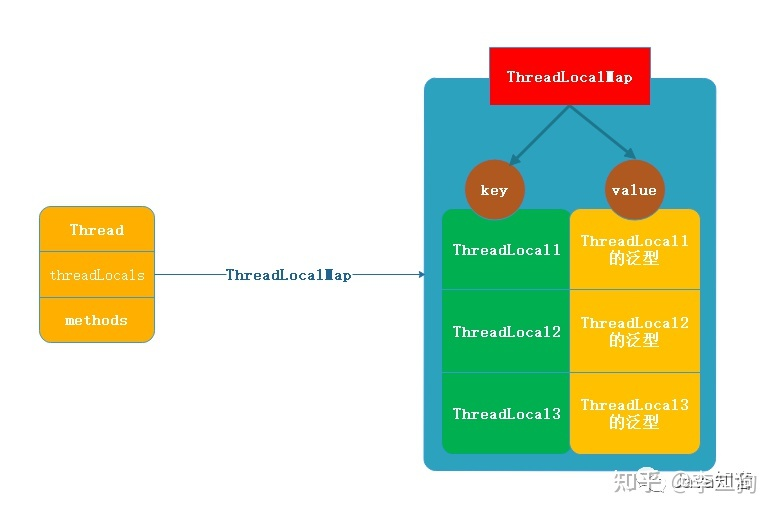
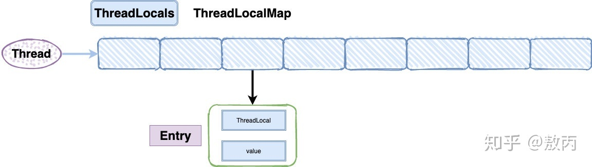
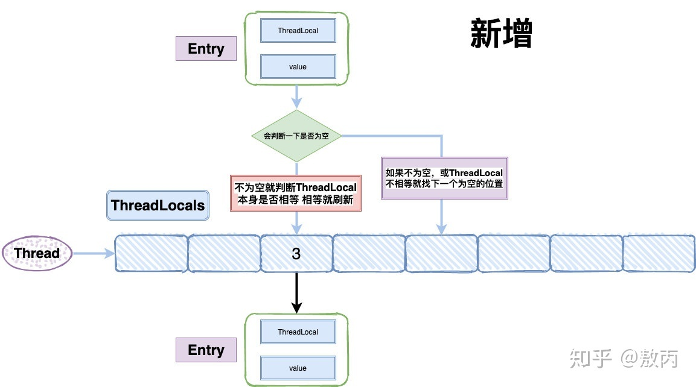
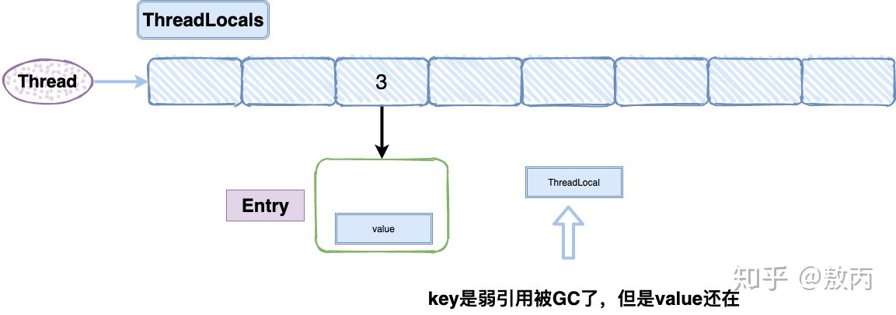

## ThreadLocal

### 作用

ThreadLocal叫做线程变量，ThreadLocal中填充的数据只属于当前线程，变量的数据对别的线程而言是相对隔离的。
ThreadLocal为变量在每个线程中都创建了一个副本，每个线程都可以访问自己内部的副本变量

多线程环境下，可以防止自己的变量被其他线程篡改

### 使用场景

Spring实现事务隔离级别

1. 在进行对象跨层传递的时候，使用ThreadLocal可以避免多次传递，打破层次间的约束

2. 线程间数据隔离

3. 进行事务操作，用于存储线程事务信息

4. 数据库连接，Session会话管理

    ```java
    class ConnectionManager {
    private static Connection connect = null;
    //private static ThreadLocal<Connection> connect = new ThreadLocal<>();
    // 建立连接
    public static Connection openConnection() {
        if(connect == null){
            connect = DriverManager.getConnection();
        }
        return connect;
    }
    // 关闭连接
    public static void closeConnection() {
        if (connect != null)
            connect.close();
        }
    }
    ```

    * 问题1：如果客户频繁使用数据库，需要多次建立和关闭连接
    * 问题2：如果有上万个客户，服务器压力会很大
    * 解决：使用ThreadLocal在每个线程中创建一个副本，线程内部任何地方都可以使用

### 原理



1. 每个线程包含一个ThreadLocalMap类型的成员变量(的引用)

2. ThreadLocalMap为ThreadLocal的静态内部类，用Entry节点(数组)进行存储

3. ThreadLocalMap结构：

   * key：ThreadLocal对象
     
   * value：set值
   
3. ThreadLocal创建的副本存储在threadLocals中，即自己的ThreadLocalMap

4. 每个ThreadLocalMap可以有多个threadLocal变量

### 数据结构



1. 底层使用数组实现ThreadLocalMap

   1. 为什么不用Entry对象
      
      1. 一个线程可以有多个ThreadLocal来存放不同类型的对象，ThreadLocalMap只有一个，所以使用数组
   
2. 哈希冲突

   1. 每个key(ThreadLocal)对象的hash值定位到槽，再进行判断

      
   
   2. 探测法解决哈希冲突(HashMap使用拉链法+红黑树)

### 内存泄漏

#### key

1. key因为是弱引用，会被GC，故key不会产生内存泄漏

#### value

1. Entry的key(ThreadLocal对象)是弱引用，会被GC扫描时回收掉

2. 如果创建ThreadLocal的线程一直持续运行，则Entry中value可能一直无法回收，产生内存泄漏

   ※ 只有弱引用的对象来说，只要GC则被回收，不管内存充不充足

3.  可达性分析：

      1. Thread->ThreadLocalMap->Entry(key为null)->value

      2. value和Thread存在链路，可达，不会被回收

4. 解决方式：

   使用完之后对值进行remove，即try {set} finally { remove}

   

### 为什么key要设置成弱引用

不设置成弱引用，忘记remove时则key无法回收

### 存储区域

ThreadLocal实例是对象，所以还是存储在堆上，JVM通过一些技巧使其线程可见(除非InheritableThreadLocal)

### InheritableThreadLocal

主线程创建InheritableThreadLocal实例，子线程获取该实例的值，实现多线程共享ThreadLocal数据

### ThreadLocal对象不一定线程安全

如果每个线程中ThreadLocal.set()进去的东西本来就是多线程共享的同一个对象，如static对象，并发访问线程不安全

### 代码分析

```java
public class TestThreadLocalNpe {
    private static ThreadLocal<Long> threadLocal = new ThreadLocal();

    public static void set() {
        threadLocal.set(1L);
    }

    public static long get() {
        return threadLocal.get();
    }

    public static void main(String[] args) throws InterruptedException {
        new Thread(() -> {
            set();
            System.out.println(get());
        }).start();
        // 目的就是为了让子线程先运行完
        Thread.sleep(100);
        System.out.println(get());
    }
}

// 代码输出：
// 主线程不能获取子线程设置的值，故1是子线程的输出
1
// 主线程执行时，threadLocal.get()返回泛型T对象null，而get()方法
// 的返回值为long，此处发生强制类型转换，即Long->long: null.longValue()
// 故产生下列错误
Exception in thread "main" java.lang.NullPointerException
at com.chentongwei.study.thread.TestThreadLocalNpe.get(TestThreadLocalNpe.java:16)
at com.chentongwei.study.thread.TestThreadLocalNpe.main(TestThreadLocalNpe.java:26)
```
