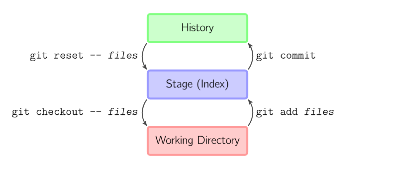
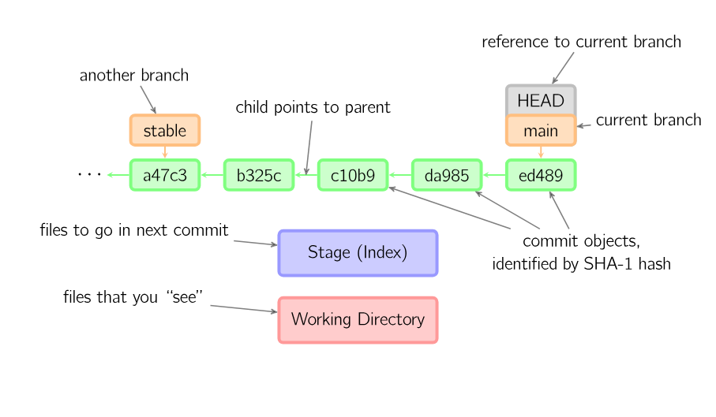
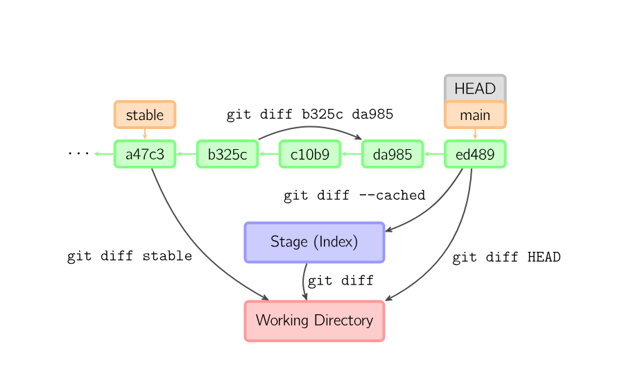

## GitHub常见命令

### 删除.idea文件夹

1. 将.idea加入gitignore清单

   echo .idea >> .gitignore

2. 删除idea缓存

   git rm --cached -r .idea
3. 将.gitignore加入git

   git add .gitignore
4. 提交.gitignore，并将.idea从(git上)源代码中删除

   git commit -m "gitignore commit"

5. push

   git push origin master

### 基本用法

#### 仓库：History
#### 暂存目录/索引：Stage（Index）
#### 工作目录：Working Directory

### 命令

* git add files

   把当前文件放入暂存区域
* git commit

   给暂存区域生成快照并提交
*  git reset -- files

   用来撤销最后一次git add files
* git reset

   撤销所有暂存区域文件
* git checkout -- files

   把文件从暂存区域复制到工作目录，用来丢弃本地修改
* 交互模式

   * git reset -p
   * git checkout -p
   * git add -p

#### 跳过暂存区域

* git commit -a

  1. 当前目录下所有文件添加到暂存区域并生成快照
  2. 提交
* git commit files

  1. files文件添加到暂存区域并生成快照
  2. 提交：files+最后一次git add对象
* git checkout HEAD --files：回滚到复制最后一次提交

  1. 撤销快照
  2. 最后一次暂存区的提交复制到工作目录，丢弃本地修改

### 约定

* 绿色5位字符：提交ID，指向父节点
* 橘色：分支，指向特定的提交
* 当前分支：由附在分支上的HEAD表示
* 当前版本最新提交：ed489，main节点指向此次提交

### 命令详解

* Diff:查看两次提交之间的变动

   
