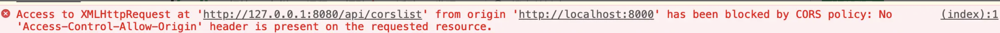
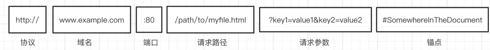
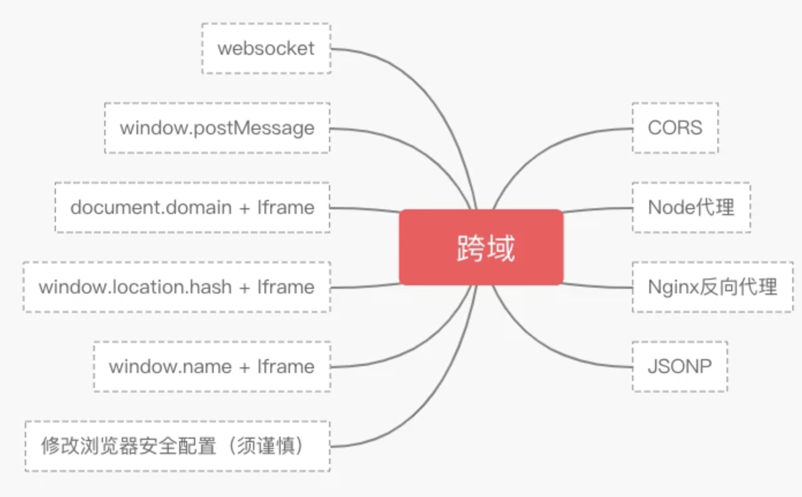

## 跨域

### 定义

跨域问题其实就是浏览器的同源策略所导致的

* 同源策略

    一个重要的安全策略，用于限制一个origin的文档或者它加载的脚本如何能与另一个源的资源进行交互。能帮助阻挡恶意文档，减少可能被攻击的媒介
  
    
  
### 同源

协议、域名、端口一致

如

```html
// 同源
http://www.example.com:80/a.js
http://www.example.com:80/b.js
// 默认http端口可以省略80，https省略443
http://www.example.com:80
http://www.example.com
https://www.example.com:443
https://www.example.com
// 不同源
http://www.example.com:8080
http://www2.example.com:80
```

* URL组成

```html
http://www.example.com:80/path/to/myfile.html?key1=value1&key2=value2#SomewhereInTheDocument
```


### 解决跨域



#### CORS

跨域资源共享，支持所有的HTTP请求

* 简单请求

  使用GET、POST、HEAD方法
  
* 复杂请求

  上述方法以外

#### Nginx反向代理

#### JSONP

  只支持GET请求

#### Websocket

#### SpringMVC实现

1.  SpringBoot注解@CrossOrigin

2. 配置方式

  1. CorsConfiguration

3. Filter过滤器，配置CORS规则


