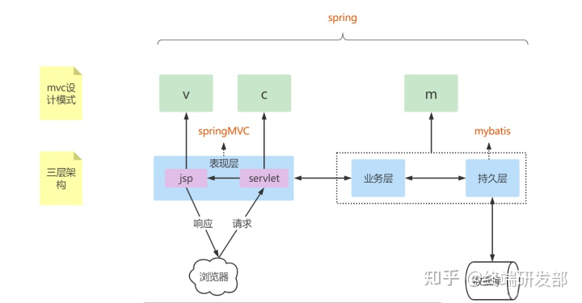

## JavaWeb、Spring家族区别

### JavaWeb：单体架构

B/S：Browser/Server

Web开发三大组件：Servlet、Filter、Listener

Web开发相关技术

1. JDBC

    一个用Java语言去访问数据库的技术

2. Servlet

    servlet是运行在web服务器中的小型java程序(服务器端的小应用程序)

3. JSP

    * Java Server Pages即Java服务端页面，本质也是一个Servlet

    * 由html、Java代码、jsp标签组成，当servlet处理完数据后会转发给jsp，jsp负责显示数据

    * 传统单体架构JSP页面无法像html一样在浏览器直接打开，需要启动服务器，通过Servlet动态渲染成html
    
三大技术协同合作

1. 接收：Servlet接收浏览器发过来的请求

2. 处理：Servlet通过一些列业务的逻辑处理：查数据库用到JDBC

3. 响应：Servlet把解析完成的视图界面(HTML)返回给前端浏览器 -> 数据动态渲染

4. 浏览器显示给用户看，这就是JSP

    1. JSP：HTML+JAVA混写，页面在后端被解析，里面的Java代码被数据动态渲染完成后成为浏览器能看懂的HTML
    
    2. 再通过服务器发送给浏览器显示
    
缺点：

1. 前后端耦合严重

    1. HTML和JAVA混合模式导致前后端程序员必须知道一定的前后端知识
    
    2. 协同开发效率低
    
2. 服务器压力大
    
    1. 负责接收请求
    
    2. 负责查询数据库的业务逻辑处理
    
    3. 负责把页面渲染好并返回
    
### MVC：MVC架构

Model：负责处理业务，包括数据库的交互

Controller：负责接收请求，根据不同情况把请求转发给不同Model层业务组件租出

View：负责处理视图在后端服务器的渲染

对于单体架构而言：

* Servlet <--> Controller， 接收请求
* JDBC和一些业务类 <--> Model，处理业务逻辑
* JSP <--> View， 由后端把数据动态渲染后返回给浏览器前端显示

### Spring：微服务架构

简单而言，Spring就是管理对象的容器，核心组件是IOC容器

功能

* 事务管理

* 对象增强
  
* 自动化配置
  
* 异步调度

#### 其他框架

Struts： 取代原生的Servlet开发模式

* 原生Servlet：
  
    * 一个Servlet对应一个请求的处理。一百个Servlet对应一百个请求
    
    * 实现Servlet，必须继承HttpServlet类，重写doGet和doPost方法，对应get和post请求逻辑
    
    * Servlet对应的请求的映射还需在web.xml里面配置（Servlet3.0后支持@WebServlet注解配置请求映射）
    
* Struts

    * 使用一个配置文件管理所有的Servlet，称为Action，每个Action就是一个Servlet(需要继承ActionSupport)

Mybatis/Hibernate：取代原生的JDBC的ORM框架

早期SSH：Structs+Spring+Hibernate，前端还是JSP在服务器渲染

#### Spring生态圈扩展

之前请求

* 一个请求对应Structs中的一个Action，然后每个Action执行execute来处理请求

* 一个请求映射一个类的全类名

Spring做法：对请求的实现维度，从Servlet的类降低到方法

* 一个请求映射一个类的全类名+里面的一个方法的方法签名，提供@RequestMapping注解映射
    
    ```java
    // getUser方法，映射来自前端的user请求
    @RequestMapping("/user")
    public XXX getUser() {
    }
    ```

SSM框架：SpringMVC+Spring+MyBatis

1. SSM和MVC

    1. SSM指的是三个框架的整合开发SpringMVC+Spring+MyBatis
    
    2. MVC是一种思想(Model+View+Controller)，可以有多种实现
    
        Servlet+JSP+JDBC、SSH+JSP、SSM+JSP
    
    3. 在MVC思想下
    
        1. SpringMVC框架充当Controller层，用于接收和处理请求
    
            Controller包、Provider包
    
        2. Mybatis持久层和一些被Spring管理的业务类，作为Model层，负责将SpringMVC分发过来的请求，进行相应的业务处理和数据的持久化操作
    
            * Service包：业务类，使用SpringIOC管理
            * DAO包/Mapper包：使用的框架就是Mybatis、Hibernate
    
        3. JSP或者其他视图技术，作为View层
    
SSM解决的问题：

1. 服务端代码逻辑混乱：MVC思想架构可以解决

2. 各个对象难以管理(针对Servlet)：Spring的IOC统一管理

3. 原生技术开发局限性大：使用ORM等框架实现

SSM未解决的问题：

1. 后端压力大，JSP未作改变：HTML+Java混写，后端渲染后成把JSP变成一个HTML后交给前端浏览器显示

    --> 前后端分离思想产生

    传统JSP单体架构也可以通过给服务器做集群解决

2. 前后端联调困难

#### 前后端分离

* 前端

    主要负责写页面，需要动态渲染的数据则通过向后端发送请求获取，获取到后进行动态渲染

* 后端

    负责处理数据(相关CRUD操作)，然后将数据返回给前端

前后端请求、响应的数据格式：轻量级数据交换格式JSON

模板引擎：不经过后端可以直接被浏览器解析，不过有些数据没有后端的返回无法渲染。如ThymeLeaf

### Spring生态圈统一JavaWeb开发

* 传统MVC架构的SSM实现时：

    * 手动xml配置：整合第三方框架的各种配置，繁琐
    
        ```xml
        <!-- SpringMVC配置 -->
        <!-- 1.注册DispatcherServlet -->
        <servlet>
            <servlet-name>springmvc</servlet-name>
            <servlet-class>org.springframework.web.servlet.DispatcherServlet</servlet-class>
            <!--关联一个springmvc的配置文件：【servlet-name】-servlet.xml-->
            <init-param>
                <param-name>contextConfigLocation</param-name>
                <param-value>classpath:springmvc-servlet.xml</param-value>
            </init-param>
            <!--启动级别-1-->
            <load-on-startup>1</load-on-startup>
        </servlet>
        
        <!--/ 匹配所有的请求:(不包括.jsp) -->
        <!--/* 匹配所有的请求:(包括.jsp) -->
        <servlet-mapping>
            <servlet-name>springmvc</servlet-name>
            <url-pattern>/</url-pattern>
        </servlet-mapping>
        <!--过滤器-->
        <filter>
            <filter-name>encoding</filter-name>
            <filter-class>org.springframework.web.filter.CharacterEncodingFilter</filter-class>
            <init-param>
                <param-name>encoding</param-name>
                <param-value>utf-8</param-value>
            </init-param>
        </filter>
        <filter-mapping>
            <filter-name>encoding</filter-name>
            <url-pattern>/*</url-pattern>
        </filter-mapping>
        
        <!--mvc拦截器配置-->
        <mvc:interceptors>
            <mvc:interceptor>
                <mvc:mapping path="/**"/>
                <bean class="com.xxx.config.MyInterceptor"/>
            </mvc:interceptor>
        </mvc:interceptors>
        
        <!--Spring整合SpringMVC-->
        <!--自动扫描包，让指定包下的注解生效，由IOC容器统一管理-->
        <context:component-scan base-package="nuc.ss.controller"/>
        <!--让SpringMVC不处理静态资源-->
        <mvc:default-servlet-handler />
        
        <!--注解驱动，以使得访问路径与方法的匹配可以通过注解配置-->
        <mvc:annotation-driven/>
        
        <!--乱码过滤器-->
        <mvc:annotation-driven>
            <mvc:message-converters>
                <bean class="org.springframework.http.converter.StringHttpMessageConverter">
                    <constructor-arg value="UTF-8"/>
                </bean>
                <bean class="org.springframework.http.converter.json.MappingJackson2HttpMessageConverter">
                    <property name="objectMapper">
                        <bean class="org.springframework.http.converter.json.Jackson2ObjectMapperFactoryBean">
                            <property name="failOnEmptyBeans" value="false"/>
                        </bean>
                    </property>
                </bean>
            </mvc:message-converters>
        </mvc:annotation-driven>
        
        <!--json乱码解决-->
        <mvc:annotation-driven>
            <mvc:message-converters register-defaults="true">
                <bean class="org.springframework.http.converter.StringHttpMessageConverter">
                    <constructor-arg value="UTF-8"/>
                </bean>
                <bean class="org.springframework.http.converter.json.MappingJackson2HttpMessageConverter">
                    <property name="objectMapper">
                        <bean class="org.springframework.http.converter.json.Jackson2ObjectMapperFactoryBean">
                            <property name="failOnEmptyBeans" value="false"/>
                        </bean>
                    </property>
                </bean>
            </mvc:message-converters>
        </mvc:annotation-driven>
        
        <!--视图解析器-->
        <bean class="org.springframework.web.servlet.view.InternalResourceViewResolver" id="internalResourceViewResolver">
            <property name="prefix" value="/WEB-INF/jsp/"/>
            <property name="suffix" value=".jsp"/>
        </bean>
        <!--文件上传配置-->
        <bean id="multipartResolver" class="org.springframework.werb.multipart.commons.CommonsMultipartResolver">
            <!--请求的编码格式，必须和jsp的pageEncoding属性一致，以便正确读取表单的内容，默认为ISO-8859-1-->
            <property name="defaultEncoding" value="utf-8"/>
            <!--文件上传大小上限，单位为字节(10485760=10M)-->
            <property name="maxUploadSize" value="10486760"/>
            <property name="maxInMemorySize" value="40960"/>
        </bean>
        
        <!--Mybatis配置-->
        <?xml version="1.0" encoding="UTF-8" ?>
        <!DOCTYPE configuration
            PUBLIC "-//mybatis.org//DTD Config 3.0/EN"
            "http://mybatis.org/dtd/mybatis-3-config.dtd">
        <configuration>
            <environments default="development">
                <environment id=""development>
                    <transactionManager type="JDBC"/>
                    <dataSource type="POOLED">
                        <property name="driver" value="${driver}"/>
                        <property name="url" value="${url}"/>
                        <property name="username" value="${username}"/>
                        <property name="password" value="${password}"/>
                    </dataSource>
                </environment>
            </environments>
            <mappers>
                <mapper resource="org/mybatis/example/BlogMapper.xml"/>
            </mappers>
        </configuration>
        <!---->
        ```
    
* Spring约定配置:约定大于配置

    * 给出一个默认的配置，按照公约，自动把核心组件的对象加入IOC当中
    
    * 自定义修改公约配置可覆盖原来的公约配置
    
        * 外部提供一个固定的配置文件，如application.yml、application.properties
    
### SpringBoot

基于Spring，简化了Spring与其他框架整合的难度，核心思想：约定大于配置

SpringBoot把很多场景都抽象为启动器starter，想使用某个场景如Web场景只需导入对应的maven依赖即可；一切都是自动配置好的，也就是约定大于配置

* 可提供自定义配置文件application.yml(properties)
* 支持多环境profile，可通过Dspring.profiles.active指定使用某个环境配置
  
    * application-dev作为开发环境配置
    * application-test作为测试环境配置
    * application-pro作为生产环境配置
* 导入starter后，Spring默认去初始化一些该框架的核心功能的组件作为bean，然后加入如IOC中

相关Starter：

* 定时调度功能：spring-boot-stater-quartz
* 入参校验：spring-boot-starter-validation
* 单元测试：spring-boot-starter-test
* 阿里数据库连接池：druid-spring-boot-starter
* MybatisPlus框架：mybatis-plus-boot-starter
* 缓存Redis：spring-boot-starter-data-redis
* WebSocket服务：spring-boot-starter-websocket

### Spring、SpringMVC、SpringBoot、SpringCloud区别

* Spring是一个引擎，一个对象管理容器，核心组件是IOC容器，提供基础功能

    核心技术

    * 依赖注入DI
    * AOP
    * 事件Events
    * 资源
    * i18n
    * 验证
    * 数据绑定
    * 类型转换
    * SpEL

* SpringMVC是基于Spring的一个MVC框架，相当于单体架构下的Servlet，底层DispatcherServlet实现

* SpringBoot是基于Spring4的一套快速开发整合包，简化了Spring与其他框架整合的难度，核心思想：约定大于配置

* SpringCloud是基于SpringBoot搭建的分布式微服务系统解决方案

    

1. Spring和SpringMVC区别

    Spring是IOC和AOP的容器框架，SpringMVC是基于Spring功能之上添加的Web框架

2. SpringBoot和SpringMVC区别

    SpringMVC是Spring的一个模块，一个web框架


