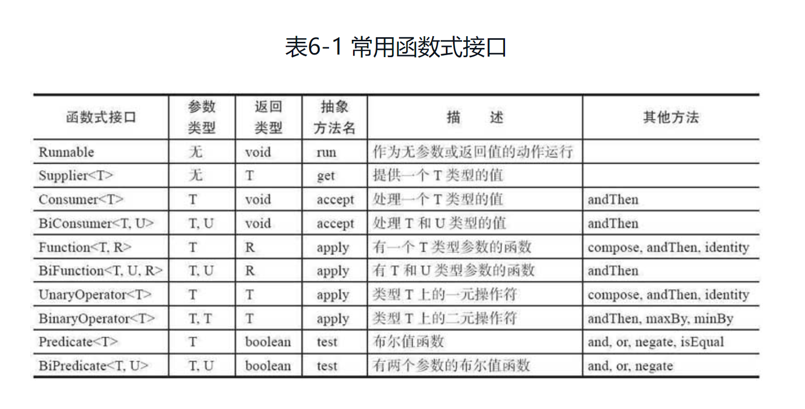
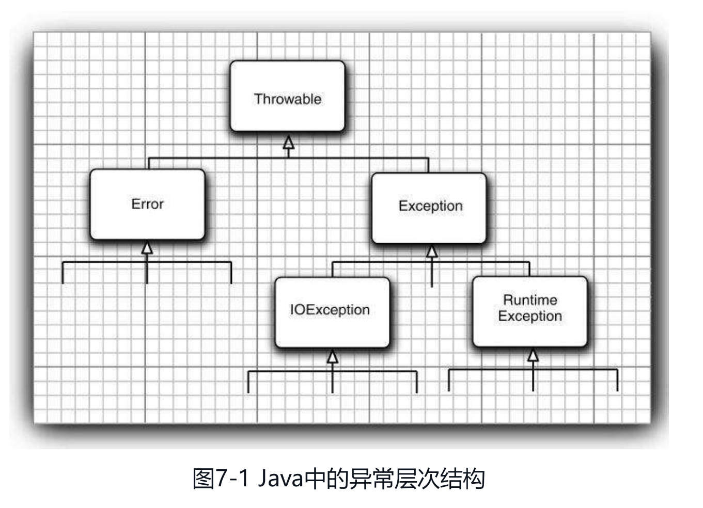
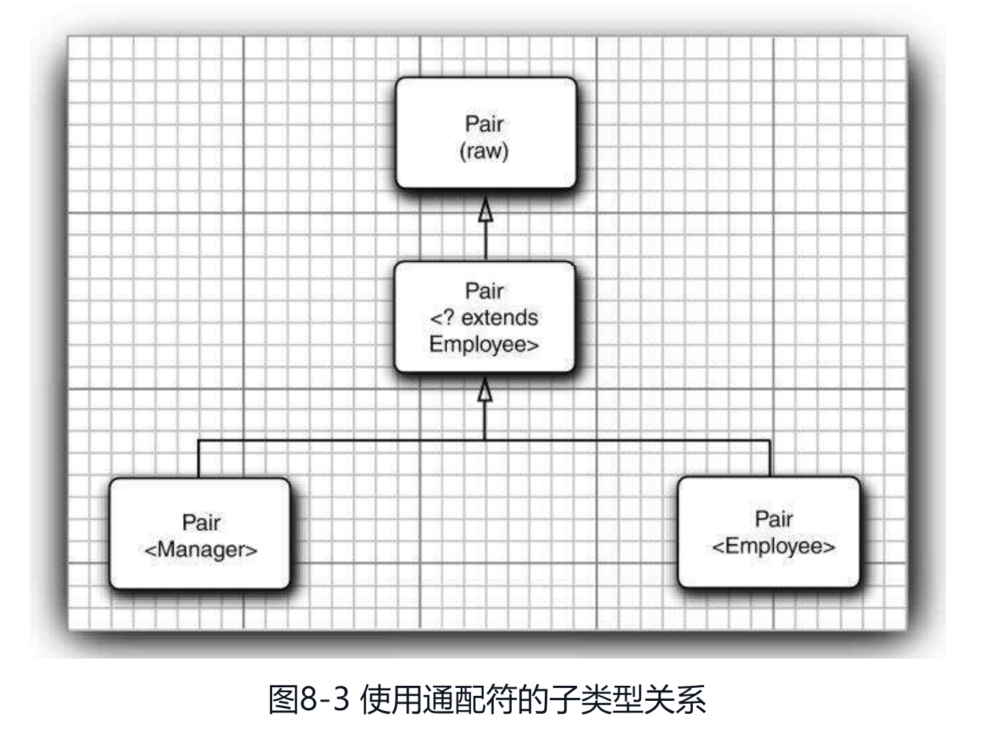
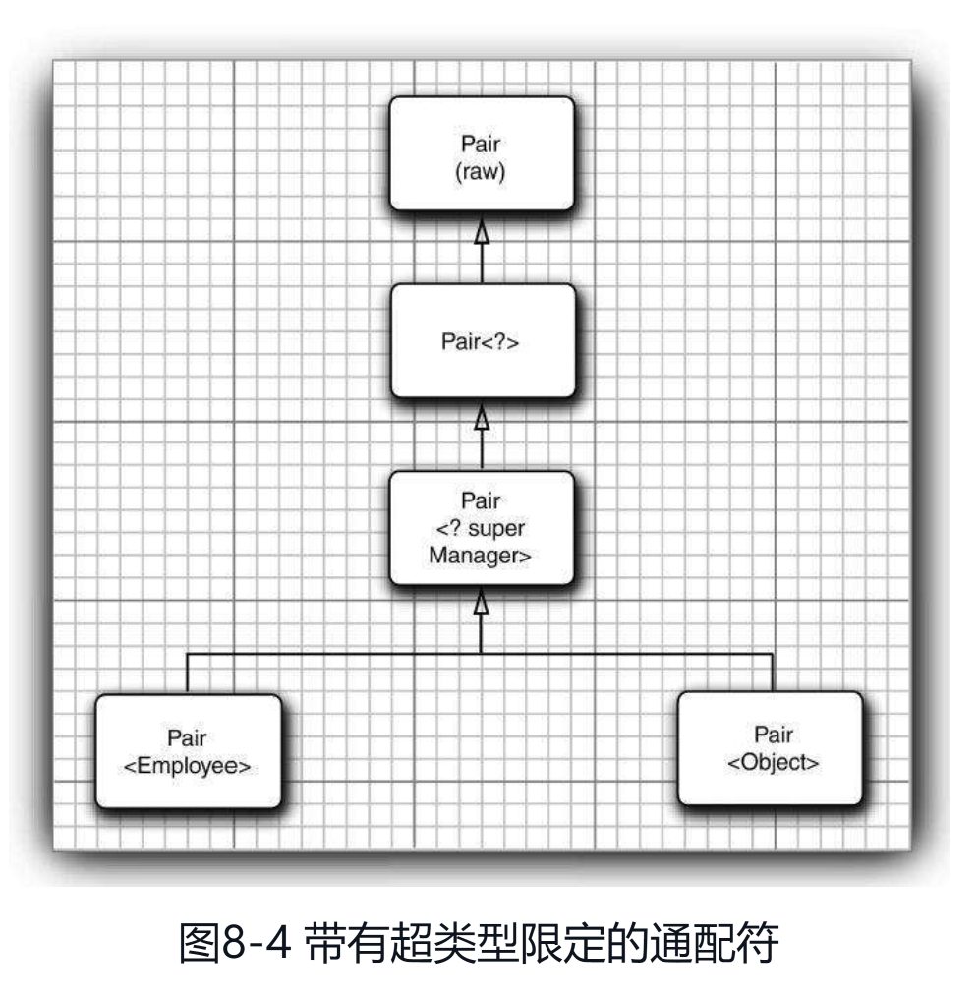
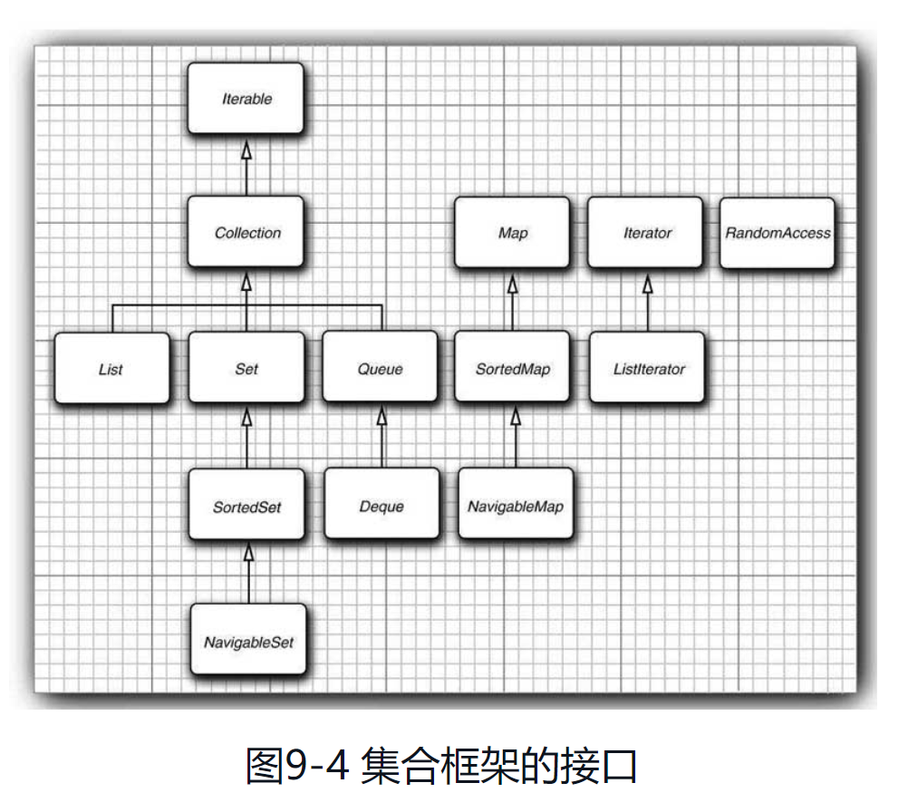
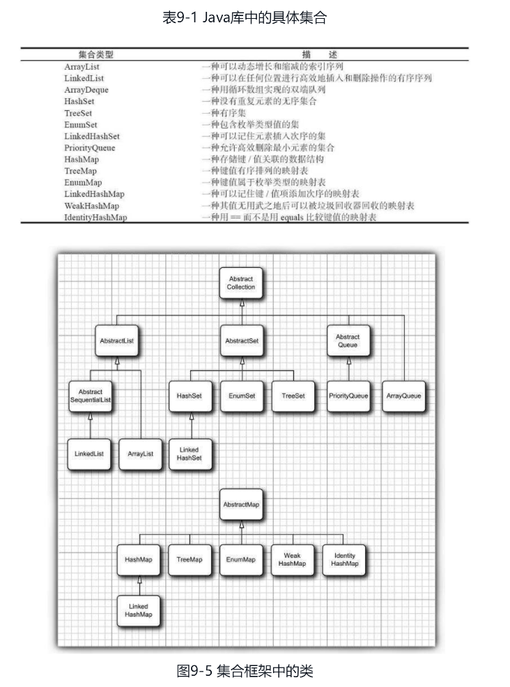
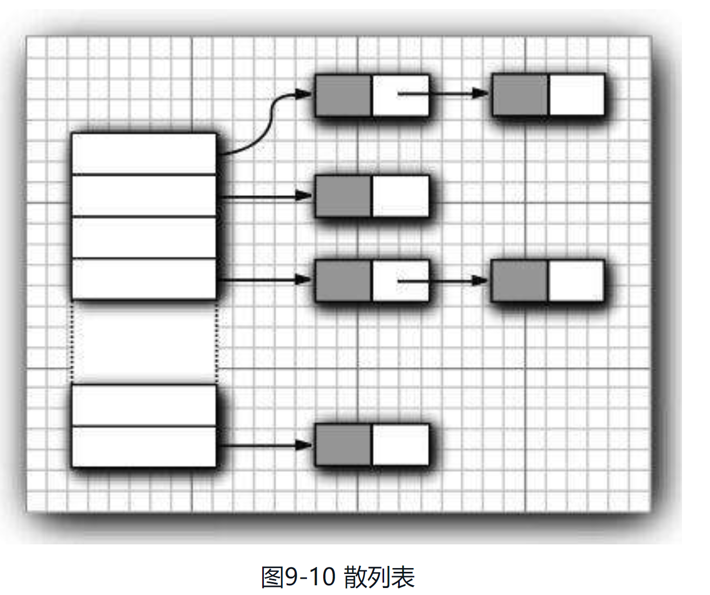

### 基本类型：

8种基本类型：4种整形，2种浮点型，1种字符类型char，1种布尔类型

*1. 整形*

* byte：1字节
* short：2字节
* int：4字节
* long：8字节

*2. 浮点型*

* float：4字节
* double：8字节

*3. 字符类型*

* char：2字节（16bit）

### 浮点数

使用严格的浮点计算

```java

public class Test() {
    public static strictfp void main(String[] args) {
        System.out.println("use strict float computable standard to evaluate");
    }
}
```

### 修饰符access modifier

* public：对所有类可见
* private：仅对本类可见（子类也不能访问超类的私有域/方法）
* protected：对包和所有子类可见
* 默认：对包可见（不需修饰符）

### 基础概念

* 隐式参数（implicit）：出现在方法名前的类对象，亦即方法调用的目标或者接收者
* 静态域（所有对象共有）：private static int nextId;
* 域常量（只能初始化一次）：private final int id;
* 静态常量：public static final double PI = 3.14;
* 静态方法：一种不能向对象实施操作的方法，也就是说没有隐藏参数(this参数)。如：Math.pow(x, a)
    * 静态方法不能访问实例域， 但是可以访问静态域。
* 静态方法适用：
    * 一个方法不需要访问对象状态，其所需参数都是通过显示参数提供（如Math.pow）
    * 一个方法只需要访问类的静态域
* 方法参数：
    * 一个方法不能修改一个基本数据类型的参数（即数值型或布尔型）
    * 一个方法可以改变一个对象参数的状态

### 空字符串check

1. 空串1

```java
public class Test() {
    public boolean strCompare(String str) {
        if (str.length() == 0) {
            return true;
        }
    }
}
```

2. 空串2

```java
public class Test() {
    public boolean strCompare(String str) {
        if ("".equals(str)) {
            return true;
        }
    }
}
```

3. 字符串null

```java
   public class Test() {
    public boolean strCompare(String str) {
        if (str == null) {
            return true;
        }
    }
}
```

4. 字符串既不是null也不是空串(null字符串上调用length会出错)

```java
 public class Test() {
    public boolean strCompare(String str) {
        if (str != null && str.length() != 0) {
            return true;
        }
    }
}
```

5. 使用StringUtils工具类

```java
import org.apache.commons.lang3;

public class Test() {
    public boolean strCompare(String str) {
        if (StringUtils.isNotBlank(str)) {
            return true;
        }
    }
}
```

### 辅助字符单元

遍历辅助字符单元

    int cp = sentence.codePointAt(i);
    if (Character.isSupplementaryCodePoint(cp)) {
        i += 2;
    } else {
        i++;
    }

系统时间

    System.out.printf("%1$s %2$tB %2$td, %2$tY\n", "current date: ", new Date());

    System.out.printf("%s %tB %<te, %<tY\n", "current date: ", new Date());

匿名数组

    new int[] {1, 2, 3}

对象变量：

* 一个对象变量并没有包含一个对象，而仅仅引用一个对象(如超类对象变量)

* 任何对象变量的值都是对存储在另外一个地方对多对象的引用

**static变量**

* 属于类不属于对象，且类的所有实例共享该变量

**静态常量**

* static final

* 调用：类.静态常量

**静态常量:**

＊ final

＊ 每一个类对象都有一份该常量的拷贝

**静态方法**

* 属于类且不属于对象

* 不能在静态方法中访问实例域，但可访问自身类中的静态域

* 调用：

1. 类名.方法

2. 对象.方法(容易混淆)

   Class Employee() { // static variable private static int nextID = 1; private int ID;

        // set ID
        public void setID() {
            id = nextID;
            nextID++;
        }

        // get ID
        public static int getNextID() ｛
            return nextID;
        ｝

   }

   // 访问静态变量 // harry.setID(); // -->
   // harry.ID = Employee.nextID; // Employee.nextID++;

   // 访问静态方法 int n = Employee.getNextID(); int n = harry.getNextID();

**使用范围**

* 方法不需要访问对象状态，所需参数可通过显式参数提供: Math.pow(a,b);

* 方法只需要访问类的静态域: Employee.getNextID();

**多态**

一个变量可以指示多种类型的现象(多用于继承后的子类方法)

**动态绑定**

在运行时能够自动地选择调用哪个方法的现象

**静态绑定**

如果是private方法，static方法，final方法或者构造器，编译器可以准确确定应该调用哪个方法，称静态绑定

与此对应的是,调用的方法依赖于隐式参数的实际类型，并且在运行时实现动态绑定

**内联**

    如果一个方法没有被覆盖且很短，边一起可以对其进行优化处理，这个过程称为内联

**散列码**

    由对象导出的一个整形数值

* (字符串)String类型的散列码由字符串内容导出
* StringBuilder(StringBuffer)类没有自定义的hashCode方法，其散列码由Object类的默认hasCode方法导出对象的存储地址

**关键字super**

* 当前对象父类的引用

* 调用父类的构造器

* 调用父类的方法

**关键字this**

* 当前对象的引用，指示隐式参数，也就是被构造的对象

        public Employee(String s, double n) {
            this.salary = n
            ...
        }

* 调用本类的另一个构造器

        public Employee(double n) {
            this("#Employee: " + nextID, n);
            nextID++;
            ...
        }

* 调用本类及父类的方法

**检测对象相等**

	public Employee(Object otherObject) {
		...
	}

1. 检测objects是否相等

   if (this == otherObject)

2. 检测显式参数是否为null

   if (otherObject == null) return false;

3. 检测class是否相等

* 比较this于otherObject是否属于同一个类。如果equals的语义在每个子类中有所改变，用getClass检测

  if (getClass != otherObject.getClass()) return false;

* 如果所有子类拥有统一的语义，使用instanceof检测

  if (!(otherObject instanceof Employee)) return false;


4. type conversion

   Employee other = (Employee)otherObject;

5. 检测域是否相等

* 使用＝＝比较基本类型，使用equals比较对象

* == 比较引用类型时，比较的是地址，当且仅当两个应用变量对象只想同一个对象时才返回true

  return Objects.equals(name, other.name)
  && (salary == other.salary)
  && (Objects.equals(hireDay, other.hireDay)); // 超类为Object的类对象用超类的equals // 基本类型直接用＝＝ // name.equals(other.name); if
  case of both fields are null

6. 如果子类中重新定义euqlas，要在其中包含调用super.equals(other)

**子类定义equals方法**

* 先比较超类是否相等

* 类型转换

* 比较子类域是否相等

  class Manger extends Employee { ... public boolean equals(Object otherObject) { if (!super.equals(otherObject)) {
  return false; } // type conversion Manger other = (Manger)otherObject; return bonus == other.bonus; } }


* 只要对象与一个字符串操作符“＋”连接起来，Java编译就会自动地调用toString方法， 以获取这个对象的字符串描述

  Point p = new Point(10,20); String message = "The current position is " + p; // automatically invokes p.toString()

* Object类定义的toString方法，用于发音输出对象所述的类名和散列码

  System.out.println(System.out); →java.io.PrintStream@2f684 // PrintStream，String类的设计者没有覆盖toString方法，调用的是Object类方法 //
  数组继承了object类的toString方法，将按照旧格式打印 // int[] arr = {1, 2, 4, 6}; // String s = "" + arr; →[I@1a345e0]  I: integer //
  String s = Arrays.toString(arr); →[1, 2, 4, 6]
  // 静态方法Arrays.toString

**异常**

    未检查异常：如null引用
    已检查异常：编译器会检查是否提供了处理器

**Class类方法**

* 获取类提供的pubic域、方法和构造器（包括超类的公有成员）

        getFields
        getMethods
        getConstructors

* 获取类中声明的全部域、方法和构造器（包括私有和受保护成员，不包括超类成员）

        getDeclaredFields
        getDeclaredMethods
        getDeclaredConstructors

**泛型**

类型参数化

**接口**

描述类具有什么功能，而并不给出每个功能的具体实现。 Java语言是一种强类型（strongly typed）语言，在调用方法时编译器会检查这个方法是否存在。
比如sort方法中，编译器必须确认对象拥有/实现compareTo方法（因为sort可能调用该方法进行对象比较）。 并且每个类只能扩展于一个类（即超类只能有一个），使用接口可以提高类的扩展性

*特点*

* 接口方法自动属于public，声明接口方法时不用提供public关键字
* 接口没有实例和静态方法，即不能包含实例域，接口中的方法不能引用实例域(JDK8中允许静态方法)
* 接口中可以定义常量（该常量为public static final类型）
* 可看成没有实例域的抽象类
* 不能构造接口对象（即实例化接口），可以声明接口变量，且该变量必须引用实现了该接口的类对象。抽象类同理
* JDK8新特征
    * 允许定义静态static方法和默认default方法
      ```java
        public interface JDK8Interface {
      
            // static修饰符定义静态方法
            static void static Method() {
                System.out.println("接口中的静态方法");
            }

            // default修饰符定义默认方法
            default void default Method() { 
                System.out.println("接口中的默认方法"); 
            }
      }
      ```

*回调callback*
可以指出某个特定事件发生时应该采取的动作。

*闭包closure*
lambda表达式就是闭包

*lambda表达式适用场景*

* 在一个单独的线程中运行代码
* 多次运行代码
* 在算法的适当位置运行代码（例如，排序中的比较操作）
* 发生某种情况时执行代码（如，点击了一个按钮，数据到达，等等）
* 只在必要时才运行代码
  
  

**TODO：包装器类**

**异常**

*异常层次结构*


### JAVA三种处理系统错误的机制

1. 抛出异常
2. 使用断言
3. 日志

异常分类

* Error(Java内部错误)：系统内部错误和资源耗尽等，应用程序不应该抛出这类异常（底层系统抛出）。
* Exception：Error以外
    * RuntimeException：由程序错误导致的异常
        * 错误的类型转换
        * 数组访问越界
        * 访问null指针
    * 其他异常(IOException)：像由于I/O错误这类问题导致的异常
        * 读取文件尾部后面读取数据
        * 打开一个不存在的文件
        * 根据字符串查找不存在的Class对象
* 非受查异常（unchecked）：派生于Error类和RuntimeException的异常
* 受查异常（checked）：其他异常

抛出异常情况（不必将所有可能抛出的异常进行声明）

1. 调用一个抛出受查异常的方法，如FileInputStream构造器
2. 程序运行过程中发现错误并用throw语句抛出一个受查异常
3. 程序出现错误，如a[-1]将抛出一个ArrayIndexOutOfBoundsException非受查异常
4. Java虚拟机和运行时库出现的内部错误

* 不需要声明Java内部错误即Error继承的错误

* 不应该声明从RuntimeException继承的非受查异常（3和4）

* 即方法必须声明所有可能抛出的受查异常，非受查异常要么不可控制（Error），要么应该避免发生（RuntimeException）

如果系统不允许抛出的的受查异常，可以通过TODO：包装技术将其包装成运行时异常（非受查异常） 可通过xx.getCause()获取原始受查异常细节

带资源的try语句：

### 泛型

类型变量关键字

* E:表示集合的元素类型
* K、V:分别表示表(hashmap)的关键字与值的类型
* T、U、S:表示任意类型

### 省略参数

定义：形参类型(可为范类型)与参数名之间加上三个连续的"."

特点：

* 只有最后一个形参才能被定义成“能和不确定个实参相匹配”，即如果这个方法还有其它的形参，要把它们放到前面的位置上
* 一个方法里只能有一个这样的形参
* 不能再同一个类中定义一个和转化后的方法签名一直的方法
* 编译器看来，实参个数可变的方法是最后带了一个数组形参方法的特例
```java
private static int sumUp(int... values) {
}
// 转化后的方法
private static int sumUp(int[] values) {
} 
```













