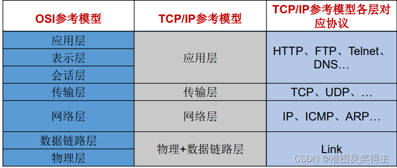
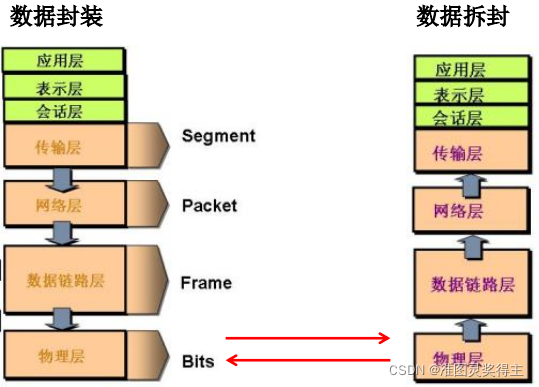
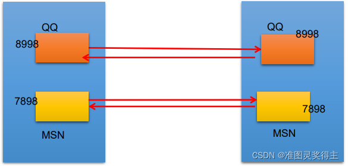
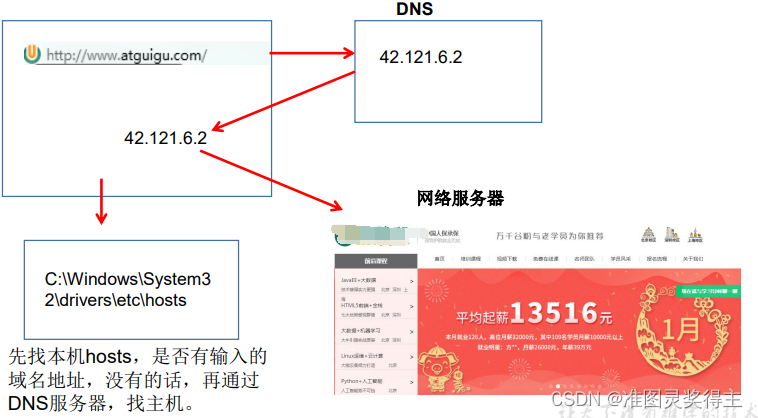
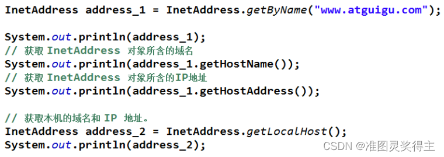
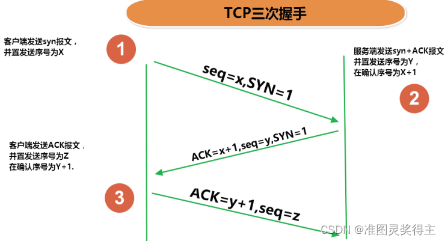
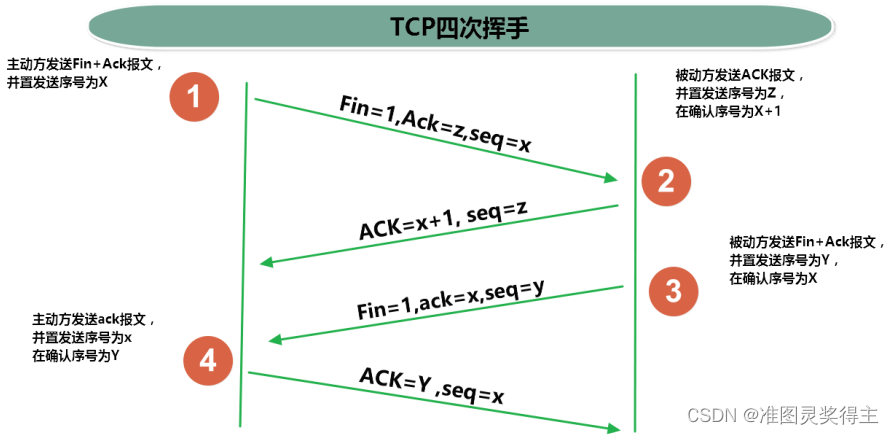

### 网络通信协议

### 通信要素一：IP和端口号
IP 地址：InetAddress
1. 唯一的标识 Internet 上的计算机（通信实体）
2. 本地回环地址(hostAddress)：127.0.0.1 主机名(hostName)：localhost
3. IP地址分类方式1：IPV4 和 IPV6
    * IPV4：4个字节组成，4个0-255。大概42亿，30亿都在北美，亚洲4亿。2011年初已
经用尽。以点分十进制表示，如192.168.0.1
    * IPV6：128位（16个字节），写成8个无符号整数，每个整数用四个十六进制位表示，数之间用冒号（：）分开，如：3ffe:3201:1401:1280:c8ff:fe4d:db39:1984
4. IP地址分类方式2：公网地址(万维网使用)和私有地址(局域网使用)。192.168.开头的就是私有址址，范围即为192.168.0.0–192.168.255.255，专门为组织机构内部使用
5. 特点：不易记忆

二、端口号
1. 端口号标识正在计算机上运行的进程（程序），不同的进程有不同的端口号，被规定为一个 16 位的整数 0~65535。
2. 端口分类：
    * 公认端口：0~1023。被预先定义的服务通信占用（如：HTTP占用端口80，FTP占用端口21，Telnet占用端口23）
    * 注册端口：1024~49151。分配给用户进程或应用程序。（如：Tomcat占用端口8080，MySQL占用端口3306，Oracle占用端口1521等）。
    * 动态/私有端口：49152~65535。
3. 端口号与IP地址的组合得出一个网络套接字：Socket。

三、InetAddress类
1. Internet上的主机有两种方式表示地址：
    1. 域名(hostName)：www.atguigu.com
    2. IP 地址(hostAddress)：202.108.35.210
2. InetAddress类主要表示IP地址，两个子类：Inet4Address、Inet6Address。
3. InetAddress 类 对 象 含 有 一 个 Internet 主 机 地 址 的 域 名 和 IP 地 址 :www.atguigu.com 和 202.108.35.210。
4. 域名容易记忆，当在连接网络时输入一个主机的域名后，域名服务器(DNS)负责将域名转化成IP地址，这样才能和主机建立连接。 -------域名解析

5. InetAddress类没有提供公共的构造器，而是提供了如下几个静态方法来获取InetAddress实例
    1. public static InetAddress getLocalHost()
    2. public static InetAddress getByName(String host)
6. InetAddress提供了如下几个常用的方法
    1. public String getHostAddress()：返回 IP 地址字符串（以文本表现形式）。
    2. public String getHostName()：获取此 IP 地址的主机名
    3. public boolean isReachable(int timeout)：测试是否可以达到该地址

       
### 通信要素二：网络协议

一、网络通信协议
计算机网络中实现通信必须有一些约定，即通信协议，对速率、传输代码、代码结构、传输控制步骤、出错控制等制定标准。
二、问题：网络协议太复杂
计算机网络通信涉及内容很多，比如指定源地址和目标地址，加密解密，压缩、解压缩，差错控制，流量控制，路由控制，如何实现如此复杂的网络协议呢？
三、通信协议分层的思想
在制定协议时，把复杂成份分解成一些简单的成份，再将它们复合起来。最常用的复合方式是层次方式，即同层间可以通信、上一层可以调用下一层，而与再下一层不发生关系。各层互不影响，利于系统的开发和扩展。
四、TCP/IP协议簇
1.传输层协议中有两个非常重要的协议：
>传输控制协议TCP(Transmission Control Protocol)
>用户数据报协议UDP(User Datagram Protocol)。
2.TCP/IP 以其两个主要协议：传输控制协议(TCP)和网络互联协议(IP)而得名，实际上是一组协议，包括多个具有不同功能且互为关联的协议。
3.IP(Internet Protocol)协议是网络层的主要协议，支持网间互连的数据通信。
4.TCP/IP协议模型从更实用的角度出发，形成了高效的四层体系结构，即物理链路层、IP层、传输层和应用层。
五、TCP协议
1.使用TCP协议前，须先建立TCP连接，形成传输数据通道
2.传输前，采用“三次握手”方式，点对点通信，是可靠的
3.TCP协议进行通信的两个应用进程：客户端、服务端。
4.在连接中可进行大数据量的传输
5.传输完毕，需释放已建立的连接，效率低
六、TCP三次握手

八、UDP协议：
1.将数据、源、目的封装成数据包，不需要建立连接
2.每个数据报的大小限制在64K内
3.发送不管对方是否准备好，接收方收到也不确认，故是不可靠的
4.可以广播发送
5.发送数据结束时无需释放资源，开销小，速度快
九、Socket
1.利用套接字(Socket)开发网络应用程序早已被广泛的采用，以至于成为事实上的标准。
2.网络上具有唯一标识的IP地址和端口号组合在一起才能构成唯一能识别的标识符套接字。
3.通信的两端都要有Socket，是两台机器间通信的端点。
4.网络通信其实就是Socket间的通信。
5.Socket允许程序把网络连接当成一个流，数据在两个Socket间通过IO传输。
6.一般主动发起通信的应用程序属客户端，等待通信请求的为服务端。
7.Socket分类：
1)流套接字（stream socket）：使用TCP提供可依赖的字节流服务
2)数据报套接字（datagram socket）：使用UDP提供“尽力而为”的数据报服务
8.Socket类的常用构造器：

public Socket(InetAddress address,int port)创建一个流套接字并将其连接到指定 IP 地址的指定端口号。
public Socket(String host,int port)创建一个流套接字并将其连接到指定主机上的指定端口号。

9.Socket类的常用方法：

public InputStream getInputStream() 返回此套接字的输入流。可以用于接收网络消息
public OutputStream getOutputStream() 返回此套接字的输出流。可以用于发送网络消息
public InetAddress getInetAddress() 此套接字连接到的远程 IP 地址；如果套接字是未连接的，则返回 null。
public InetAddress getLocalAddress() 获取套接字绑定的本地地址。 即本端的IP地址
public int getPort() 此套接字连接到的远程端口号；如果尚未连接套接字，则返回 0。
public int getLocalPort() 返回此套接字绑定到的本地端口。 如果尚未绑定套接字，则返回 -1。即本端的端口号。
public void close() 关闭此套接字。套接字被关闭后，便不可在以后的网络连接中使用（即无法重新连接或重新绑定）。需要创建新的套接字对象。 关闭此套接字也将会关闭该套接字的 InputStream 和OutputStream。
public void shutdownInput() 如果在套接字上调用 shutdownInput() 后从套接字输入流读取内容，则流将返回 EOF（文件结束符）。 即不能在从此套接字的输入流中接收任何数据。
public void shutdownOutput() 禁用此套接字的输出流。对于 TCP 套接字，任何以前写入的数据都将被发送，并且后跟 TCP 的正常连接终止序列。 如果在套接字上调用shutdownOutput() 后写入套接字输出流，则该流将抛出 IOException。 即不能通过此套接字的输出流发送任何数据。

