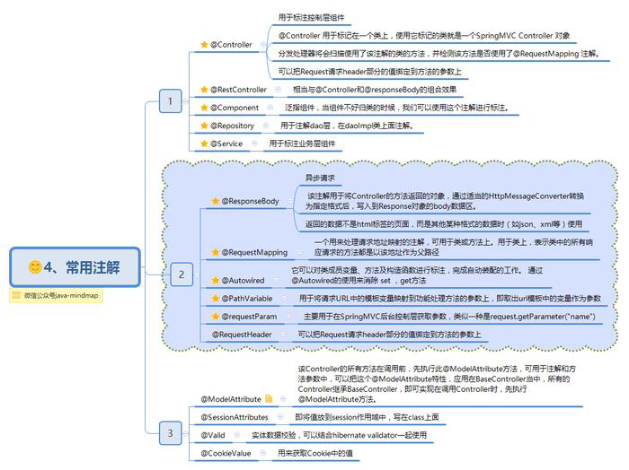

## Java注解

### @Bean注解

bean组件(负责整个应用功能的一部分)

### @NotNull

使用在Bean的字段注解中

在Controller的方法中验证时使用，如果不合法(为空)，注解中的提示信息会保存在result中

### @NonNull

Lombok注解，在方法或构造函数的参数上使用，生成一个空值检查语句。用于指明所修饰的参数、字段或方法的值不能为null

* 代码静态检查时有空值会给出风险警告，运行时不报警告，可能出现空指针异常

```java
public User(@NonNull String name) {
    this.name=name;
}
```

### TODO

```java
public class User implements Serializable {
//主键
@NotNull(message = "primary is not null",groups = {GroupInterface1.class})
private Long id;

@Pattern(regexp = "[0123456789]",groups = {GroupInterface1.class,GroupInterface2.class},message = "hava a error Date")
private Long maxDiscountAmount;

@JsonFormat(pattern = "yyyy-MM-dd HH:mm:ss", timezone = "GMT+8")
private Date createTime;

@Future(message = "expireTime is not less than now",groups = {GroupInterface1.class,GroupInterface2.class})
@NotNull(message = "expireTime is not null",groups = {GroupInterface1.class,GroupInterface2.class})
private Date expireTime;
}

import java.util.Date;
import javax.validation.constraints.DecimalMax;
import javax.validation.constraints.DecimalMin;
import javax.validation.constraints.Email;
import javax.validation.constraints.Future;
import javax.validation.constraints.Max;
import javax.validation.constraints.Min;
import javax.validation.constraints.NotNull;
import javax.validation.constraints.Size;
import org.hibernate.validator.constraints.Range;
import org.springframework.format.annotation.DateTimeFormat;

/**** imports ****/
public class ValidatorPojo {
// 非空判断
@NotNull(message = "id不能为空")
private Long id;

@Future(message = "需要一个将来日期") // 只能是将来的日期
// @Past //只能去过去的日期
@DateTimeFormat(pattern = "yyyy-MM-dd") // 日期格式化转换
@NotNull // 不能为空
private Date date;

@NotNull // 不能为空
@DecimalMin(value = "0.1") // 最小值0.1元
@DecimalMax(value = "10000.00") // 最大值10000元
private Double doubleValue = null;

@Min(value = 1, message = "最小值为1") // 最小值为1
@Max(value = 88, message = "最大值为88") // 最大值88
@NotNull // 不能为空
private Integer integer;

@Range(min = 1, max = 888, message = "范围为1至888") // 限定范围
private Long range;

// 邮箱验证
@Email(message = "邮箱格式错误")
private String email;

@Size(min = 20, max = 30, message = "字符串长度要求20到30之间。")
private String size;

public Long getId() {
    return id;
}

public void setId(Long id) {
    this.id = id;
}

public Date getDate() {
    return date;
}

public void setDate(Date date) {
    this.date = date;
}

public Double getDoubleValue() {
    return doubleValue;
}

public void setDoubleValue(Double doubleValue) {
    this.doubleValue = doubleValue;
}

public Integer getInteger() {
    return integer;
}

public void setInteger(Integer integer) {
    this.integer = integer;
}

public Long getRange() {
    return range;
}

public void setRange(Long range) {
    this.range = range;
}

public String getEmail() {
    return email;
}

public void setEmail(String email) {
    this.email = email;
}

public String getSize() {
    return size;
}

public void setSize(String size) {
    this.size = size;
}

/**** setter and getter ****/

}

// controller应该要加上@Valid ,否则不会验证
/***
 * 解析验证参数错误
 * @param vp —— 需要验证的POJO，使用注解@Valid 表示验证
 * @param errors  错误信息，它由Spring MVC通过验证POJO后自动填充
 * @return 错误信息Map
 */

@RequestMapping(value = "/valid/validate")
@ResponseBody
public Map<String, Object> validate(
        @Valid @RequestBody ValidatorPojo vp, Errors errors) {
    Map<String, Object> errMap = new HashMap<>();
    // 获取错误列表
    List<ObjectError> oes = errors.getAllErrors();
    for (ObjectError oe : oes) {
        String key = null;
        String msg = null;
        // 字段错误
        if (oe instanceof FieldError) {
            FieldError fe = (FieldError) oe;
            key = fe.getField();// 获取错误验证字段名
        } else {
            // 非字段错误
            key = oe.getObjectName();// 获取验证对象名称
        }

        // 错误信息
        msg = oe.getDefaultMessage();
        errMap.put(key, msg);
    }
    return errMap;
}
```

### @Null 被注释的元素必须为null

### @NotNull 被注释的元素不能为null，可以为空字符串

### @AssertTrue 被注释的元素必须为true

### @AssertFalse 被注释的元素必须为false

### @Min(value) 被注释的元素必须是一个数字，其值必须大于等于指定的最小值

### @Max(value) 被注释的元素必须是一个数字，其值必须小于等于指定的最大值

### @DecimalMin(value) 被注释的元素必须是一个数字，其值必须大于等于指定的最小值

### @DecimalMax(value) 被注释的元素必须是一个数字，其值必须小于等于指定的最大值

### @Size(max,min) 被注释的元素的大小必须在指定的范围内。

### @Digits(integer,fraction) 被注释的元素必须是一个数字，其值必须在可接受的范围内

### @Past 被注释的元素必须是一个过去的日期

### @Future 被注释的元素必须是一个将来的日期

### @Pattern(value) 被注释的元素必须符合指定的正则表达式。

### @Email 被注释的元素必须是电子邮件地址

### @Length 被注释的字符串的大小必须在指定的范围内

### @Range 被注释的元素必须在合适的范围内

### @NotEmpty：用在集合类上，不能为null，并且长度必须大于0

### @NotBlank：只能作用在String上，不能为null，而且调用trim()后，长度必须大于0

## Spring/MVC注解




### @Configuration注解

    配置类，为容器提供bean
    配置类中方法用@Bean注解进行标注，表明方法返回的对象会以bean的形式添加到容器中（默认bean ID与方法名称相同）

### @SpringBootConfiguration注解

    声明该类为配置类
    属于@Configuration注解的特殊形式

### @ComponentScan注解

    启用组件扫描

### @Service

* 用于标注业务层组件
  
* 让组件扫描将类识别为一个组件，并创建该类实例作为Spring上下文中的bean

### @Controller注解

* 用于标注控制层组件(如Struts中的action)

* 让组件扫描将类识别为一个组件，并创建该类实例作为Spring上下文中的bean

### @Repository注解

* 用于标注数据访问层组件

* 让组件扫描将类识别为一个组件，并创建该类实例作为Spring上下文中的bean

* 将标注类中的数据访问异常封装为Sprig的数据访问异常类型

###  @Component注解

* 表示泛型组件，当组件不好归类的时候，可以使用这个组件进行注解

* 让组件扫描将类识别为一个组件，并创建该类实例作为Spring上下文中的bean

### @Autowired注解

* 默认开启按类型的自动装配(byType)，可通过参数 required=false关闭自动装配
  
* 当接口实现类有多个时，需要配合修饰注解Qualifier或Primary使用
  
  

### @Resource注解(Java注解)

* 默认byName注入策略、或者指定了name

    
  
* 如果设置type值，则使用byType注入策略

    

* 同时指定name、type

    
  
* name、type均不指定，利用反射机制使用byName注入

    


