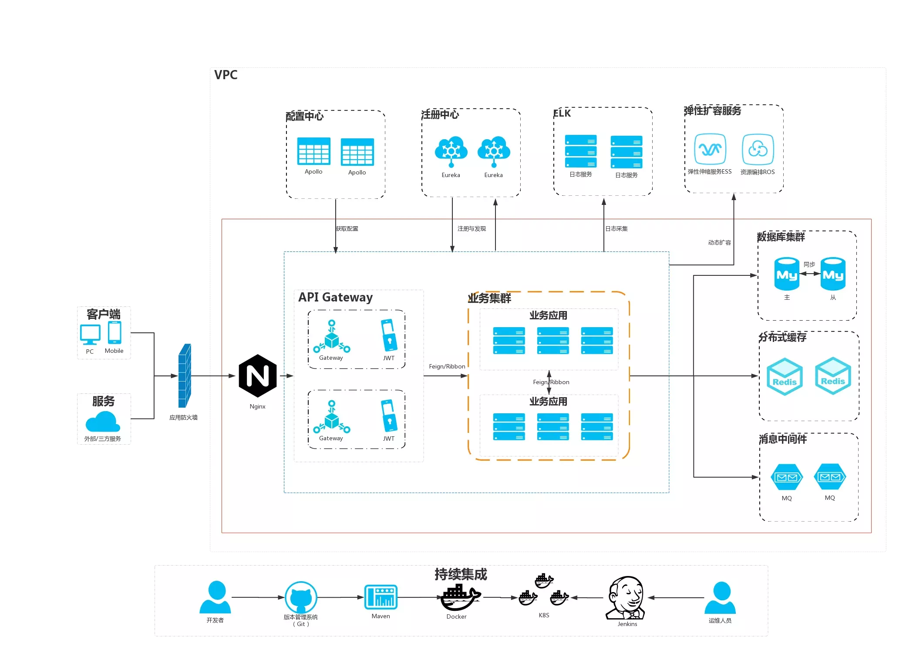
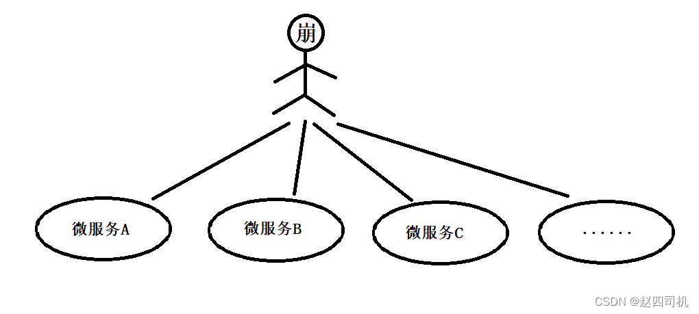
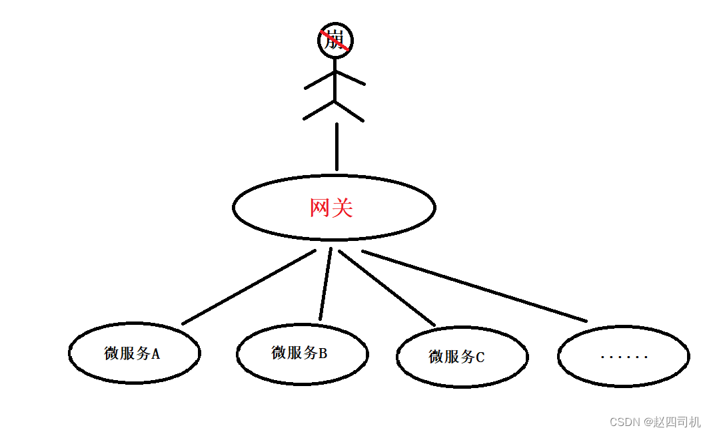

## 网关

网关是系统的唯一对外的入口，介于客户端和服务端之间的中间层，处理非业务功能，如

* 路由请求
* 鉴权
* 监控
* 缓存
* 限流

1. 未使用网关

    1. 使用者需要知道各个微服务的访问地址
    2. 访问不同微服务时均需要需要认证
    3. 存在跨域请求问题

    
   
2. 使用网关

    1. 业务需求只需要直接访问网关即可，网关根据实际请求再去访问不同的微服务
    2. 认证请求统一在网关进行认证
    2. 网关可以对微服务进行监控，实时掌握各个微服务的运行状况
    
    