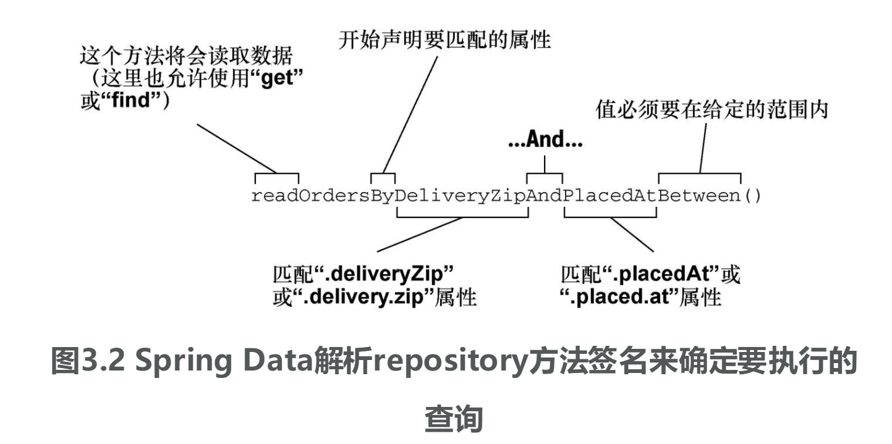

## Spring

一个轻量级的控制反转和面向切面编程的框架

### Spring框架结构


### Spring核心组件


* 核心容器

      核心容器SpringCore提供框架的基本功能。
      核心容器的主要组件是BeanFactory，它是工厂模式的实现。
      BeanFactory使用控制反转的模式(IOC)将应用程序的配置和依赖性规范与实际的应用程序代码分开。

* Spring上下文

      Spring上下文是一个配置文件，向Spring提供上下文信息。
      Spring上下文包括包括企业服务，如JNDI、EJB、电子邮件、国际化、校验和调度功能。

* Spring AOP

      Spring AOP为基于Spring的应用程序中的对象提供了事务管理服务。

* EJB组件(非Spring特性，AOP替换该功能)

      TODO

* Spring DAO

      异常层次结构：简化了错误处理，并极大降低了需要编写的异常代码数量(如打开和关闭连接)。     
      通用DAO：JDBC DAO抽象层提供了异常层次结构，可管理异常处理和不同数据库服务提供商抛出的错误信息。
      Spring DAO：面向JDBC的异常遵从通用DAO异常层次结构。

* Spring ORM

      Spring框架插入了若干个ORM框架，从而提供了ORM的对象关系工具。
      如JDO、Hibernate、iBatisSQL MAP。
      所有上述框架都遵从Spring的通用事务和DAO异常层次结构。

* Spring WEB模块

      Web上下文模块建立在应用程序上下文模块之上，为基于Web的应用提供上下文。
      Web模块还简化了处理大部分请求以及将请求参数绑定到域对象的工作。

* Spring MVC框架

      MVC模型：由javabean构成
      MVC视图：接口，负责现实模型
      MVC控制器：表示逻辑代码，是Controller的实现

### Spring优点

    1.低侵入式设计，代码污染极低
    2.独立于各种应用服务器，基于Spring框架的应用，可以真正实现Write Once,Run Anywhere的承诺
    3.Spring的DI机制降低了业务对象替换的复杂性，提高了组件之间的解耦
    4.Spring的AOP支持允许将一些通用任务如安全、事务、日志等进行集中式管理，从而提供了更好的复用
    5.Spring的ORM和DAO提供了与第三方持久层框架的良好整合，并简化了底层的数据库访问
    6.Spring并不强制应用完全依赖于Spring，开发者可自由选用Spring框架的部分或全部

### <font color=FF0000>关键字</font>

* 非入侵式
  
      Spring应用中的对象不依赖于特定的Spring类

* 组件

      负责整个应用功能的一部分，也称为~~bean~~

*  *容器container*

       定义：由Spring提供，也称Spring应用上下文（Spring application context）,实体。
       作用：创建和管理应用组件。
       如何管理组件：通过依赖注入。

      

*  **依赖注入DI(dependency injection)**

       1. 实体/容器创建和维护所有组件并管理它们的生命周期。
       2. 实体将bean注入到需要它们的bean中。
       依赖注入方式：
         a. XML配置
         b. Java类配置(配置类@Configuration等)
         c. Java类配置(注解@Autowired等)
         d. 自动配置

*  ***自动配置(SpringBoot Auto Configuration)***

       自动配置≈自动装配+组件扫描

*  自动装配autowiring

       Spring能够自动为组件注入它们所依赖的其他bean。

*  组件扫描component scanning

       Spring能够自动发现应用路径下的组件，并将它们创建成Spring应用上下文中的bean。

*  控制器controller

       1. 处理HTTP请求
       2. 填充可选的数据模型并将请求传递给一个视图，以便于生成返回给浏览器的HTML。
       3. 直接将数据写入响应体(RESTful) 

* 视图

      将数据渲染到html中并在浏览器中展现

* 领域

      应用所要解决的主题范围（也就是会影响到对应用理解的理念和概念）
      如taco中组成这些设计的配料，顾客，顾客所下的订单

* 领域特定语言

      DSL(Domain-Specified Language)：通过方法签名描述。
      如findByDeliveryZip(String)

    

*  模板引擎
    > [服务端模板引擎：Thymeleaf](https://www.thymeleaf.org/ 'Thymeleaf.org')
    > 
    > [服务端模板引擎：FreeMarker](https://freemarker.apache.org/ "FreeMarker.apache.org") 
    > 
    > [客户端模板引擎：Vue](https://vuejs.org/index.html 'Vue.org')

### Spring注解


* @Configuration注解

      配置类，为容器提供bean。
      配置类中方法用@Bean注解进行标注，表明方法返回的对象会以bean的形式添加到容器中（默认bean ID与方法名称相同）。

* @Bean注解

      bean组件。

* @SpringBootConfiguration注解

      声明该类为配置类。属于@Configuration注解的特殊形式。

* @EnableAutoConfiguration注解

      启用Spring Boot的自动配置。

* @ComponentScan注解

      启用组件扫描。

* @SpringBootApplication注解
  > Spring Boot应用。该注解为组合注解。包含：
  > * @SpringBootConfiguration注解
  > * @EnableAutoConfiguration注解
  > * @ComponentScan注解

* @Controller注解

      让组件扫描将类识别为一个组件，并创建该类实例作为Spring上下文中的bean。

* @Component注解

      让组件扫描将类识别为一个组件，并创建该类实例作为Spring上下文中的bean。

* @Repository注解

      让组件扫描将类识别为一个组件，并创建该类实例作为Spring上下文中的bean。
      同时将标注类中的数据访问异常封装为Sprig的数据访问异常类型。

* @Service注解

      让组件扫描将类识别为一个组件，并创建该类实例作为Spring上下文中的bean。

* @Autowired注解

      将@Autowired标注的组件注入到相应的bean中。
      默认根据type进行注解，当接口实现类有多个时，需要配合修饰注解Qualifier或Primary使用

* @Resource注解(Java注解)

      默认byName注入策略
      如果设置type值，则使用byType注入策略
      name、type均不指定，利用反射机制使用byName注入

* @Data注解

      提高代码的简洁，该注解可以省去getter、setter、toString等方法(运行时生成)。
      该注解会自动添加一个有参构造器。

* 构造型(stereotype)注解

  * @Controller
  * @Component
  * @Repository
  
* @RunWith(测试运行器)注解

      JUnit注解。提供一个测试运行器来指导JUnit如何运行测试。
      @RunWith(SpringRunner.class)：Spring提供测试运行器，将创建测试运行时所需的Spring应用上下文。
      SpringJUnit4ClassRunner:SpringRunner全称。别称SpringRunner于Spring4.3引入，以便于移除对特定JUnit版本的关联(如JUnit4)
      适用于JUnit4。

* @SpringBootTest注解

      告诉JUnit在启动测试时要添加上Spring Boot的功能
      包含@ExtendWith(SpringExtension.class)用于支持JUnit5，
      但Sprint Boot2.1.x后SpringBootTest注解包含ExtendWith注解，
      即Spring Boot2.1.x后使用JUnit时不再需要ExtendWith注解

* @GetMapping(URL)注解

      表明如果针对URL发送HTTP GET请求，被注解的方法将会处理请求。
      通常返回试图的逻辑名称

* @NotNull注解

      应用场景：基本类型（或包装类）或String
      说明：不能为null，可以为empty

* @NotBlank注解

      应用场景：只适用于String类型
      说明：不能为null且trim()之后size>0

* @NotEmpty注解

      应用场景：集合
      说明：不能为null或也不能为空
      补足：加了该注解的String类、Collection、Map、数组不能为null或长度为0的（String、Collection、Map的isEmpty()方法）。

* @NoArgsConstructor注解（Lombok注解）

      添加一个无参构造器（JPA）
      如果有final字段，应将force设置true以确保Lombok无参构造器会将final字段为null
      @NoArgsConstructor(access = AccessLevel.PRIVATE, force = true)
      使用该注解后，@Data注解生成的有参构造器会被移除掉，因此需要有参构造器时需要显式指定。

* @RequiredArgsConstructor

      显示添加一个有参构造器。
    

* @PrePersist注解

      用于为相应的生命周期指定回调方法(无参无返回)，不能用于属性注解
      
* @Table

      实体应该持久化到数据库中的指定表中

### JPA注解

* @Entity

      声明为JPA实体类（必须）。

* @Id

      数据库中唯一标识该实体的属性。即PK。

* @GeneratedValue

      自动生成。
      @GeneratedValue(strategy = GenerationType.IDENTITY)

* @ManyToMany

      声明关系。多对多。
      @ManyToMany(targetEntity = Ingredient.class)

* @ManyToOne

      声明关系。多对一（Order实体中多个Order对应一个User）。
      @ManyToOne
      private User user;

* @PrePersist

      用于为相应的生命周期事件指定回调方法。 该注释可以应用于实体类，映射超类或回调监听器类的方法。可以方便的自动填入实体类创建时间、更新时间。

* @Column

      定义了被标注字段在数据库表中所对应字段的名称。
      如果Column注解定义的字段名和属性名一样，会被忽略。

* @Table

      表明实体应该持久化到数据库中的指定表。

* @Query注解

      Repository方法调用时要执行的查询。

### MyBatis注解

* @Mapper

      把Mapper这个DAO交给Spring管理
      不用写映射文件(xml文件)

### BeanFactory和ApplicationContext区别

1. 国际化

    1.  BeanFactory未扩展MessageResource接口，不支持国际化
        
    2.  ApplicationContext扩展MessageResource接口，支持国际化，具备消息处理的能力

2. 事件机制(Event)

    1. ApplicationContext事件机制通过ApplicationEvent和ApplicationListener接口提供
    
    2. ApplicationContext中发布一个事件时，所有扩展了ApplicationListener的Bean都会接收这个事件并进行相应处理
   
3. 底层资源访问
   
    1. ApplicationContext扩展了ResourceLoader(资源加载器)接口，可用来加载多个Resource
    
    2. BeanFactory未实现资源加载器接口
    
4. 对Web应用的支持
   
    1. BeanFactory：以编程方式创建
    
    2. ApplicationContext
    
        1. 以声明方式创建，如使用ContextLoader
    
        2. 使用ApplicationContext的实现之一以编程方式创建ApplicationContext实例(如)
    
            ```java
            ApplicationContext = new ClassPathXmlApplicationContext("xxx.xml");
            ``` 
5. 延迟加载

    1. BeanFactory
    
        1. 延迟加载方式注入bean，即使用(getBean)时才加载bean进行实例化
    
    2. ApplicationContext
    
        1. 容器启动时加载所有bean(除非配置文件显示声明lazy-init或原型模式)

总结：

* BeanFactory

    * Spring原始Factory，不支持AOP、Web等插件
    
    * Spring基础设施，面向Spring本身

* ApplicationContext

    * 继承BeanFactory，支持Spring各种插件
    
    * 以一种面向框架的方式工作以及对上下文进行分层和实现继承
    
    * 面向开发者

## Spring框架

### Spring核心框架

    1. 提供了核心容器和依赖注入框架
    2. 其他特性
       a.Spring的Web框架：Spring MVC
       b.提供了对数据持久化的基础支持
       c.添加对反应式reactive风格编程的支持。包括Spring WebFlux新反应式Web框架

### Spring Boot

    1. starter依赖 -> 依赖管理
    2. 自动配置
    3. 其他特性：
       a.Actuator：洞察应用运行时的内部工作状况。包括指标、线程dump信息、应用的健康状况亦即应用可用的环境属性。
       b.灵活的环境属性规范 -> 运行时洞察
       c.在核心框架的测试辅助功能之上提供了对测试的额外支持
       d.Spring Boot命令行接口CLI（基于Groovy脚本）

### Spring Data
    
    将应用程序的数据repository定义为简单的Java接口
    使用：定义驱动存储和检索数据的方法时使用一种命名约定
    特点：能够处理多种不同类型的数据库
         a.关系型数据库JPA( JPA：Java Persistence API JAVA持久层API)
         b.文档数据库Mongo
         c.图形数据库Neo4j
         d.Redis key-value存储
         e.Cassandra数据库

### Spring Security

    TODO：

### Spring Integration和Spring Batch

    Spring Integration:实时集成
    Spring Batch:批处理集成（触发器触发数据梳理）

### Spring Cloud
    不再将应用程序作为单个部署单元来开发，而是使用由微服务组成的多个独立部署单元来组合形成应用程序。

### Spring MVC请求映射注解


[comment]: <> (** 构造型注解：stereotype @Repository:Spring组件扫描ComponentScan会自动发现类并将其初始化为Spring应用上下文中的bean，)

[comment]: <> (创建bean时，会通过@Autowired标注的构造器将JdbcTemplate注入进来 @Controller @Component)

[comment]: <> (@SessionAttribute @ModelAttribute)

[comment]: <> (4716442903549583)

[comment]: <> (JDBC：Java Database connectivity JPA：Java Persistence API持久层API Spring Data JPA：基于关系型数据库进行JPA持久化)

## 流程图

### mermaid


