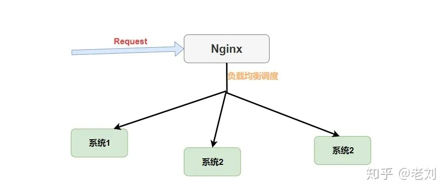

## 应用架构

### CAP定理/原则

分布式系统中，三者不可兼得

1. Consistency一致性

    分布式系统中的所有数据备份，在同一时刻是否是同样的值

2. Availability可用性

    集群中一部分节点故障后，集群整体是否还能响应客户端的读写请求：对数据更新具备高可用性

3. Partition tolerance分区容错性

    分区相当于对通信的时限要求。系统如果不能在时限内达成数据一致性，就意味着发生了分区，必须就当前操作在C和A之间作出选择

### 应用架构类型

1. 单体应用：JSP+JavaBean
2. 基于MVC三层架构
3. 分布式架构开发
4. 基于SOA(面向服务编程)架构开发
5. 微服务开发
    
    1. Dubbo：半自动
    
       服务治理开发框架：一般和Zookeeper注册中心联合使用
    
       当当扩展后：Dubbox+Zookeeper
    
    2. SpringCloud：提供一站式微服务架构，全自动
    
#### 注册中心

1. Zookeeper

    保证CP原则，可用性降低

2. Eureka

    1. 保证AP原则，一致性降低
   
    2. 集群节点对等，地位相同
    
    3. 通过Eureka自我保护机制和心跳检查确保微服务高可用
    
### 微服务

定义

1. 一种架构风格，将单一应用程序划分为一组小的服务，每个服务运行在其独立的进程中，服务间小胡协调、配合

2. 服务间采用轻量级的通信机制(通常基于HTTP的RESTful API)

3. 每个服务围绕着具体的业务构建，能被独立的构建在生产环境

SpringBoot和SpringCloud

1. SpringBoot独立开发微服务

2. SpringCloud微服务治理框架


## SpringCloud

SpringCloud就是微服务架构的一站式解决方案，我们构建微服务系统过程中需要做如服务发现注册、配置中心、消息总线、负载均衡、断路器、数据监控等操作，Spring Cloud提供了一套简易的编程模型，使我们能在SpringBoot基础上轻松实现微服务项目的构建

### SpringCloud优缺点

优点

1. 每个服务足够内聚，足够小，代码容易理解这样的能聚集一个指定的业务功能或业务需求
2. 开发简单，效率高，一个服务可能就是专一的只做一件事
3. 微服务是松耦合，由功能意义的服务，无论是开发阶段还是部署阶段都是独立的
3. 微服务能使用不同的语言开发------跨语言
4. 易于与第三方继承，微服务允许容易以灵活的方式集成自动部署，通过持续集成工具。Docker+Jenkins
5. 微服务易于被一个开发人员立即修改和维护，这样小团队能够更关注自己的工作成果，无需合作才能体现价值

缺点

1. 开发人员要处理分布式系统的复杂性
2. 多服务运维难度，随着服务数量增加，运维压力也在增大
3. 系统部署依赖
4. 服务间通信成本
5. 数据一致性
6. 系统集成测试
7. 性能监控

### 微服务组件

微服务开源解决方案，包括以下组件：

1. 注册与发现：独立部署

2. 负载均衡：作为基础设置模块，存在于每个Spring Cloud微服务提供者中

3. 配置中心：独立部署

3. 全链路监控

4. 服务网关

6. 断路器/熔断器


### 五大组件运行流程

1. 服务发现框架-Eureka：服务注册发现

    1. 服务注册
        
        只有一个服务注册到注册中心，才可能被其他服务发现并调用

    2. 服务发现

        一个服务通过注册中心发现了其他服务
   
2. 负载均衡Ribbon

    客户端维护一份从注册中心获取的Provider列表清单，根据自己配置的Provider负载均衡选择算法在客户端进行请求的分发    
   
3. 服务调用Feign

    一个服务对另一个服务进行调用
   
4. 隔离、熔断与降级

    1. 通过Hystrix的线程池去访问服务，不同的服务通过不同的线程池，实现了不同的服务调度隔离
       
    2. 如果服务出现故障，通过服务熔断，避免服务雪崩的问题
    
    3. 并且通过服务降级，保证可以手动实现服务正常功能
    
5. 网关路由

    如果前端调用后台系统，统一从网关进入，通过网关转发请求给对应的服务
   
### 五大组件

#### 服务发现框架-Eureka注册中心

Spring Cloud Eureka是Spring Cloud Netflix微服务套件的一部分，基于Netflix Eureka做了二次封装，主要完成微服务实例的自动注册和发现

Eureka服务治理体系中的角色

1. 服务提供者Eureka Client Provider：提供自己能够执行的服务给外界

2. 服务消费者Eureka Client Consumer：需要使用服务的客户

3. 服务中介Eureka Server：服务提供者和服务消费者之间的桥梁，服务提供者把自己注册到服务中介，服务消费者如需要消费一些服务(或使用一些功能)可以从服务中介寻找注册在服务中介的服务提供者

Eureka功能


1. 服务注册Register：Eureka Client Service Provider

    Eureka客户端(可理解成房东)向Eureka Server注册时，它提供自身的元数据，比如IP地址、端口、运行状况指示符URL、主页等

2. 服务续约/心跳续约Renew：Eureka Client Service Provider

    Eureka客户会每隔30秒(默认)发送一次心跳来续约，通过续约来告知Eureka Server该Eureka客户仍然存在，没有出现问题

    1. 如果Eureka Server在90秒没有收到Eureka客户的续约，它会将实例从注册表中删除
    
3. 获取注册列表信息Fetch Registers：Eureka Client Service Consumer

    1. 实例缓存：Eureka客户端从服务器(Eureka Server)获取注册表信息，并将其缓存在本地
    
    2. 服务发现：客户端会使用该信息查找其他服务，从而进行RPC远程调用
    
    3. 更新注册列表：Eureka客户端会定期(30S)更新注册列表信息
       
        1. 当注册列表信息与缓存信息不同时：客户端自动更新缓存
    
        2. 当由于某种原因导致注册列表信息不能及时匹配：Eureka客户端重新获取整个注册表信息
    
    4. 注册列表压缩Eureka Server：Eureka服务器对缓存的注册列表信息和每个应用程序信息进行压缩
    
        1. 客户端和Eureka Server可通过JSON/XML格式通讯，默认客户端使用压缩JSON格式获取注册列表信息

4. 服务下线Cancel

    1.  Eureka客户端在程序关闭时向Eureka服务器发送取消请求，发送请求后，该客户端实例将从服务器的实例注册表中删除
    
    2. 该下线请求不会自动完成，需调用以下内容：
            
        ```java
        DiscoveryManager.getInstance.shutdownComponent
        ```
    
5. 服务剔除Eviction

    1. 默认情况下，Eureka客户端连续90秒没有向Eureka服务器发送服务续约，即心跳，Eureka服务器会将该服务实例从服务注册列表删除，即服务剔除

#### Ribbon

##### 负载均衡

1. 定义：将请求分摊在不同的服务器上进行处理

2. 分类
    
    1. 软负载
    
        1. 集中式LB：在服务的消费方和提供方之间使用独立的LB设施，如Nginx设施负责把访问请求集中起来通过某种策略转发至服务的提供方
    
            
        
            1. ApacheHttpServer+Tomcat搭建集群
        
            2. LVS
        
            3. Nginx+Tomcat搭建集群
        
        2. 进程式LB：将LB逻辑集成到消费方，消费方从服务注册中心获取哪些地址可用，并自己从中找出一个合适的服务器
        
            1. SpringCloud Netflix Ribbon
    
                
    
    2. 硬负载：使用均衡负载服务器
    
        

##### 负载均衡-Ribbon

1. 客户端的负载均衡开源组件，Feign组件不具备负载均衡能力，通过集成Ribbon组件实现客户端的负载均衡

2. Ribbon实现负载均衡样例：
    
    1. 微服务间的RPC远程调用
    
    2. API网关的代理请求的RPC转发调用

3. Ribbon负载均衡算法：

    1. 轮询策略RoundRobinRule（Ribbon默认）
    
        若经过一轮没有找到可用的Provider，其最多轮询10轮。若最终没有找到，返回null
       
    2. 随机策略RandomRule
    
        从所有可用的Provider中随机选择一个
       
    3. 重试策略RetryRule
    
        先按照RoundRobinRule策略获取Provider，若获取失败，则在指定时限内重试。默认时限500毫秒
    
    4. 自定义负载均衡策略
        
        实现IRule接口，然后修改配置文件或者自定义Java Config类
    
    * 更换默认的负载均衡算法
    
        ```java
        providerName:
          ribbon:
            NFLoadBalancerRuleClassName: com.netflix.loadbalancer.RandomRule
        ```

4. Ribbon负载均衡过程
    
    1. 从Eureka Client获取Provider服务列表清单
    
    2. 通过定期IPing实例(如10s)向每个Provider发送ping，根据Provider是否响应，判断服务实例可用性
    
        1. Provider可用性发生改变，或者Provider清单中的数量和之前不一致：从注册中心更新或者重新拉去Provider服务实例清单 
        
    3. RPC请求到来时，由Ribbon的IRule负载均衡策略接口的某个实现类进行负载均衡，计算出要访问的最终Provider
    
5. 编码：微服务调用方法1

    1. pom依赖

        ```xml
        <!--添加Ribbon支持负载均衡添加如下依赖-->
        <dependency>
          <groupId>org.springframework.cloud</groupId>
          <artifactId>spring-cloud-starter-ribbon</artifactId>
          <version>1.4.6.RELEASE</version>
        </dependency
        ```
       
    2. 在RestTemplate的Bean上添加@LoadBalance注解
    
        RestTemplate是Spring提供的一个访问Http服务的客户端类
    
        ```java
        // 每次调用服务都需要调用RestTemplate的API
        // 消费者B调用提供者A提供的服务
        @Autowired
        private RestTemplate restTemplate;
        // 这里是提供者A的ip地址，但是如果使用了 Eureka 那么就应该是提供者A的名称
        private static final String SERVICE_PROVIDER_A = "http://localhost:8081";
        
        @PostMapping("/judge")
        public boolean judge(@RequestBody Request request) {
            String url = SERVICE_PROVIDER_A + "/service1";
            return restTemplate.postForObject(url, request, Boolean.class);
        }
        ```

#### Open Feign

特点

1. Feign使用了动态代理

    1. @FeignClient调用接口的本质就是调用Feign创建的动态代理
    
    2. 根据接口上的@RequestMapping等注解，动态构造出要请求的服务地址并对这个地址发起请求、解析响应

2. 使用Feign，可以做到使用HTTP请求访问远程服务，就像调用本地方法一样，开发者感知不到在调用远程方法，也感知不到在访问HTTP请求 

3. Feign整合了(内置)Ribbon和Hystrix，具备负载均衡、隔离、熔断与降级功能

编码：微服务调用方法2，将被调用的服务代码映射到消费者端

1. pom依赖

    ```xml
    <dependency>
        <groupId>org.springframework.cloud</groupId>
        <artifactId>spring-cloud-starter-feign</artifactId>
        <version>1.4.6.RELEASE</version>
    </dependency>
    ```
   
2. API添加Client实体(自定义名字)

    ```java
    @Component
    // 使用@FeignClient注解来指定提供者的名字
    @FeignClient(value = "eureka-client-provider")
    public interface TestClient {
        // 这里一定要注意需要使用的是提供者那端的请求相对路径，这里就相当于映射了
        @RequestMapping(value = "/provider/xxx", method = RequestMethod.POST)
        CommonResponse<List<Plan>> getPlans(@RequestBody planGetRequest request);
    }
    ```

3. 在消费者修改Controller
    
    ```java
    @RestController
    public class TestController {
        // 这里就相当于原来自动注入的Service
        @Autowired
        private TestClient testClient;
        // controller 调用 service 层代码
        @RequestMapping(value = "/test", method = RequestMethod.POST)
        public CommonResponse<List<Plan>> get(@RequestBody planGetRequest request) {
            return testClient.getPlans(request);
        }
    }
    ```

#### Hystrix

##### 服务雪崩

* 定义：一个服务失败，导致整条链路的服务都失败的情形，称之为服务雪崩

    

* 引发原因

    * 硬件故障
    
    * 程序Bug
    
    * 缓存穿透(用户大量访问缓存中没有的键值，导致大量请求查询数据库，使数据库压力过大)
    
    * 用户大量请求

* 服务雪崩表现

    1. 第一阶段：服务不可用->ServiceC不可用
    
    2. 第二阶段：调用端重试加大流量(用户重试/代码逻辑重试)->
    
    3. 第三阶段：服务调者不可用(同步等待造成的资源耗尽)->ServiceA不可用
    
        
    
* 解决方案

    * 应用扩容(扩大服务器承受能力)：增加机器、升级硬件
    
    * 流量控制：超出限定流量后，返回类似重试页面让用户稍后再试
    
    * 服务熔断：
    
    * 服务降级：服务接口/页面拒绝服务

##### Hystrix

Hystrix是一个用于处理分布式系统的延迟和容错的开源库

功能

1. 隔离

    舱壁模式：通过Hystrix线程池去访问服务，不同的服务通过不同的线程池，实现了不同的服务调度隔离

2. 熔断
   
    1. 服务雪崩的一种有效解决方案。当指定时间窗口内的请求失败率达到设定域值时，系统通过断路器直接将此请求链路断开，避免服务方线程长时间被占用引发服务雪崩
        ```java
        @HystrixCommand(commandProperties = {@HystrixProperty(name = "execution.isolation.thread.timeoutInMilliseconds",value = "1200")})
        public List<Xxx> getXxxx() {
            // ...省略代码逻辑
        }
        ```

3. 降级

    降级是为了更好的用户体验：当一个方法调用异常时，通过执行另一种代码逻辑来给用户友好的回复，对应着Hystrix的后备处理模式。通常通过fallbackMethod设置备用的代码逻辑

    1. 服务正在等待
    
    2. 链接超时
    
    3. 网络延迟
    
    4. 服务器响应慢
    
        ```java
        // 指定了后备方法调用
        @HystrixCommand(fallbackMethod = "getHystrixNews")
        @GetMapping("/get/news")
        public News getNews(@PathVariable("id") int id) {
            // 调用新闻系统的获取新闻api 代码逻辑省略
        }
        // 
        public News getHystrixNews(@PathVariable("id") int id) {
            // 做服务降级
            // 返回当前人数太多，请稍后查看
        }
        ```
    
编码

1. pom依赖

    ```xml
    <!--增加熔断机制-->
    <dependency>
        <groupId>org.springframework.cloud</groupId>
        <artifactId>spring-cloud-starter-hystrix</artifactId>
        <version>1.4.6.RELEASE</version>
    </dependency>
    ```
   
2. 消费者main添加注解@EnableDiscoveryClient、@EnableCircuitBreaker

    ```java
    @SpringBootApplication
    @EnableEurekaClient
    @EnableFeignClients(basePackages = {"cn.pro.api.service"})
    @EnableDiscoveryClient
    @EnableCircuitBreaker
    public class Demo1ConsumerApplication {
        public static void main(String[] args) {
            SpringApplication.run(Demo1ConsumerApplication.class,args);
        }
    }
    ```

3. 在微服务启动类添加@EnableHystrix注解

4. 在微服务中的接口设置fallback

    ```java
    @RestController
    public class UserController {
        @GetMapping("/get")
        @HystrixCommand(fallbackMethod = "getByFallBack")
        public List<User> get() throws Exception{
            List<User> list= new ArrayList<>();
            list.add(new User(1001,"大娃",12));
            list.add(new User(1001,"大娃",12));
            list.add(new User(1001,"大娃",12));
            list.add(new User(1001,"大娃",12));
            if (list.size() != 0){
                throw new Exception("出错啦，进入雪崩");
            }
            return list;
        }
     
        public List<User> getByFallBack(){
            List<User> list= new ArrayList<>();
            list.add(new User(1001,"出错啦",12));
            list.add(new User(1001,"出错啦",12));
            list.add(new User(1001,"出错啦",12));
            list.add(new User(1001,"出错啦",12));
            return list;
        }
    }
    ```

#### 微服务网关-Zuul

未使用网关：

1. 用户调用消费者工程

2. 消费者通过Eureka Server调用服务提供者

    此时Eureka Server是服务提供者的统一入口

使用网关：

1. 网关是对于消费者的统一入口

##### Zuul功能

1. 路由功能
   
   

    1. 简单配置使用

        1. Zuul向Eureka进行注册，注册后可以获取所有消费者信息(元数据：名称/ip/端口)

        2. 进行路由映射

            ```java
            // 映射前调用Consumer1
            localhost:8001/studentInfo/update
            // 映射后   
            localhost:9000/consumer1/studentInfo/update
            ```

        3. 配置(yaml形式)

            ```xml
            server:
              port: 9000
            eureka:
              client:
                service-url:
                  # 这里只要注册 Eureka 就行了
                  defaultZone: http://localhost:9997/eureka
            ```

        4. 启动类上添加@EnableZuulProxy注解

    1. 将不同的REST请求转发至不同的微服务提供者，类似Nginx的反向代理。
    
    2. 统一前缀：在访问地址前面加一个统一的前缀
        
        ```java
        // 添加配置前
        localhost:9000/consumer1/studentInfo/update
        // 添加yaml配置
        zuul:
            prefix: /zuul
        // 添加配置后
        localhost:9000/zuul/consumer1/studentInfo/update
        ```
    
    3. 路由策略：自定义路径代替微服务名，即自定义路由策略。暴露微服务名存在安全性问题
       
        ```xml
        // 自定义路由策略
        zuul:
          routes:
            consumer1: /FrancisQ1/**
            consumer2: /FrancisQ2/**
        // 添加配置后
        localhost:9000/zuul/FrancisQ1/studentInfo/update
        ```
       
    4. 服务名屏蔽：自定义路由策略后，依然可通过微服务名访问，此时应将服务名屏蔽
       
        ```xml
        zuul:
          ignore-services: "*"
        ```
       
    5. 路径屏蔽：屏蔽掉路径URI，可以限制用户的权限
    
        ```xml
        // **:匹配多级任意路径
        // *:匹配一级任意路径
        // 过滤掉关于auto的请求
        zuul:
          ignore-patterns: **/auto/**
        ```
       
    6. 敏感请求头屏蔽
       
        默认情况，像Cookie、Set-Cookie等敏感请求头会被Zuul屏蔽掉，我们可以将默认屏蔽去掉。也可以添加需要屏蔽的请求头
       
2. 过滤：所有请求都经过Zuul，可以进行各种过滤，以此实现各种功能

    * 过滤不符合规定的请求
    * 限流
    * 灰度发布
    * 权限控制
    
    1. 过滤
        
        过滤器类型：
       
        * Pre：在请求之前进行过滤
          
        * Routing：路由策略
          
        * Post：Response之前进行的过滤
    
        
    
        请求时间日志打印
    
        ```java
        // 加入Spring容器
        @Component
        public class PreRequestFilter extends ZuulFilter {
            // 返回过滤器类型 这里是前置过滤器
            @Override
            public String filterType() {
                return FilterConstants.PRE_TYPE;
            }
            // 指定过滤顺序 越小越先执行，这里第一个执行
            // 当然不是真正第一个 在Zuul内置中有其他过滤器会先执行
            // 那是写死的 比如 SERVLET_DETECTION_FILTER_ORDER = -3
            @Override
            public int filterOrder() {
                return 0;
            }
            // 什么时候该进行过滤
            // 这里我们可以进行一些判断，这样我们就可以过滤掉一些不符合规定的请求等等
            @Override
            public boolean shouldFilter() {
                return true;
            }
            // 如果过滤器允许通过则怎么进行处理
            @Override
            public Object run() throws ZuulException {
                // 这里我设置了全局的RequestContext并记录了请求开始时间
                RequestContext ctx = RequestContext.getCurrentContext();
                ctx.set("startTime", System.currentTimeMillis());
                return null;
            }
        }
        
        // lombok的日志
        @Slf4j
        // 加入 Spring 容器
        @Component
        public class AccessLogFilter extends ZuulFilter {
            // 指定该过滤器的过滤类型
            // 此时是后置过滤器
            @Override
            public String filterType() {
                return FilterConstants.POST_TYPE;
            }
            // SEND_RESPONSE_FILTER_ORDER 是最后一个过滤器
            // 我们此过滤器在它之前执行
            @Override
            public int filterOrder() {
                return FilterConstants.SEND_RESPONSE_FILTER_ORDER - 1;
            }
            @Override
            public boolean shouldFilter() {
                return true;
            }
            // 过滤时执行的策略
            @Override
            public Object run() throws ZuulException {
                RequestContext context = RequestContext.getCurrentContext();
                HttpServletRequest request = context.getRequest();
                // 从RequestContext获取原先的开始时间 并通过它计算整个时间间隔
                Long startTime = (Long) context.get("startTime");
                // 这里我可以获取HttpServletRequest来获取URI并且打印出来
                String uri = request.getRequestURI();
                long duration = System.currentTimeMillis() - startTime;
                log.info("uri: " + uri + ", duration: " + duration / 100 + "ms");
                return null;
            }
        }
        ```
        
    2. 令牌桶限流
    
        
    
        首先定义一个桶，如果里面没有满那么就会以一个固定的速率往里面放入令牌，一个请求过来首先要从桶中获取令牌，如果没有获取到则拒绝这个请求；获取到则放行
    
        ```java
        @Component
        @Slf4j
        public class RouteFilter extends ZuulFilter {
            // 定义一个令牌桶，每秒产生2个令牌，即每秒最多处理2个请求
            private static final RateLimiter RATE_LIMITER = RateLimiter.create(2);
            @Override
            public String filterType() {
                return FilterConstants.PRE_TYPE;
            }
         
            @Override
            public int filterOrder() {
                return -5;
            }
         
            @Override
            public Object run() throws ZuulException {
                log.info("放行");
                return null;
            }
         
            @Override
            public boolean shouldFilter() {
                RequestContext context = RequestContext.getCurrentContext();
                if(!RATE_LIMITER.tryAcquire()) {
                    log.warn("访问量超载");
                    // 指定当前请求未通过过滤
                    context.setSendZuulResponse(false);
                    // 向客户端返回响应码429，请求数量过多
                    context.setResponseStatusCode(429);
                    return false;
                }
                return true;
            }
        }
        ```

    3. 灰度发布
    
    4. 权限控制/认证

        1. 网关直接暴露在公网时，终端要调用某个服务，通常把登录后的token(令牌)传过来，网关层对token进行有效性验证
        
            1. token无效/没有token，不允许访问REST服务
        
            2. 实现：结合Spring Security的认证机制完成Zuul网关的安全认证

            编码
            
            1. pom依赖
            
                ```xml
                <!--  增加网关  -->
                <dependency>
                  <groupId>org.springframework.cloud</groupId>
                  <artifactId>spring-cloud-starter-zuul</artifactId>
                  <version>1.4.6.RELEASE</version>
                </dependency>
                ```
               
            2. 启动类添加@EnableZuulProxy注解开启网关代理
            
                ```java
                @SpringBootApplication
                @EnableZuulProxy //开启网关代理
                public class Demo1ZuulApplication {
                    public static void main(String[] args) {
                        SpringApplication.run(Demo1ZuulApplication.class,args);
                    }
                }
                ```
            
            3. 在application.yml中设置
            
                ```xml
                server:
                  port: 5050
                spring:
                  application:
                    name: demo1-zuul
                eureka:
                  client:
                    service-url:
                      defaultZone: http://eureka7070:7070/eureka,http://eureka7071:7071/eureka,http://eureka7072:7072/eureka
                zuul:
                  routes:
                    provider8080.serviceId: DEMOSPRINGCLOUDPROVIDER-8080
                    provider8080.path: /user/**
                ```

#### Spring Cloud配置管理-Config

将各个应用/系统/模块的配置文件存放到统一的地方然后进行管理


配置动态刷新：运行时更改远程配置仓库中的对应配置文件，可使用以下方式：

* 使用Bus消息总线+SpringCloud Config

##### Spring Cloud Bus

用于将服务和服务实例与分布式消息系统链接在一起的事件总线。在集群中传播状态更改很有用

通常用于管理和广播分布式系统中的消息


实现方式：创建一个简单请求，并添加上@RefreshScope注解即可进行配置动态修改
