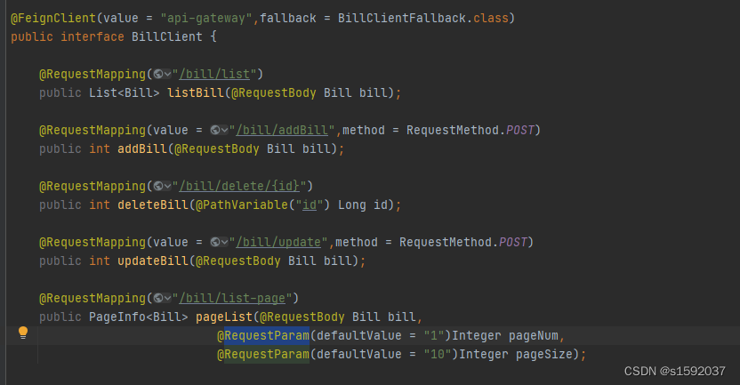

## 微服务常见问题

1. Eureka注册服务慢

    1. 只有当实例、服务器端和客户端的本地缓存中的元数据都相同时，服务才能被其他客户端发现(所以可能需要3次心跳)
    2. EurekaClient向EurekaServer发送心跳默认间隔30秒，可修改该时间提高工作效率
    
2. 已停止的微服务节点注销慢或不注销

    1. EurekaServer清理节点周期长(默认90s)，以及自我保护机制等原因
    
        ```markdown
         Eureka Server端：
        配置关闭自我保护，并按需设置Eureka Server清理无效节点的时间间隔。
        eureka.server.enable-self-preservation
        #设置为false，关闭自我保护，从而保证会注销微服务
        eureka.server.eviction-interval-timer-in-ms
        #清理间隔（单位毫秒，默认是60*1000）
        
        Eureka Client端：
        配置开启健康检查，并按需配置持续更新的时间和到期时间。
        eureka.client.healthcheck.enabled
        #设为true，开启健康检查（需要spring-boot-starter-actuatoryi依赖）
        eureka.instance.lease-xepiration-duration-in-seconds
        #续约到期时间（默认90秒）
        ```
       
3. Hystrix/Feign整合Hystrix首次请求失败

    1. Hystrix默认超时时间是1s，如果1s内得不到响应，则进入fallback逻辑。Spring的懒加载机制，首次请求会比较慢，某些情况下首次请求时间会大于1s
    2. 解决方案
        1. 延长Hystrix的超时时间
        2. 禁用Hystrix的超时设置
    
4. eureka连接服务报错：Connection refused:connect

    1. 重启服务
    2. 配置文件微服务service-url拼写错误
    
5. 服务调用Feign传参问题

    1. 使用Feign传参时
        1. 字符串使用@RequestParam注解:获取url后面追加的参数(所有get请求、postman的post请求)
        2. 对象使用@RequestBody注解
        3. 多个参数传递时，传输会变成POST方法传输
        
           
6. Gateway跨域配置

    1. 网关是所有微服务的统一入口，必然在调用时出现跨域问题
    2. 跨域：js请求访问中，访问地址与当前服务器的域名、ip地址或者端口号不一致则称为跨域
        如从在 http://localhost:9090 中的 js 访问 http://localhost:9000 的数据，因为端口不同，所以也是跨域请求。
   3. SpringCloudGateway网关设置跨域
        ```yaml
        server:
        port: 10010
        
        spring:
        application:
        name: api-gateway
        cloud:
        gateway:
        routes:
        #路由Ip，可以任意设置
        - id: user-service-route
        #代理的服务地址
        #uri: http://127.0.0.1:9091
        uri: lb://billManager-service
        #断言
        predicates:
        - Path=/**
        #跨域配置：允许https://docs12.spring.io的请求通过
        globalcors:
        cors-configurations:
        '[/**]':
        allowedOrigins:
        - "https://docs12.spring.io"
        allowedMethods:
        - GET
        ```
    
7. config配置中心，访问路径的相关问题ssh无效等

8. SpringCloudBus广播时相关问题：版本相关bus-refresh、busrefresh

9. MyBatis的Long型数据问题:不支持的jdbcType类型，使用bigInt解决

### SpringCloud问题排查

1. 排查配置问题

    1. 应用名称UNKNOWN，spring.application.name或者eureka.instance.appname未配置
    2. 微服务实例状态UNKNOWN，eureka.client.healthcheck.enabled=true必须设置在application.yml中，而不能设置在bootstrap.yml中，否则一些场景下会导致应用状态UNKNOW的问题
    
2. 排查代码问题

    1. 注解缺失，依赖缺失
    
3. SpringCloud自身问题

    1. Debug相关代码