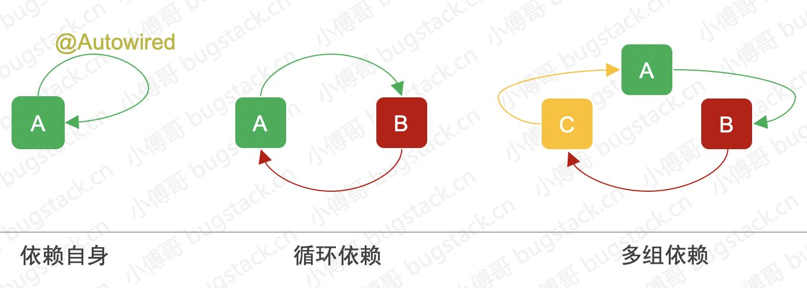
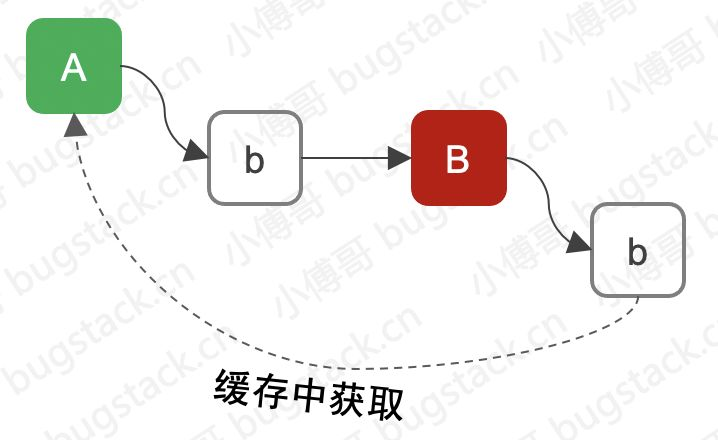
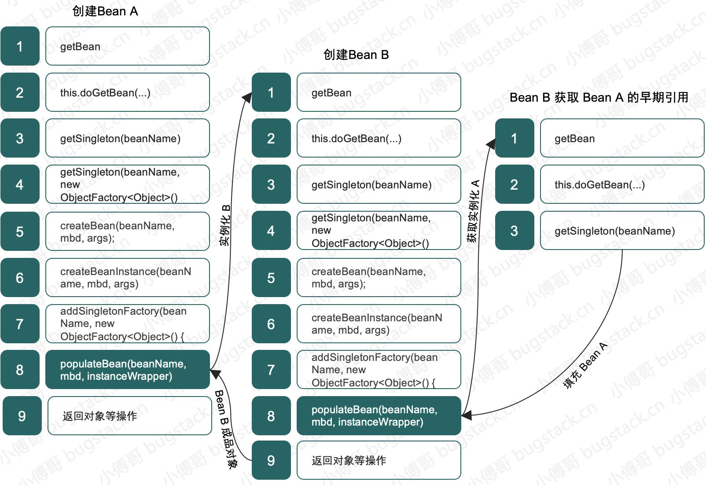
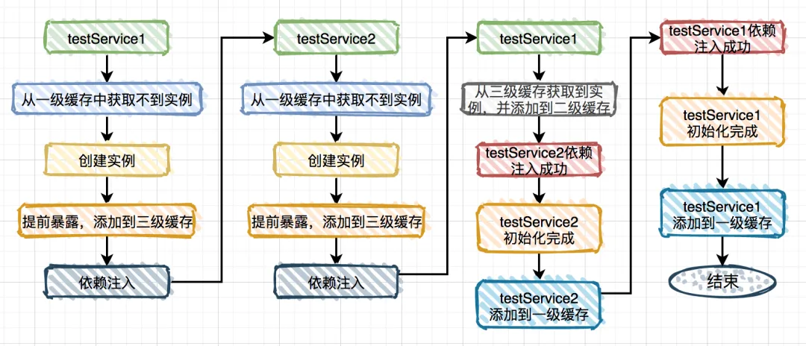
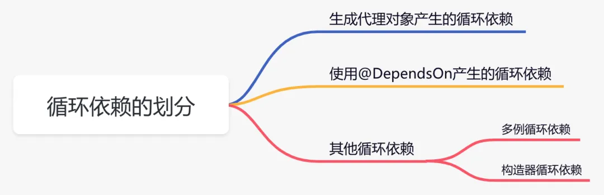
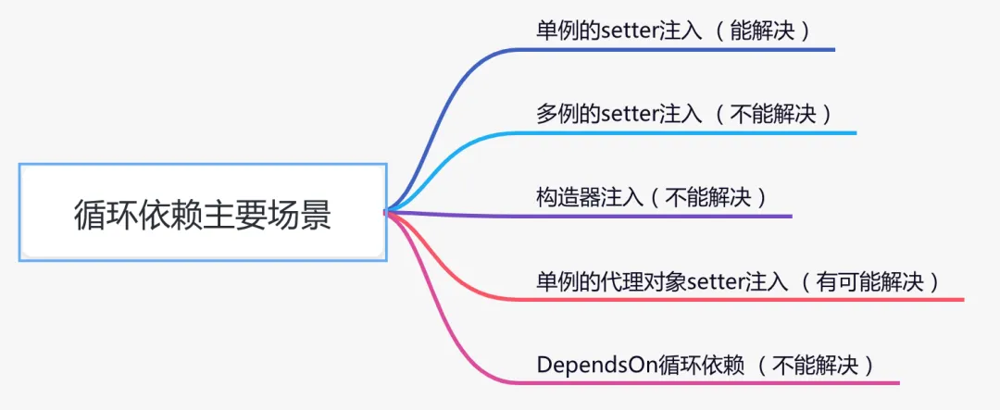

## Spring循环依赖



* 循环依赖：自身依赖于自身、互相循环依赖、多组循环依赖

* 强依赖

    类在创建之初必须依赖于另一个对象，无法解决
    
    ```java
    public class LoopDependency {
        public static void main(String[] args) {
            new ClazzA();
        }
    }
    
    class ClazzA {
        private ClazzB b = new ClazzB();
    }
    
    class ClazzB {
        private ClazzA a = new ClazzA();
    }
    ```

### 循环依赖解决

1. Spring的get/set或者注解，进行一定程度的解耦(类的创建和属性的填充分离)

    * 先创建出半成品Bean
    
    * 填充属性，完成成品Bean
    
      

2. Spring内部解决循环依赖

    

### 三级缓存

* 一级缓存singletonObjects

    用于保存实例化、注入、初始化完成的bean实例

* 二级缓存earlySingletonObjects

    用于保存实例化完成的bean实例

* 三级缓存singletonFactories

    用于保存bean创建工厂，以便于后面扩展有机会创建代理对象
  
#### 单例setter注入

```java
@Service
public class TestService1 {
    @Autowired
    private TestService2 testService2;
    public void test1() {
    }
}
@Service
public class TestService2 {
    @Autowired
    private TestService1 testService1;
    public void test2() {
    }
}
```

* Spring内部解决


  
##### 为什么使用二级缓存

```java
@Service
public class TestService1 {
    @Autowired
    private TestService2 testService2;
    @Autowired
    private TestService3 testService3;
    public void test1() {
    }
}
@Service
public class TestService2 {
    @Autowired
    private TestService1 testService1;
    public void test2() {
    }
}
@Service
public class TestService3 {
    @Autowired
    private TestService1 testService1;
    public void test3() {
    }
}
```

三级缓存保存的并非真正的实例对象，而是一个ObjectFactory对象，每次从三级缓存中获取
的都是ObjectFactory对象，通过它创建的实例对象每次都可能不一样

引入二级缓存后，第二次依赖注入时，直接从二级缓存获取已经创建的对象

* 为什么三级缓存不直接保存实例对象？

    无法对实例对象进行增强

#### 多例setter注入

```java
@Scope(ConfigurableBeanFactory.SCOPE_PROTOTYPE)
@Service
public class TestService1 {
    @Autowired
    private TestService2 testService2;
    public void test1() {
    }
}
@Scope(ConfigurableBeanFactory.SCOPE_PROTOTYPE)
@Service
public class TestService2 {
    @Autowired
    private TestService1 testService1;
    public void test2() {
    }
}
```

#### 构造器注入
```java
@Service
public class TestService1 {
    public TestService1(TestService2 testService2) {
    }
}
@Service
public class TestService2 {
    public TestService2(TestService1 testService1) {
    }
}
```

#### 单例的代理对象setter注入：使用@Lazy注解，延迟加载

@Async注解的场景，会通过AOP自动生成代理对象

```java
@Service
public class TestService1 {
    @Autowired
    private TestService2 testService2;
    @Async
    public void test1() {
    }
}
@Service
public class TestService2 {
    @Autowired
    private TestService1 testService1;
    public void test2() {
    }
}
```

默认情况下，spring是按照文件完整路径递归查找的，按路径+文件名排序，排在前面的先加载

TestService1修改为TestService6即可

#### DependsOn循环依赖

在实例化Bean A之前，先实例化Bean B，可使用@DependsOn注解

```java
@DependsOn(value = "testService2")
@Service
public class TestService1 {
    @Autowired
    private TestService2 testService2;
    public void test1() {
    }
}
@DependsOn(value = "testService1")
@Service
public class TestService2 {
    @Autowired
    private TestService1 testService1;
    public void test2() {
    }
}
```

#### 循环依赖解决方案





1. 单例循环依赖：Spring默认能解决

2. 多例循环依赖：bean改成单例，除此之外无法解决

3. 构造器循环依赖：@Lazy注解
   
4. 生成代理对象产生的依赖
   
    1. 使用@Lazy注解，延迟加载
    2. 使用@DependsOn注解，指定加载先后关系
    3. 修改文件名称，改变循环依赖类的加载顺序

5. DependsOn循环依赖：无法解决

