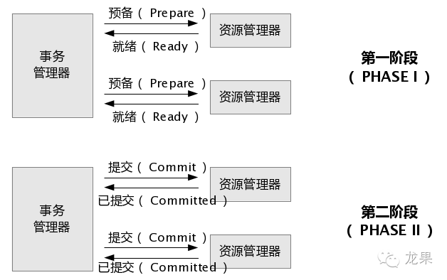
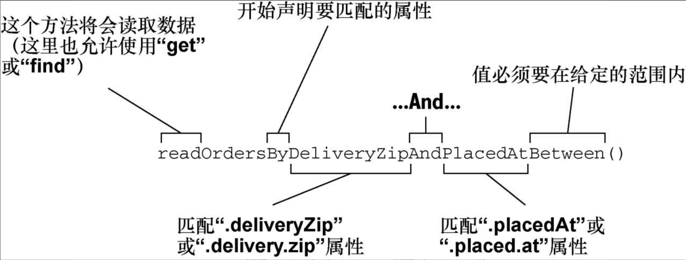
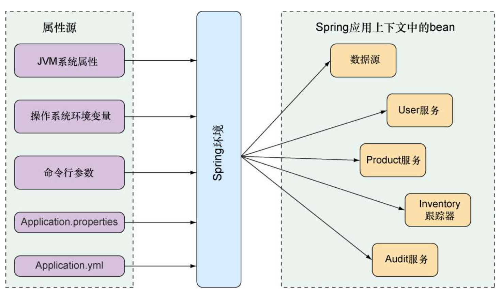

## JPA(Java Persistence API持久层API)

### 事务

一组原子性的SQL查询/操作，或者说一个独立的工作单元

特点

* 事务内的语句要么全部执行成功，要么全部执行失败

### 本地事务(原生sql)

紧密依赖于底层资源管理器(如数据库连接)，事务处理局限在当前事务资源内

优缺点：

* 部署灵活，不存在对应用服务器的依赖

* 无法支持多数据源的分布式事务

```java
public void transferAccount() {
    Connection conn = null;
    Statement stmt = null;
    try{
        // 1. 获取连接
        conn = getDataSource().getConnection();
        // 1.1 自动提交设置为false，若设置为true则数据库默认把每一次数据更新认定为一个事务并自动提交
        conn.setAutoCommit(false);
        // 2. 准备语句
        stmt = conn.createStatement();
        // 3. 执行
        // 3.1 将A账户中的金额减少500
        stmt.execute("update t_account set amount = amount - 500 where account_id = 'A'");
        // 3.2 将B账户中的金额增加500
        stmt.execute("update t_account set amount = amount + 500 where account_id = 'B'");
        // 4. 提交事务
        conn.commit();
    // 事务提交：转账的两步操作同时成功
    } catch(SQLException sqle){
        // 5.1 发生异常，回滚在本事务中的操作
        conn.rollback();
        // 5.2 事务回滚：转账的两部操作完全撤销
        stmt.close();
        conn.close();
    }
}
```

### 分布式事务(Distributed Transaction)

分布式事务底层支持：

* Java事务编程接口

    JTA：Java Transaction API

* Java事务服务

    JTS：Java Transaction Service

分布式事务组成：

* 事务管理器

    Transaction Manager：承担所有事务参与单元的协调与控制

* 参与者/资源管理器(1个或多个)

    * Resource Manager：支持XA协议的资源管理器
    
    * 可看做任意类型的持久化数据存储
    
```java
public void transferAccount() {
    UserTransaction userTx = null;
    Connection connA = null;
    Statement stmtA = null;
    Connection connB = null;
    Statement stmtB = null;
    try{
        // 获得 Transaction 管理对象
        userTx = (UserTransaction)getContext().lookup("java:comp/UserTransaction");
        // 从数据库 A 中取得数据库连接
        connA = getDataSourceA().getConnection();
        // 从数据库 B 中取得数据库连接
        connB = getDataSourceB().getConnection();
        // 启动事务
        userTx.begin();
        // 将 A 账户中的金额减少 500
        stmtA = connA.createStatement();
        stmtA.execute("update t_account set amount = amount - 500 where account_id = 'A'");
        // 将 B 账户中的金额增加 500
        stmtB = connB.createStatement();
        stmtB.execute("update t_account set amount = amount + 500 where account_id = 'B'");
        // 提交事务
        // 事务提交：转账的两步操作同时成功（数据库 A 和数据库 B 中的数据被同时更新）
        userTx.commit();
    } catch(SQLException sqle){
        // 发生异常，回滚在本事务中的操纵
        // 事务回滚：数据库 A 和数据库 B 中的数据更新被同时撤销
        userTx.rollback();
    } catch(Exception ne){
    }
}
```

#### 两阶段提交

两阶段提交保证了分布式事务的原子性：所有结点要么全做，要么全不做



1. 准备阶段

    1. 事务协调者/事务管理器：给每个参与者发送Prepare消息

    2. 参与者返回消息：
    
        * 失败：如权限认证失败

        * 成功：在本地执行事务，写本地的redo和undo日志

2. 提交阶段

    1. 准备阶段返回的消息：
    
        * 失败或者超时：给每个参与者发送回滚Rollback消息
    
        * 成功：给每个参与者发送提交Commit消息
    
    2. 释放所有事务处理过程中使用的锁资源

两阶段尽可能晚地提交事务，让事务在提交前尽可能完成所有能完成的工作


### 领域

#### 默认命名策略：ImprovedNamingStrategy

    即用下划线转换驼峰名。authorId  -> author_id

#### 领域特定语言DSL：Domain-Specific Language

    在特定领域下的上下文的语言。
    简单理解为JPA中指代repository方法。
    持久化细节通过repository方法签名描述。
    即Spring Data解析方法名称，基于被持久化的对象来推测方法的目的。

* repository方法是由一个动词(find/get/read/count)、一个可选的主题（Subject）、关键词By以及一个断言所组成的。如findByDeliveryZip：动词是find，断言是DeliveryZip，主题并没有指定，暗含的主题是Order。

* Spring Data解析repository方法签名来确定要执行的查询

  
#### Spring Data方法签名操作符

* IsAfter、After、IsGreaterThan、GreaterThan
* IsGreaterThanEqual、GreaterThanEqual
* IsBefore、Before、IsLessThan、LessThan
* IsLessThanEqual、LessThanEqual
* IsBetween、Between
* IsNull、Null
* IsNotNull、NotNull
* IsIn、In
* IsNotIn、NotIn
* IsStartingWith、StartingWith、StartsWith
* IsEndingWith、EndingWith、EndsWith
* IsContaining、Containing、Contains
* IsLike、Like
* IsNotLike、NotLike
* IsTrue、True
* IsFalse、False
* Is、Equals
*IsNot、Not
* IgnoringCase、IgnoresCase

#### Spring属性配置

