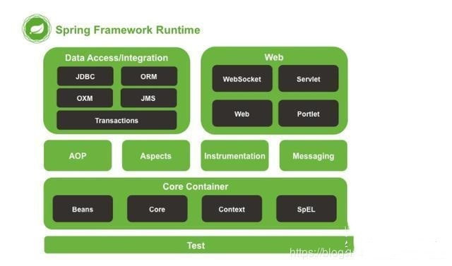

## Spring、SpringMVC、SpringBoot区别

### 概念

#### Spring

    Spring是一个开源容器框架，可以接管dao层、持久层、web层和业务层的组件，并且可以配置各种bean和维护bean与bean之间的关系。
    核心是控制反转IOC和面向切面编程AOP，简而言之Spring是一个分层的轻量级开源框架。

#### SpringMVC

    SpringMVC属于SpringFrameWork的后续产品，融合在Spring Web Flow里面。
    SpringMVC是一种web层的MVC框架，用于替代servlet(处理/响应请求、获取表单参数、表单校验等)。
    SpringMVC是一个MVC开源框架，SpringMVC=struts2+Spring，相当于Struts2加上Spring的整合

#### SpringBoot

    SpringBoot是一个微服务框架，延续Spring框架的核心思想IOC和AOP，简化了应用的开发和部署。

### 原理和结构

#### Spring

    Spring为简化开发工作，封装了一系列开箱即用的组件功能模块，包括Spring JDBC、SpringMVC
    Spring Security、Spring AOP、SPring ORM、Spring Test等

#### SpringMVC

    SpringMVC是SpringWeb里面的一个功能模块(SpringWebMVC)。
    专门用来开发SpringWeb项目的一种MVC模式的技术框架实现。

#### SpringBoot

    SpringBoot是Spring框架的扩展，消除了设置Spring应用程序所需的XML配置
    特点：
        1. 创建独立的Spring应用
        2. 嵌入Tomcat、JettyUndertow而且无需部署它们
        3. 提供starters的pom来简化Maven配置
        4. 尽可能自动部署Spring应用
        5. 没有代码生成和XML配置要求

SpringBoot是包含了Spring的核心（IOC）和（AOP）；以及封装了一些扩展，如Starter

### 区别与总结

1. 简单理解：Spring包含SpringMVC，SpringBoot包含Spring或者说是在Spring基础上做的一个扩展

    

2. 关系：SpringMVC < Spring < SpringBoot

3. SpringBoot对比Spring的优点

    * 提供嵌入式容器支持
    
    * 使用命令java -jar独立运行jar
      
    * 外部容器中部署时，可以选择排除依赖关系以避免潜在的jar冲突 
   
    * 部署时灵活指定配置文件的选项
    
    * 用于集成测试的随机端口生成
