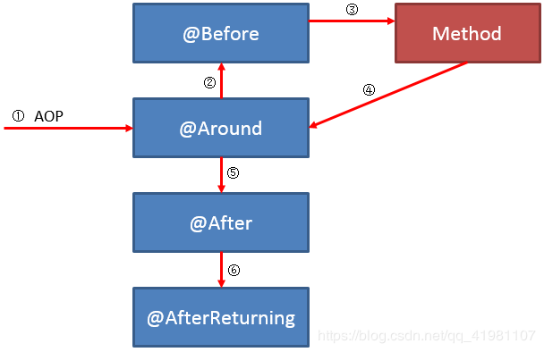
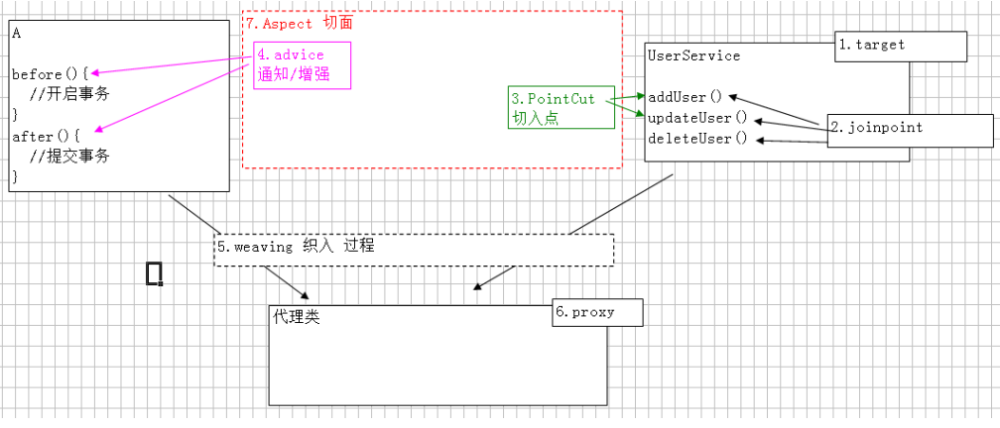

### Spring MVC
#### Spring MVC处理流程
1. 初始化处理
    1. Web容器启动通知Spring初始化容器，加载Bean的定义信息并初始化所有单例Bean
    2. 遍历容器中的Bean，获取每一个Controller中所有方法访问的URL，将URL和所有对应的Controller保存到Map集合(HandlerMapping)中
2. 请求处理(生成处理器执行链)
    1. 所有请求转发给前端处理器DispatcherServlet处理
    2. DispatcherServlet请求HandlerMapping找出被@Controller注解修饰的Bean和被@RequestMapping修饰的方法和类
       * Controller中可调用一些Service和DAO进行数据操作
    3. 生成Handler和HandlerInterceptor并以一个HandlerExecutionChain处理器执行链返回
3. 执行处理(获取ModelAndView)
    1. DispatcherServlet使用Handler找到HandlerAdapter
    2. 通过HandlerAdapter调用Handler方法
    3. 将请求参数绑定到方法的形参上，执行方法处理请求并得到逻辑视图ModelAndView
4. 视图解析
    1. DispatcherServlet使用视图解析器ViewResolver对ModelAndView进行解析，得到View物理视图
    2. 对视图渲染并填充数据到视图中
    3. 返回客户端
    
#### Spring MVC组件

* DispatcherServlet
    
    前端控制器，整个控制流程核心，负责接受请求并转发给对应的处理器组件
  
* Handler

    处理器，完成具体业务逻辑，相当于Servlet和Action
  
* HandlerMapping

    完成URL到Controller的映射，DispatcherServlet通过HandlerMapping将不同请求映射到不同Handler
  
* HandlerInterceptor

    处理拦截器(接口)，如果需要可实现该接口完成一些拦截处理
  
* HandlerExecutionCharin

    处理器执行链，包括Handler和HandlerInterceptor
  
* HandlerAdapter
    
    处理器适配器，Handler执行业务前需要进行的一系列操作
  
    包括：表单数据验证，数据类型转换，将表单数据封装到JavaBean
  
    DispatcherServlet通过HandlerAdapter执行不同Handler
  
* ModelAndView

    装在模型数据和视图信息，Handler处理结果并返回给DispatcherServlet
  
* ViewResolver

    视图解析器，DispatcherServlet通过ViewResolver将逻辑视图解析为物理视图，将渲染结果响应给客户端
  
#### Spring MVC注解

* @Controller

    类定义处添加，将类交给IoC容器管理

* @RequestMapping

  映射URL请求和业务方法，类和方法定义上都可添加

  参数：
    * value：URL请求的实际地址
    * method：请求方法类型
        * GET
        * POST
        * PUT
        * DELETE
    * params：限制必须提供的参数

* @RequestParam

    Controller方法的形参和URL参数名不一致可使用该注解绑定(一致时可不使用)

    参数：
    * value：HTTP请求中的参数名
    * required：参数是否必要，默认false
    * defaultValue：没有给参数赋值时的默认值

* @PathVariable

    RESTful风格URL，通过@PathVariable完成请求参数与形参的绑定

### AOP(Aspect Orient Programming)

面向切面编程，简单说就是将重复代码提取出来，在需要执行的时候使用动态代理技术，在不修改源码的基础上对源码进行增强

#### 分类

JDK动态代理：类实现接口时使用
    
CGLib动态代理：类未实现接口时使用，在运行时动态生成某个类的子类，final标记的类不能使用

#### 注解

* @Aspect

    被注解的类是一个切面Bean

* @Before
  
    前置通知，在某个连接点之前执行的通知
  
* @After
  
    后置通知，某个连接点退出时执行的通知(正常退出/异常退出均执行)
  
* @AfterReturning
  
    返回后通知，某个连接点正常执行后执行的通知，returning属性接收返回值
  
* @AfterThrowing

    异常通知，方法抛出异常导致退出时执行的通知，throwing属性接收返回值

    和@AfterReturning只会有一个执行

#### AOP相关术语

* Aspect

    切面，一个关注点的模块化，这个关注点会横切多个对象

    切入点+通知

* JoinPoint

    连接点，程序执行过程中的某一行为，即业务层中的所有方法

* Advice

    通知，切面对于某个连接点所产生的动作，包括前置通知、后置通知、返回后通知、异常通知和环绕通知

* PointCut

    切入点，指被拦截的连接，切入点一定是连接点，连接点不一定是切入点

* Proxy
    
    代理，Spring AOP有JDK动态代理和CGLib代理

* Target

    代理的目标对象，指一个或多个切面通知的对象

* Weaving

    织入，指把增强advice应用到目标对象target来创建代理对象proxy的过程

  

### IOC(Inversion of Control控制反转)

    传统创建对象：new关键字创建
    Spring创建对象：通过IOC容器创建，即将创建对象的控制权交给了IOC容器
    优点：IOC让程序员不再关注如何创建对象，而关注创建对象后的操作，把对象的创建、初始化、销毁等工作交给Spring容器
    通俗理解，对于某个具体对象而言，传统是它控制其他对象，现在是所有对象都被Spring控制，称控制反转

