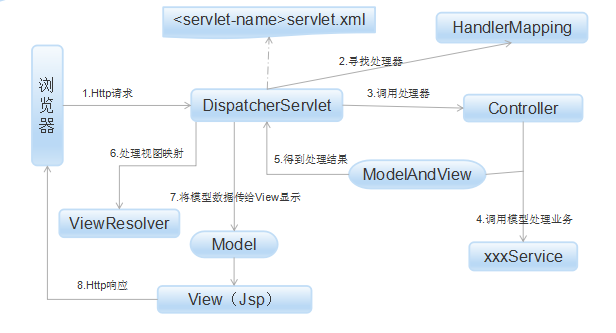
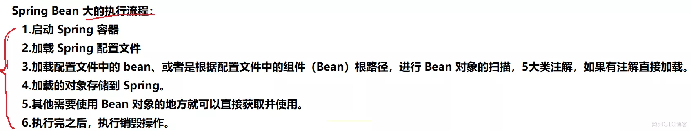
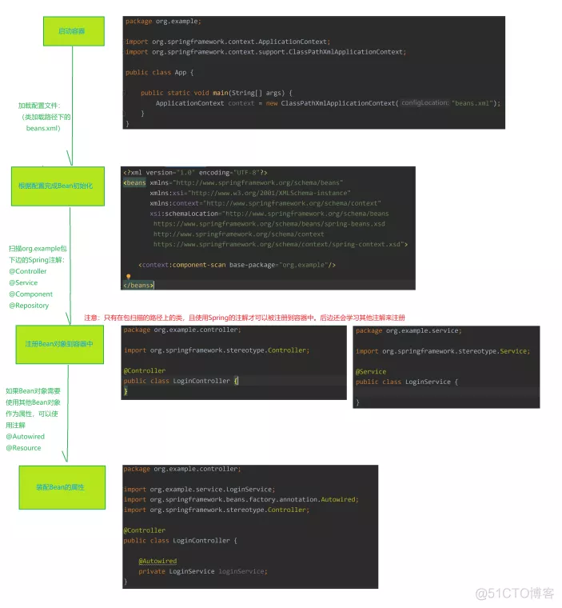
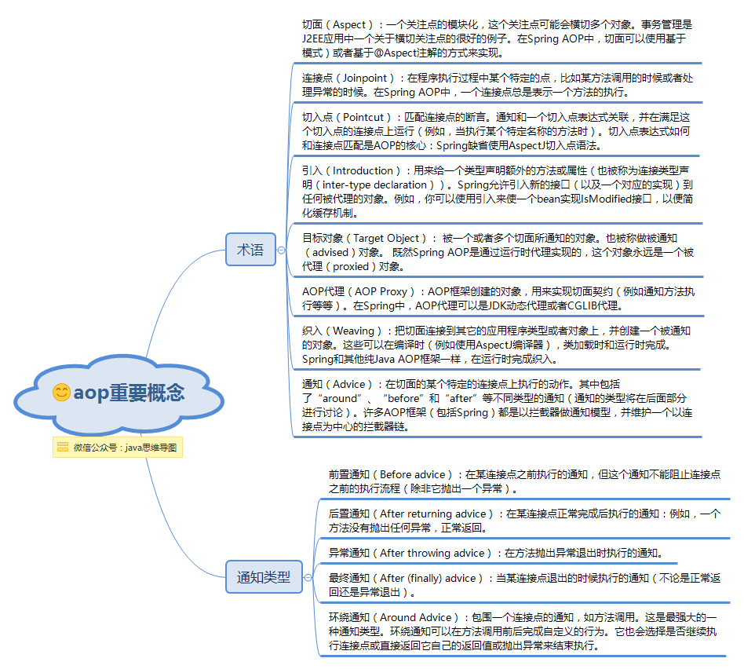
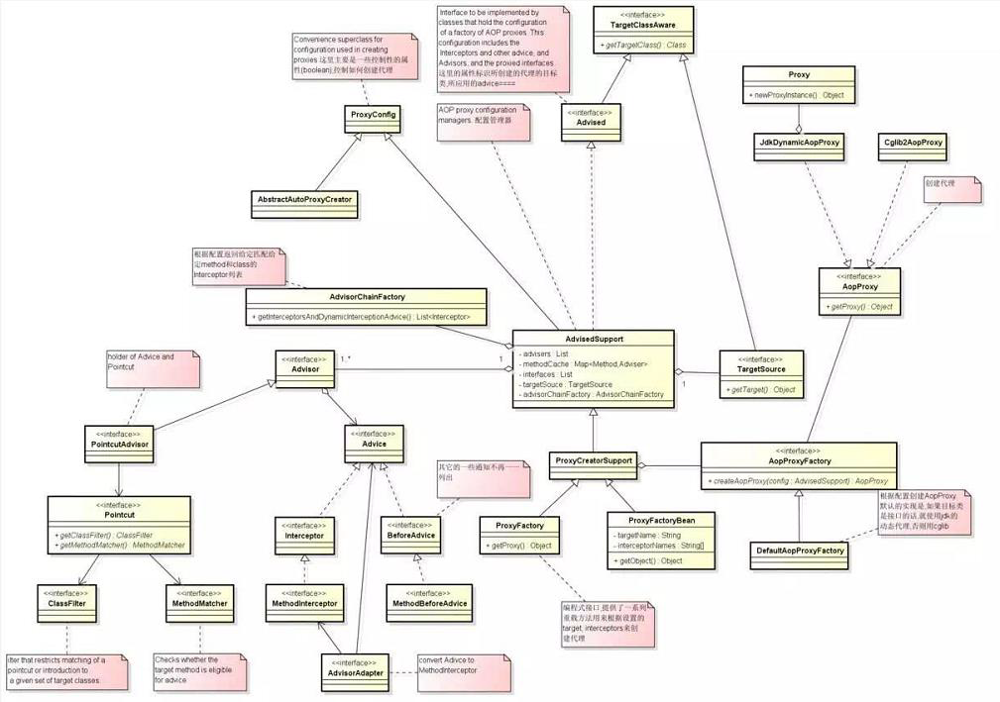
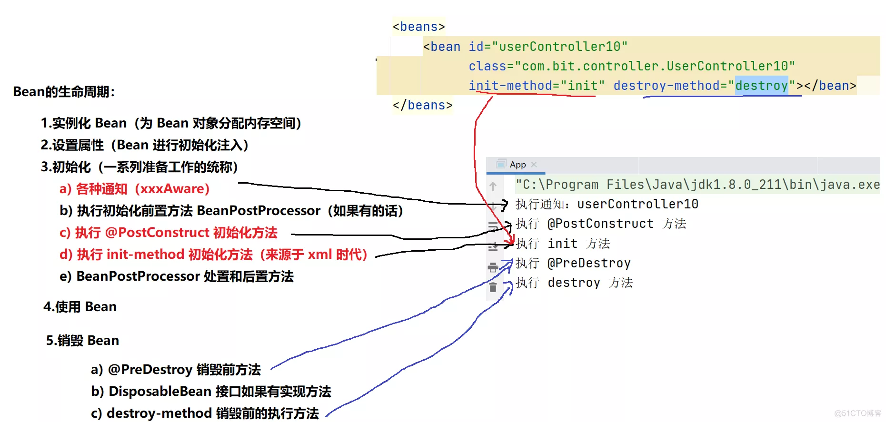
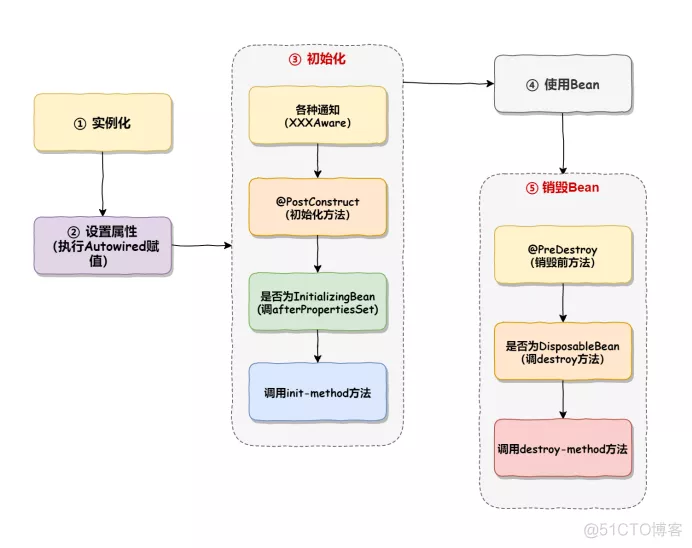
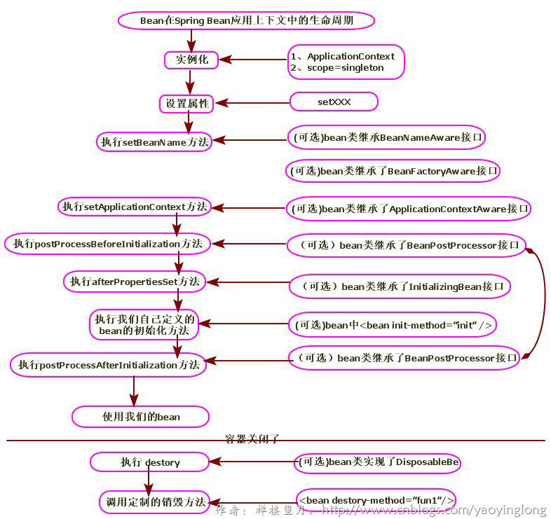

## Spring MVC

### Spring MVC初始化



#### 处理流程

1. 初始化处理
   
    1. Web容器启动通知Spring初始化容器，加载Bean的定义信息并初始化所有单例Bean

        
       
    2. 遍历容器中的Bean，获取每一个Controller中所有方法访问的URL，将URL和所有对应的Controller保存到Map集合(HandlerMapping)中
    
2. 请求处理(生成处理器执行链)
   
    1. 所有请求转发给前端处理器DispatcherServlet处理
       
    2. DispatcherServlet请求HandlerMapping找出被@Controller注解修饰的Bean和被@RequestMapping修饰的方法和类
       
       * Controller中可调用Service进行业务处理和DAO进行数据操作
       
    3. 生成Handler和HandlerInterceptor并以一个HandlerExecutionChain处理器执行链返回
    
3. 执行处理(获取ModelAndView)
   
    1. DispatcherServlet使用Handler找到HandlerAdapter并执行业务前相应处理(表单验证、数据类型转换)
       
    2. 通过HandlerAdapter调用Handler方法
       
    3. 将请求参数绑定到方法的形参上，执行方法处理请求并得到逻辑视图ModelAndView
    
4. 视图解析
   
    1. DispatcherServlet使用视图解析器ViewResolver对ModelAndView进行解析，得到View物理视图
       
    2. 对视图渲染并填充数据到视图中
       
    3. 返回客户端

#### Bean执行流程




#### Spring MVC组件

* DispatcherServlet
    
    前端控制器，整个控制流程核心，负责接受请求并转发给对应的处理器组件
  
* Handler

    处理器，完成具体业务逻辑，相当于Servlet和Action
  
* HandlerMapping

    完成URL到Controller的映射，DispatcherServlet通过HandlerMapping将不同请求映射到不同Handler
  
* HandlerInterceptor

    处理拦截器(接口)，如果需要可实现该接口完成一些拦截处理
  
* HandlerExecutionCharin

    处理器执行链，包括Handler和HandlerInterceptor
  
* HandlerAdapter
    
    处理器适配器，Handler执行业务前需要进行的一系列操作
  
    包括：表单数据验证，数据类型转换，将表单数据封装到JavaBean
  
    DispatcherServlet通过HandlerAdapter执行不同Handler
  
* ModelAndView

    装载模型数据和视图信息，Handler处理结果并返回给DispatcherServlet
  
* ViewResolver

    视图解析器，DispatcherServlet通过ViewResolver将逻辑视图解析为物理视图，将渲染结果响应给客户端
  
### Spring MVC注解

* @Controller

    类定义处添加，将类交给IoC容器管理

* @RequestMapping

  映射URL请求和业务方法，类和方法定义上都可添加

  参数：
    * value：URL请求的实际地址
    * method：请求方法类型
        * GET
        * POST
        * PUT
        * DELETE
    * params：限制必须提供的参数

* @RequestParam

    Controller方法的形参和URL参数名不一致可使用该注解绑定(一致时可不使用)

    参数：
    * value：HTTP请求中的参数名
    * required：参数是否必要，默认false
    * defaultValue：没有给参数赋值时的默认值

* @PathVariable

    RESTful风格URL，通过@PathVariable完成请求参数与形参的绑定

### AOP(Aspect Orient Programming)

面向切面编程，简单说就是将重复代码提取出来，在需要执行的时候使用动态代理技术，在不修改源码的基础上对源码进行增强




#### AOP分类

* JDK动态代理
  
    * 目标类是接口时使用(类实现接口时使用)
    
        * 只能为接口创建代理实例
    
    * 涉及Proxy和InvocationHandler类
    
        * 实现InvocationHandler接口定义横切逻辑
    
* CGLib动态代理
  
    * Code Generation Library

    * 目标类不是接口时使用(类未实现接口时使用)
      
    * 在运行期动态扩展Java类和实现Java接口，封装asm，运行器动态生成新的class(final标记的类不能使用)
    
    * 对于没有通过接口定义业务方法的类只能通过CGLib代理
    
        

#### AOP注解

* @Aspect

    被注解的类是一个切面Bean

* @Before
  
    前置通知，在某个连接点之前执行的通知
  
* @After
  
    后置通知，某个连接点退出时执行的通知(正常退出/异常退出均执行)
  
* @AfterReturning
  
    返回后通知，某个连接点正常执行后执行的通知，returning属性接收返回值
  
* @AfterThrowing

    异常通知，方法抛出异常导致退出时执行的通知，throwing属性接收返回值

    和@AfterReturning只会有一个执行


#### AOP相关术语

* Aspect

    切面，一个关注点的模块化，这个关注点会横切多个对象

    切入点+通知

* JoinPoint

    连接点，程序执行过程中的某一行为，即业务层中的所有方法

* Advice

    通知，切面对于某个连接点所产生的动作，包括前置通知、后置通知、返回后通知、异常通知和环绕通知

* PointCut

    切入点，指被拦截的连接，切入点一定是连接点，连接点不一定是切入点

* Proxy
    
    代理，Spring AOP有JDK动态代理和CGLib代理

* Target

    代理的目标对象，指一个或多个切面通知的对象

* Weaving

    织入，指把增强/通知advice应用到目标对象target来创建代理对象proxy的过程

* Introduction

    在不修改代码的前提下，引入可以在运行期为类动态地添加一些方法或字段

  

### IOC(Inversion of Control控制反转)

    传统创建对象：new关键字创建
    Spring创建对象：通过IOC容器创建，即将创建对象的控制权交给了IOC容器
    优点：IOC让程序员不再关注如何创建对象，而关注创建对象后的操作，把对象的创建、初始化、销毁等工作交给Spring容器
    通俗理解，对于某个具体对象而言，传统是它控制其他对象，现在是所有对象都被Spring控制，称控制反转

#### BeanFactory框架基础设施

Spring框架的基础设施，面向Spring本身


##### HierarchicalBeanFactor父子级联

子容器可以通过接口(HierarchicalBeanFactor父子级联)访问父容器的bean，父容器不能访问子容器的bean

如：SpringMVC

* 视图层Bean：子容器中

* 业务层/持久层Bean：父容器中

* 视图层Bean可以引用业务层和持久层Bean，反之则不行

#### ApplicationContext面向开发应用


1. ClassPathXmlApplicationContext：默认从类路径加载配置文件

2. FileSystemXmlApplicationContext：默认从文件系统中装载配置文件
   
3. ApplicationEventPublisher：让容器拥有发布应用上下文事件的功能，包括容器启动事
   件、关闭事件等。
4. MessageSource：为应用提供 i18n 国际化消息访问的功能；
   
5. ResourcePatternResolver ： 所 有 ApplicationContext 实现类都实现了类似于
   PathMatchingResourcePatternResolver 的功能，可以通过带前缀的 Ant 风格的资源文
   件路径装载 Spring 的配置文件。
   
6. LifeCycle：该接口是 Spring 2.0 加入的，该接口提供了 start()和 stop()两个方法，主要
   用于控制异步处理过程。在具体使用时，该接口同时被 ApplicationContext 实现及具体
   Bean 实现， ApplicationContext 会将 start/stop 的信息传递给容器中所有实现了该接
   口的 Bean，以达到管理和控制 JMX、任务调度等目的。
   
7. ConfigurableApplicationContext 扩展于 ApplicationContext，它新增加了两个主要
   的方法： refresh()和 close()，让 ApplicationContext 具有启动、刷新和关闭应用上下
   文的能力。在应用上下文关闭的情况下调用 refresh()即可启动应用上下文，在已经启动
   的状态下，调用 refresh()则清除缓存并重新装载配置信息，而调用close()则可关闭应用
   上下文。

#### WebApplication体系架构

面向Web应用，允许从相对于web根目录路径装载配置文件完进行初始化

* ServletContext：存放Web应用上下文对象(作为属性)
  
* WebApplicationContext：可获取ServletContext的引用

* Web应用环境可以访问Spring应用上下文


### DI(Dependency Injection依赖注入)

    Spring通过DI动态的向某个对象提供其他所需要的对象(通过反射实现)，可通过@Autowire注解实现


#### 依赖注解@Autowired

默认开启按类型的自动装配(byType)，可通过参数 required=false关闭自动装配


#### 依赖注入方式

* 基于构造函数的依赖注入(Constructor Injection)

    * 优点：可以将需要注入的字段声明为final，在类实例化期间被初始化

        ```java
        @Component
        public class ConstructorBasedInjection {
            private final InjectedBean injectedBean;
      
            // 官方文档中，@Autowired可省略
            // 此处并非构造器装配，依然使用Autowired装配方式字段(字段注入相同效果)
            @Autowired
            public ConstructorBasedInjection(InjectedBean injectedBean) {
                this.injectedBean = injectedBean;
            }
        }
        ```

* 基于方法的依赖注入(Method Injection)

    * Spring启动过程中，自动调用一次加了@Autowired注解的方法，我们可以在此做一些初始化工作

        ```java
        @Service
        public class UserService {
        
            @Autowired
            public void test(IUser user) {
               user.say();
            }
        }
        ```
      
* 基于setter的依赖注入(Setter Injection)

    * 使用无参构造函数或无参静态工厂方法实例化Bean时，为了注入Bean的依赖项，Spring容器将调用这些setter方法

        ```java
        @Component
        public class SetterBasedInjection {
            private InjectedBean injectedBean;
        
            // 官方文档中，@Autowired可省略
            @Autowired
            public void setInjectedBean(InjectedBean injectedBean) {
                this.injectedBean = injectedBean;
            }
        }
        ```
      
* 基于字段的依赖注入(Field Injection)
    
    * 不允许声明不可变域(final/immutable)

        * 依赖注入字段必须在类实例化时初始化(final域不允许更改值)

    * 容易违反单一设计原则(依赖增多容易)

    * Spring4开始不推荐使用

        ```java
        @Component
        public class FieldBasedInjection {
            @Autowired
            private InjectedBean injectedBean;
        }
        ```

* 基于参数的依赖注入(Parameter Injection)

    * 构造器参数依赖注入
    
        ```java
        @Service
        public class UserService {
        
            private IUser user;
        
            public UserService(@Autowired IUser user) {
                this.user = user;
                System.out.println("user:" + user);
            }
        }
        ```
      
    * 非静态方法参数依赖注入

        ```java
        @Service
        public class UserService {
        
            public void test(@Autowired IUser user) {
               user.say();
            }
        }
        ```

* 基于注解的依赖注入(ANNOTATION_TYPE Injection)

    * TODO：不常使用

#### 依赖注入失效

1. 类未加@Controller、@Service、@Repository、@Component等注解

2. 注入Filter或Listener(在Filter中字段注入)

    * Web应用启动顺序：Listener->Filter->Servlet

        
    
    * 对于所有SpringBootWeb应用程序而言，SpringMVC启动(DispatcherServlet加载Bean)在Listener/Filter之后执行

3. 注解未被@ComponentScan扫描/路径不正确

   ※ SpringBoot项目中@SpringBootApplication注解内置@ComponentScan注解功能

   ※ basePackages：默认扫描与启动类在同个包以及子包下的bean
   
    1. @Component注解扫描[@Controller、@Service、@Repository、@Component等注解的]类，收集元数据
    
        1. 扫描路径未添加 -> 注解无法收集
    
        2. 扫描路径不正确 -> 注解无法收集
    
        3. 扫描范围太小 -> 注解无法收集
    
    2. 使用@Autowired自动装配(已经被收集/注入的Bean)

4. 循环依赖问题

    如果A依赖于B，B依赖于C，C依赖于A，形成一个死循环

    

    * Spring默认单例，单例使用@Autowired装配，大多数情况能解决循环依赖
    
        * 如果创建代理对象，单例可能出现循环依赖问题
    
    * 多例Bean出现循环依赖，导致bean自动装配失败

#### 静态注入(new)/动态注入(Autowired)

##### 为什么要动态注入

传统：

1. 只需要一个实例

    判断有无Object实例，没有则创建    

2. 需要多个实例

    每次都创建Object实例

    -> 更好办法：Object定义初始化静态工厂方法，别的地方都调用

##### 静态工厂注入
    
所谓静态工厂，就是通过调用静态工厂的方法来获取自己需要的对象

1. 配置文件注入

```java
// 静态工厂
public class DaoFactory {
    public static final FactoryDao getStaticFactoryDaoImpl() {
        return new StaticFacotryDaoImpl();
    }
}

public class SpringAction {
    // 注入对象FactoryDao的Bean实例
    private FactoryDao staticFactoryDao;
    // 注入对象的set方法
    public void setStaticFactoryDao(FactoryDao staticFactoryDao) {
        this.staticFactoryDao = staticFactoryDao;
    }
}

// xml配置文件
<bean name="springAction" class=" SpringAction" >
    <!-- 使用静态工厂方法注入对象，以下为初始化内容
         即private FactoryDao staticFactoryDao; 初始化为ref指向的Bean -->
    <property name="staticFactoryDao" ref="staticFactoryDao"></property>
</bean>
<!-- 使用静态工厂方法注入对象 -->
<!-- factory-method：指定调用哪个工厂方法-->
<bean name="staticFactoryDao" class="DaoFactory"
    factory-method="getStaticFactoryDaoImpl"></bean>
```

2. 注解注入

```java
// 静态工厂
@Component
public class DaoFactory {
    @Bean
    public static final FactoryDao getStaticFactoryDaoImpl() {
        return new StaticFacotryDaoImpl();
    }
}

@Component
public class SpringAction {
    // 注入对象FactoryDao的Bean实例
    private FactoryDao staticFactoryDao;

    // 注入对象的set方法
    @Autowired
    public void setStaticFactoryDao(FactoryDao staticFactoryDao) {
        this.staticFactoryDao = staticFactoryDao;
    }
}
```

##### 实例工厂注入

获取对象实例的方法不是静态的，需要首先new工厂类，再调用普通的实例方法

```java
// 实例工厂
public class DaoFactory { 
    public FactoryDao getFactoryDaoImpl(){
        return new FactoryDaoImpl();
    }
}

public class SpringAction {
    // 注入对象
    private FactoryDao factoryDao;
    public void setFactoryDao(FactoryDao factoryDao) {
        this.factoryDao = factoryDao;
    }
}
<!-- xml配置文件 -->
<bean name="springAction" class="SpringAction">
    <!-- 使用实例工厂的方法注入对象,对应下面的配置文件 -->
    <property name="factoryDao" ref="factoryDao"></property>
</bean>
<!-- 此处获取对象的方式是从工厂类中获取实例方法 -->
<!-- [factory-bean]+[factory-method]生成实例(类似new) -->
<bean name="daoFactory" class="com.DaoFactory"></bean>
<bean name="factoryDao" factory-bean="daoFactory"
    factory-method="getFactoryDaoImpl"></bean>
```

##### 静态注入

    本质是创建一个全局的KV，key是Object的类，value是new出来的所有Object
    代码逻辑：
      1. 创建全局KV
      2. 手工new或通过静态方法创建第一个没有依赖的Ojbect，存放到KV
      3. 手工new或通过静态方法创建其他Ojbect，如果需要依赖则从KV取出来用
      4. 所有Object创建完启动服务

##### 动态注入

    运行时注入
    代码逻辑：
      1. 初始化Object
        a. 如何创建：单例/多例/Factory
        b. 自定义初始化代码等
      2. 描述Object的依赖(class/name描述)

#### 依赖注入选择

1. 依赖注入的使用上，Constructor Injection是首选
   
2. 使用@Autowired注解的时候，要使用Setter Injection方式，这样代码更容易编写单元测试
   
    

### Spring Bean作用域


* 无状态bean：通常指对象的属性状态不需要更新

* 有状态bean：通常指对象的属性状态需要更新

#### 单例模式singleton(默认作用域:全局共享)

* IoC容器启动产生，容器销毁时销毁(bean实例/对象)

* SpringIoC容器只存在一个共享的Bean实例

场景：通常无状态的Bean使⽤该作⽤域
 
```java
<bean id="userDao" class="com.ioc.UserDaoImpl" scope="singleton"/>
```

#### prototype原型模式(创建后IoC容器不再管理bean状态)

* 瞬时Bean，用完就销毁(Spring容器不再管理的意思)，多例Bean
  
* 每次获取bean时，容器创建新bean实例/对象
  
* xml配置时，Spring启动时不创建实例，类似lazy-init

场景：通常有状态的Bean使⽤该作⽤域

#### request：请求作用域

每一次HTTP请求都会创建一个新的bean，该bean仅在当前Http Request内有效，请求处理完后销毁实例(请求和响应共享bean)

场景：一次Http请求和响应的共享Bean

```java
<bean id="loginAction" class="" scope="request"/>
```

#### session：会话作用域

* 会话开始产生，会话结束销毁
  
* 同一Http Session之间共享一个bean，不同session(会话)使用不同bean

场景：记录用户的登录信息

```java
<bean id="user" class="" scope="session"/>
```

解读

    1. 设置bean id = user
    2. Spring容器每次调用user时，都会在(每)一个会话中创建一个新实例(因为bean是session级别)
    3. session中所有请求(request)共享一个bean
    4. 会话级别的bean可随意修改互不影响 

#### ~~global session：全局会话作用域~~

* web容器启动产生，web容器销毁bean销毁(MVC中bean类似)

* 全局session作用域，仅在基于portlet的web应用中才有意义

* portlet时能够生成语义代码(如HTML)片段的小型JavaWeb插件(Spring5已取消该功能)

* portlet与servlet不同，每个portlet都有不同的会话

#### application：全局作用域

ServletContext级别：在一个Http Servlet Context中，定义一个Bean实例

场景：Web应用的上下文信息，比如：记录一个应用的共享信息

```java
<bean id="app" class="" scope="application"/>
```

#### singleton和application区别

* singleton是Spring Core的作用域，作用于IoC的容器
  
* application是Spring Web中的作用域，作用于Servlet容器

#### Spring的Controller是单例

单例线程不安全，可能导致属性重复使用(单例：同一实例可能被多处修改)

解决方案：

* 不在Controller中定义成员变量

* 必须定义非静态成员变量时，通过注解@Scope("request")，将其设置为多例模式

### Spring Bean生成方式

#### 1. 基于XML配置

* Bean生成入方式

    1. Spring容器优先读取配置文件
    
    2. 生成配置文件内定义的Bean实例
    
#### 2. 基于@Configuration和@Bean的形式

* Bean生成方式

    1. Spring容器优先读取配置信息(此处配置注解类)
    
    2. 生成配置类Bean实例
    
    3. 生成配置类定义的Bean实例

#### 3. 基于@Configuration+@Component/@Service/@Controller/@Repository注解方式

* Bean生成方式

    1. Spring容器优先读取配置信息(此处配置注解类)

    2. 生成配置类Bean实例

    3. 生成配置类定义的组件扫描到的Bean实例
    
    4. 生成组件扫描的的Bean内定义的Bean实例

    5. 生成配置类Bean内定义的Bean实例

#### 4. 基于@Configuration、@Import注解方式
   
* @Import注解引入外部资源交由Spring管理
  
* 通过@Import注解引入的类只能根据类型进行注入，不能根据名称注入

* Bean生成方式(@Import注解时通常配置类中不定义其他Bean)

    1. Spring容器优先读取配置信息(此处配置注解类)

    2. 生成配置类Bean实例

    3. 生成通过配置类@Import注解引入的Bean实例(非接口实现)


#### 5.基于@Configuration、@Import注解和ImportSelector接口方式

通常实现类同时实现以下接口

1. ImportSelector接口：收集需要导入的配置类

    * 方法： 调用selectImports方法之前先调用其他接口中对应方法

2. 其他接口
   
    * EnvironmentAware
      
    * BeanFactoryAware
      
    * BeanClassLoaderAware
      
    * ResourceLoaderAware

3. Bean生成生成方式(@Import注解时通常配置类中不定义其他Bean)

    1. Spring容器优先读取配置信息(此处配置注解类)

    2. 生成配置类Bean实例

    3. 生成通过配置类@Import引入的接口实现类中定义的Bean实例(接口实现不生成Bean实例)

        * 实现EnvironmentAware接口的方法内，生成Environment的Bean实例

#### 6. 基于@Configuration、@Import注解和ImportBeanDefinitionRegistrar接口方式

* ImportBeanDefinitionRegistrar能够实现动态注册bean到容器中

    如可以先判断容器中是否存在某个对象，然后进行相应的逻辑处理，动态的向容器中添加对象等

* Bean生成方式(@Import注解时通常配置类中不定义其他Bean，也可以定义)

    1. Spring容器优先读取配置信息(此处配置注解类)

    2. 生成配置类Bean实例
    
    3. 生成配置类Bean定义的其他Bean实例(如果有)

    4. 生成通过配置类@Import引入的接口实现类中定义的Bean实例(接口实现不生成Bean实例)
       
        * 实现ImportBeanDefinitionRegistrar接口的方法内，动态生成的Bean实例

#### 7. 基于@Configuration+@Component注解方式和实现FactoryBean接口方式
   
* BeanFactory负责创建Bean对象，FactoryBean是由BeanFactory创建出来的Bean

* Bean生成方式(@Import注解时通常配置类中不定义其他Bean)

    1. Spring容器优先读取配置信息(此处配置注解类)

    2. 生成配置类Bean

    3. 生成配置类定义的组件扫描到的Bean实例

    4. 生成通过组件扫描到Bean(接口实现)中定义的其他Bean实例: getBean时生成

#### 8. 基于@Configuration+@Conditional注解(Spring4注解)+实现Condition接口方式

* 按照一定的条件进行判断(类似动态注册ImportBeanDefinitionRegistrar)，满足条件给容器注册bean，通常和配置文件配合使用(类似ImportSelector)

* Bean生成方式(@Import注解时通常配置类中不定义其他Bean)

    1. Spring容器优先读取配置信息(此处配置注解类)

    2. 生成配置类Bean

    3. 根据配置类中@Conditional注解的条件判断，生成相应的Bean实例
    
        ```java
        @Configuration
        @PropertySource("myApplication.properties")
        public class MyConfiguration8Conditional {
            @Bean
            @Conditional(MyConfiguration8ConditionalImpl.class)
            public Customer customerConditional() {
            return new Customer("张楚岚", 21);
            }
        
            @Bean
            @Conditional(MyConfiguration8ConditionalImpl2.class)
            public Customer customerConditional2() {
                return new Customer("冯宝宝", 18);
            }
        }

        public class MyConfiguration8ConditionalImpl implements Condition {
            /**
            * 当配置文件中包含有配置security.isOpen并且配置文件的值为true时才向Spring中注入Bean
            */
            @Override
            public boolean matches(ConditionContext context, AnnotatedTypeMetadata metadata) {
                Environment environment = context.getEnvironment();
                if (environment.containsProperty("security.isOpen") &&
                  environment.getProperty("security.isOpen").equals("true")) {
                  return true;
                }
                return false;
            }
        }
        ```
       
### Spring 对象注入方式

1. xml配置文件注入

    通过obj = context.getBean("xxx")获取

2. 依赖注入@Autowired注解(默认byType)

    ```java
    @Autowired
    private InjectedObject injectedObject;
    ```
3. @Resource注解(默认byName)

4. @Inject注解(默认byType)

    第三方插件

### Spring Bean生命周期

    一个Bean对象从出生到销毁的过程
    即Bean的定义 -> Bean的初始化 -> Bean的使用 -> Bean的销毁

具体过程：







1. 实例化Bean，为Bean分配一些内存空间

    实例化一个Bean，也就是常说的new

2. 设置属性，注入或者装配Bean

3. 进行初始化

    1. 实现各种通知(Aware)方法，如BeanNameAware、BeanFactoryAware、BeanFactoryAware、ApplicationContextAware等
    
    2. 执行BeanPostProcessor初始化前置方法
       
    3. 执行@PostConstruct初始化方法，注入依赖后执行
       
    4. 执行自定义的init-method方法(可有可无)
       
    5. 执行BeanPostProcessor初始化后置方法
    
4. 使用Bean

5. 销毁Bean

#### 实例化和初始化区别(生命周期中)

* 实例化

实例化和属性设置时Java级别的系统事件，操作过程不可人工干预和修改

* 初始化

给开发者提供的，可在实例化之后，类加载完成之前进行自定义事件处理

#### 生命周期样例：买房

1. 买房(实例化，从无到有)

2. 装修(设置属性)

3. 买家电，如洗衣机等(各种初始化)

4. 入住(使用Bean)

5. 卖出(Bean销毁)