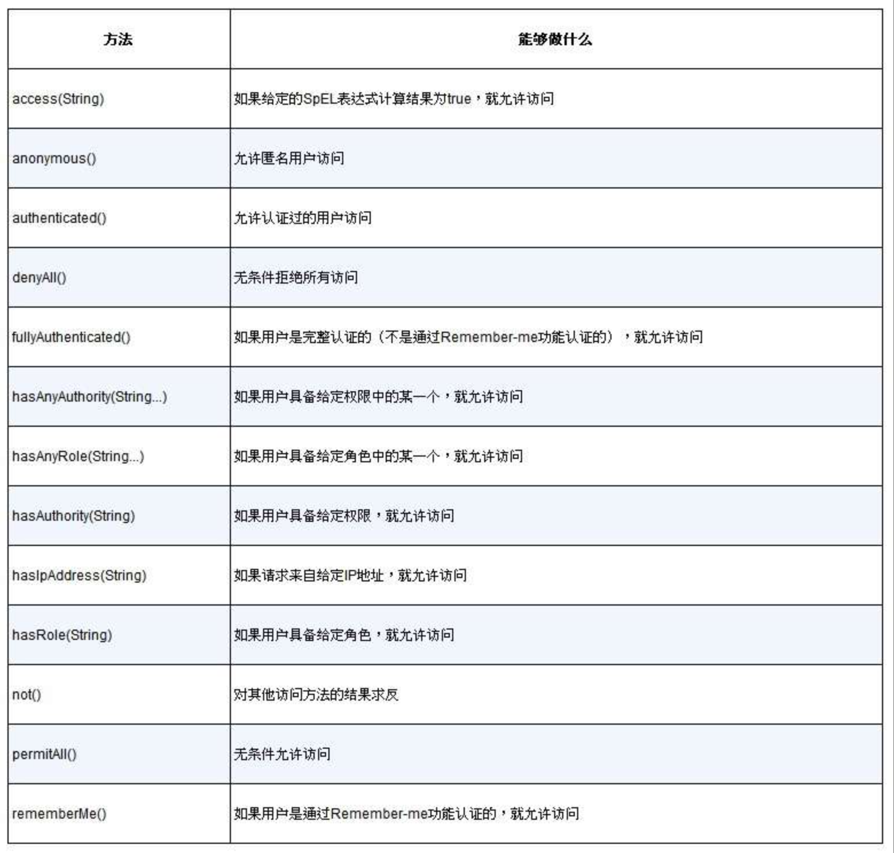
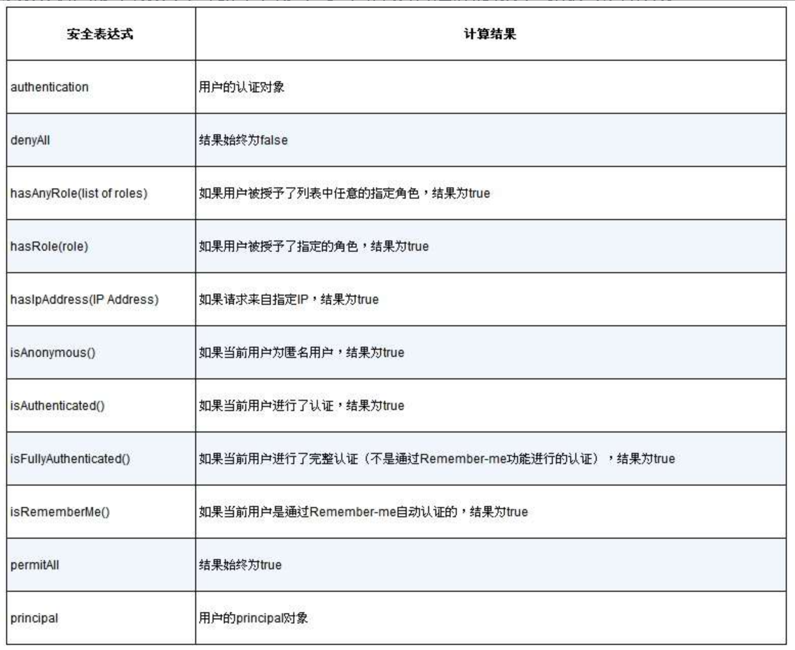

### 权限认证(授权鉴权)

* 授权(登录)

* 鉴权(权限拦截)

### 实现方式

1. aop filter
2. shiro
3. spring security
#### Spring Security

* 使用门槛高，无法做到开箱即用。需要写繁杂的配置类。
* 定制授权逻辑时，增加验证码字段，需要自己增加filter。
* 定制鉴权逻辑时，基本要重写detail和manager
* 性能堪忧。默认启动后注入十几个filter，每个filter都会跑一遍(一个不通过，状态保存，后续filter检查状态，如果有就不执行当前filter)

#### HttpSecurity保护路径配置方法

#### SpEL表达式：Spring Security对Spring表达式语言的扩展

#### CSRF

跨站请求伪造Cross-Site Request Forgery

