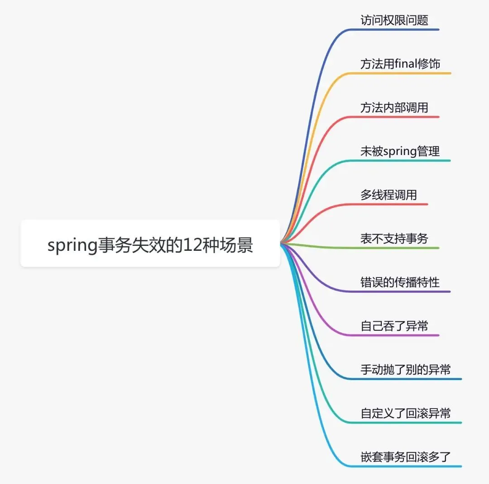

## Spring事务失效




### 事务不生效

#### 访问权限

```java
@Service
public class UserService {
    @Transactional
    private void add(UserModel userModel) {
         saveData(userModel);
         updateData(userModel);
    }
}
```

Spring要求被代理的方法是public

#### 方法用final修饰符

```java
@Service
public class UserService {
    @Transactional
    public final void add(UserModel userModel){
        saveData(userModel);
        updateData(userModel);
    }
}
```

spring事务底层使用aop，即通过jdk动态代理或者cglib代理，如果用final则代理类无法重写该方法

#### 方法内部调用

```java
@Service
public class UserService {
    @Autowired
    private UserMapper userMapper;

    //@Transactional
    public void add(UserModel userModel) {
        userMapper.insertUser(userModel);
        updateStatus(userModel);
    }

    @Transactional
    public void updateStatus(UserModel userModel) {
        doSameThing();
    }
}
```

* 事务方法add中，直接调用事务方法updateStatus

* updateStatus方法拥有事务的能力是因为Transaction注解导致spring aop生成了代理对象，代理对象直接调用this.updateStatus方法不会生成事务

解决方法：

1. 新增service方法，将事务放到新方法中

```java
@Servcie
public class ServiceA {
   @Autowired
   prvate ServiceB serviceB;

   public void save(User user) {
         queryData1();
         queryData2();
         serviceB.doSave(user);
   }
 }

 @Servcie
 public class ServiceB {

    @Transactional(rollbackFor=Exception.class)
    public void doSave(User user) {
       addData1();
       updateData2();
    }
 }
```

2. Service类中注入自己

```java
@Servcie
public class ServiceA {
   @Autowired
   prvate ServiceA serviceA;

   public void save(User user) {
         queryData1();
         queryData2();
         serviceA.doSave(user);
   }

   @Transactional(rollbackFor=Exception.class)
   public void doSave(User user) {
       addData1();
       updateData2();
    }
 }
```

3. 使用AopContext.currentProxy获取代理对象

```java
@Servcie
public class ServiceA {

   public void save(User user) {
         queryData1();
         queryData2();
         ((ServiceA)AopContext.currentProxy()).doSave(user);
   }

   @Transactional(rollbackFor=Exception.class)
   public void doSave(User user) {
       addData1();
       updateData2();
    }
}
```

#### 未被Spring管理

使用spring事务的前提是：对象要被spring管理，需要创建bean实例

```java
//@Service
public class UserService {

    @Transactional
    public void add(UserModel userModel) {
         saveData(userModel);
         updateData(userModel);
    }    
}
```

#### 多线程调用

```java
@Slf4j
@Service
public class UserService {

    @Autowired
    private UserMapper userMapper;
    @Autowired
    private RoleService roleService;

    @Transactional
    public void add(UserModel userModel) throws Exception {
        userMapper.insertUser(userModel);
        new Thread(() -> {
            roleService.doOtherThing();
        }).start();
    }
}

@Service
public class RoleService {

    @Transactional
    public void doOtherThing() {
        System.out.println("保存role表数据");
    }
}
```

* add方法和doOtherThing方法不再同一个线程中，获取到的数据库连接不一样，从而是两个不同的事务

* 如果doOtherThing抛出异常，add方法无法回滚

* 同一事务指的是同一连接

#### 表不支持事务

MyIsam引擎不支持事务

#### 未开启事务

* SpringBoot默认开启事务

* 传统Spring需要在ApplicationContext.xml中手动配置事务相关参数

```xml
<!-- 配置事务管理器 --> 
<bean class="org.springframework.jdbc.datasource.DataSourceTransactionManager" id="transactionManager"> 
    <property name="dataSource" ref="dataSource"></property> 
</bean> 
<tx:advice id="advice" transaction-manager="transactionManager"> 
    <tx:attributes> 
        <tx:method name="*" propagation="REQUIRED"/>
    </tx:attributes> 
</tx:advice> 
<!-- 用切点把事务切进去 --> 
<aop:config> 
    <aop:pointcut expression="execution(* com.susan.*.*(..))" id="pointcut"/> 
    <aop:advisor advice-ref="advice" pointcut-ref="pointcut"/> 
</aop:config>
```

### 事务不回滚

#### 错误的传播特性

```java
@Service
public class UserService {

    @Transactional(propagation = Propagation.NEVER)
    public void add(UserModel userModel) {
        saveData(userModel);
        updateData(userModel);
    }
}
```

add方法的事务传播特性定义成了Propagation.NEVER，这种类型的传播特性不支持事务，如果有事务则会抛异常

#### 自己吞了异常

```java
@Slf4j
@Service
public class UserService {
    
    @Transactional
    public void add(UserModel userModel) {
        try {
            saveData(userModel);
            updateData(userModel);
        } catch (Exception e) {
            log.error(e.getMessage(), e);
        }
    }
}
```

如果想要spring事务能够正常回滚，必须抛出它能够处理的异常。如果没有抛异常，则spring认为程序是正常的

#### 手动抛了别的异常

```java
@Slf4j
@Service
public class UserService {
    
    @Transactional
    public void add(UserModel userModel) throws Exception {
        try {
             saveData(userModel);
             updateData(userModel);
        } catch (Exception e) {
            log.error(e.getMessage(), e);
            throw new Exception(e);
        }
    }
}
```

spring事务，默认情况下只会回滚RuntimeException（运行时异常）和Error（错误），对于普通的Exception（非运行时异常），它不会回滚

#### 自定义了回滚异常

```java
@Slf4j
@Service
public class UserService {
    
    @Transactional(rollbackFor = BusinessException.class)
    public void add(UserModel userModel) throws Exception {
       saveData(userModel);
       updateData(userModel);
    }
}
```

* rollback参数自定义回滚异常

* 如程序报错了，抛了SqlException、DuplicateKeyException等异常不属于自定义的异常，所以事务不会回滚

* 通常需要重新指定rollback参数为Exception或Throwable

#### 嵌套事务回滚多了

```java
public class UserService {

    @Autowired
    private UserMapper userMapper;

    @Autowired
    private RoleService roleService;

    @Transactional
    public void add(UserModel userModel) throws Exception {
        userMapper.insertUser(userModel);
        // 因为嵌套传播，此处不消化异常，整个add方法会回滚
        try {
            roleService.doOtherThing();
        } catch (Exception e) {
            log.error(e.getMessage(), e);
        }
    }
}

@Service
public class RoleService {

    @Transactional(propagation = Propagation.NESTED)
    public void doOtherThing() {
        System.out.println("保存role表数据");
    }
}
```

### 其他

### 大事务问题

```java
@Service
public class UserService {
    
    @Autowired 
    private RoleService roleService;
    
    @Transactional
    public void add(UserModel userModel) throws Exception {
       query1();
       query2();
       query3();
       roleService.save(userModel);
       update(userModel);
    }
}


@Service
public class RoleService {
    
    @Autowired 
    private RoleService roleService;
    
    @Transactional
    public void save(UserModel userModel) throws Exception {
       query4();
       query5();
       query6();
       saveData(userModel);
    }
}
```

* 使用编程式事务

    ```java
    @Autowired
    private TransactionTemplate transactionTemplate;
    
    ...
    
    public void save(final User user) {
         queryData1();
         queryData2();
         transactionTemplate.execute((status) => {
            addData1();
            updateData2();
            return Boolean.TRUE;
         })
    }
    ```

* 追加service方法

    ```java
    @Servcie
    publicclass ServiceA {
     @Autowired
     prvate ServiceB serviceB;
    
     public void save(User user) {
           queryData1();
           queryData2();
           serviceB.doSave(user);
     }
    }
    
    @Servcie
    publicclass ServiceB {
    
      @Transactional(rollbackFor=Exception.class)
      public void doSave(User user) {
         addData1();
         updateData2();
      }
    
    }
    ```

* 类中注入自己
    
    ```java
    @Servcie
    publicclass ServiceA {
     @Autowired
     prvate ServiceA serviceA;
    
     public void save(User user) {
           queryData1();
           queryData2();
           serviceA.doSave(user);
     }
     
     @Transactional(rollbackFor=Exception.class)
     public void doSave(User user) {
         addData1();
         updateData2();
      }
    }
    ```

* 使用AopContext.currentProxy获取代理对象

    ```java
    @Servcie
    publicclass ServiceA {
    
     public void save(User user) {
           queryData1();
           queryData2();
           ((ServiceA)AopContext.currentProxy()).doSave(user);
     }
     
     @Transactional(rollbackFor=Exception.class)
     public void doSave(User user) {
         addData1();
         updateData2();
      }
    }
    ```


