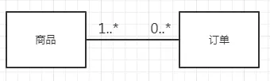
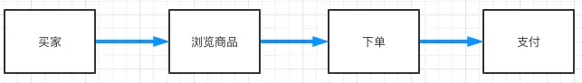
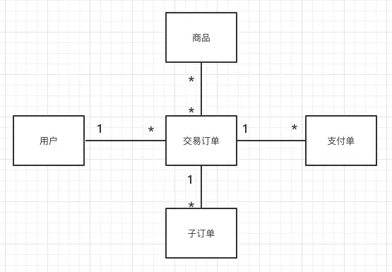

#### 陈氏模型ERD

概念：Entity Relationship Modeling

* 实体
  
* 弱实体

  在众多的实体中，有些实体对另一些实体有很强的依赖关系，即一个实体的存在必须以另一实体的存在为前提，前者就称为“弱实体”。

* 关系

  

* 基数(Cardinality):一个实与另一个实体的关系里面，某方可能出现次数
  * 1:1
  
    
  * 1:n
    
    
  * n:n(在物理ERD中被分成一对一对多的关系)
    
    

#### 进阶

* 1..*
  
    1到多个，是一种强制对应关系
  
* 0..*

    0到多个，是一种可选对应关系

* 示例1
  
    
    * 1个订单：至少包括一个商品，也可以包括多个商品
    * 1个商品：可以不属于任何订单(没有交易的情况)，也可以属于多个订单
* 示例2    
  
  
    * 1个实体A：对应0到3个实体B
    * 1个实体B：对应1个实体A

#### 画法

陈氏符号

* 实体：实体用矩形表示。

* 属性：属性用椭圆表示，椭圆内注明属性内容，若是该属性为键值属性，可以在属性下方用横线表示。

* 联系：实体之间通过菱形与直线相连，菱形内注明实体之间的联系情况。

* 基数：菱形两侧注明基数关系。

UML符号

* 流程图
  
  
  
* ER图1

  

* ER图2

  

#### 符号体系

  