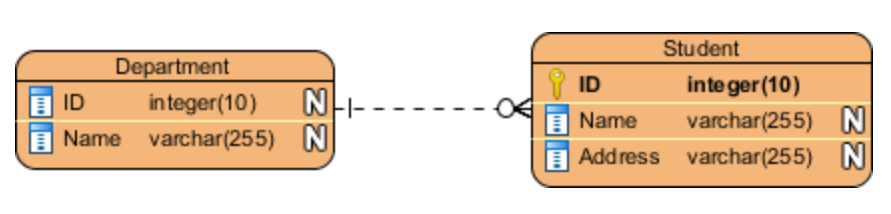

#### 鸭掌模型ERD

##### 关键字

* 标识实体(Entity)

  

* 主键(PrimaryKey)
  
  
  
* 外键(ForeignKey)
  
  
  
* 标识每个实体的属性(Attribute)
* 标识实体之间的关系(Relationship)
* 基数(Cardinality):一个实与另一个实体的关系里面，某方可能出现次数
    * 1:1
      
    * 1:n
      
    * n:n(在物理ERD中被分成一对一对多的关系)
      

##### 模型

* 概念数据模型：概念ERD（业务分析人员用于展示业务对象）
  
* 逻辑数据模型：逻辑ERD（业务分析人员用于展示业务对象）
  
* 物理数据模型：物理ERD（数据库设计人员用）
  

|ERD功能|概念|逻辑|物理|
|--|--|--|--|
实体(名称)|是|是|是|
关系|是|是|是|
列|-|是|是|
列的类型|-|随意|是|
主键|-|-|是|
外键|-|-|是|

姓名|武器|武力排行
:--|:--:|--:
刘备|双股剑|三
关羽|青龙偃月刀|第一
张飞|丈八蛇矛|排第二