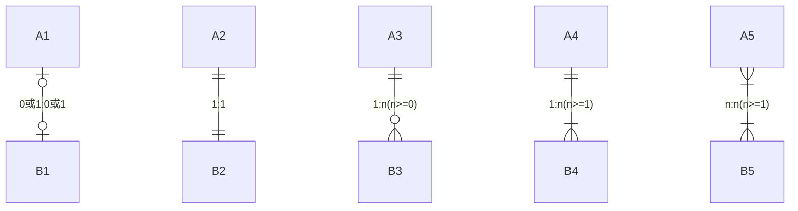
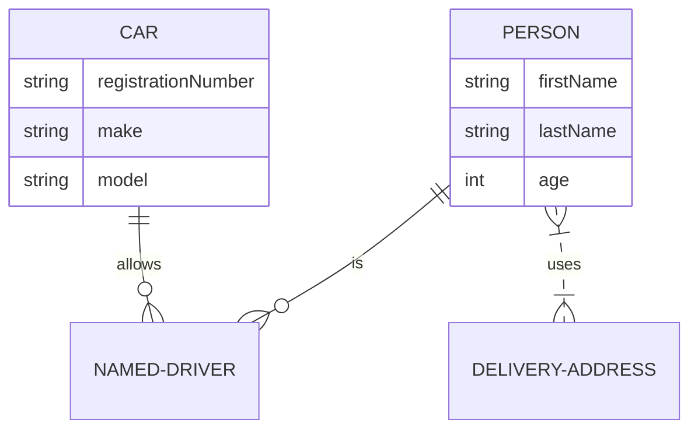

### ER图

Mermaid使用鸭掌模型(crow's foot notation)定义

* 基本语法

      <first-entity> [<relationship> <second-entity> : <relationship-label>]

* 关系relationship

|Value(left)|Value(right)|Meaning|
|:--:|:--:|:--|
|&#124;o|o&#124;|Zero or one|
|&#x7C;&#x7C;|&#x7C;&#x7C;|Exactly one|
|}o|o{|Zero or more(no upper limit)|
|}&#124;|&#124;{|one or more(no upper limit)|

* 属性

[comment]: <> (TODO:style)

[comment]: <> (style CAR fill:#f9f,stroke:#333,stroke-width:4px)

[comment]: <> (style PERSON fill:#ccf,stroke:#f66,stroke-width:2px,stroke-dasharray: 5, 5)
