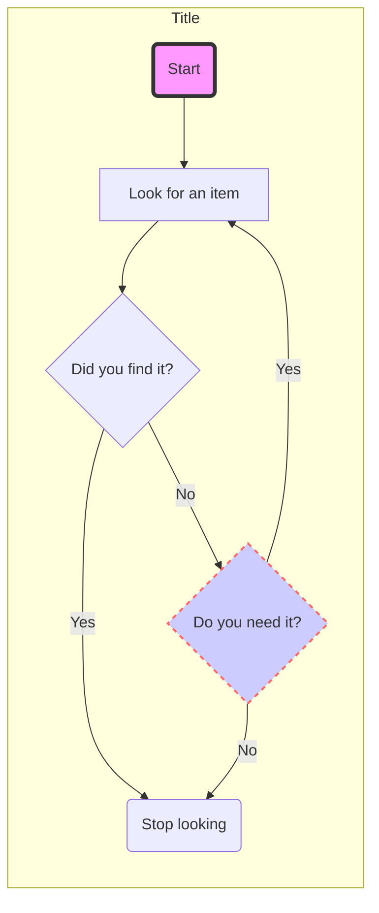
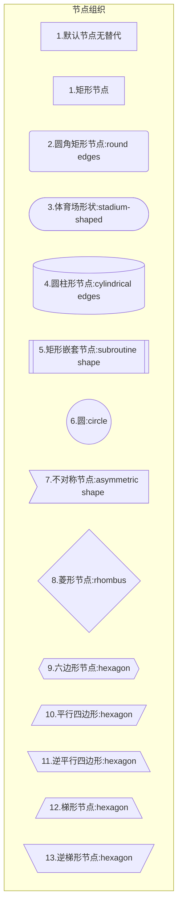
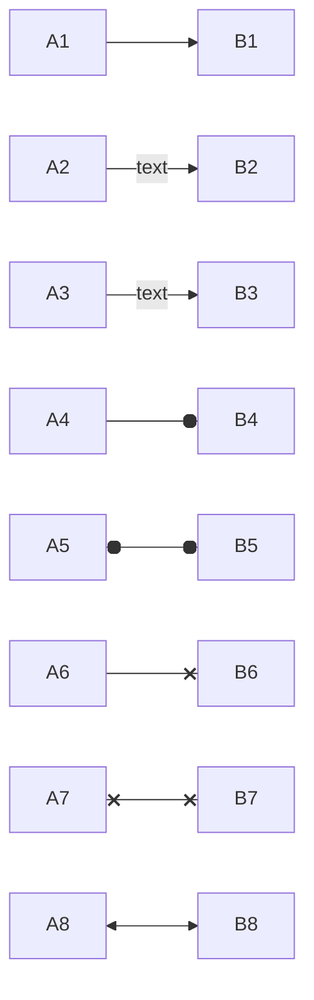
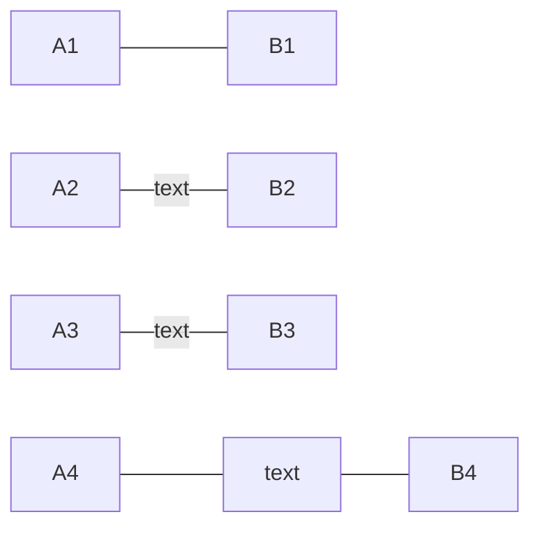
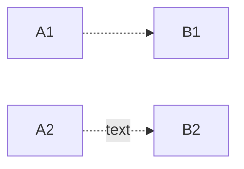
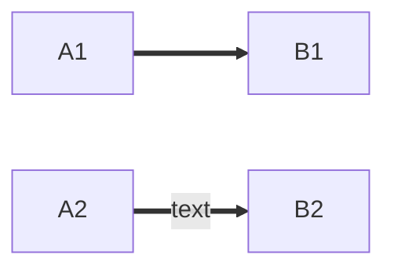
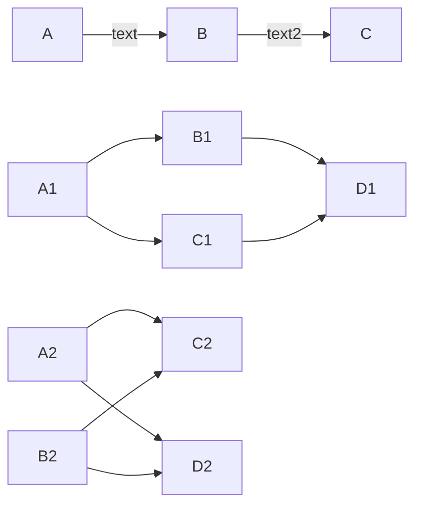
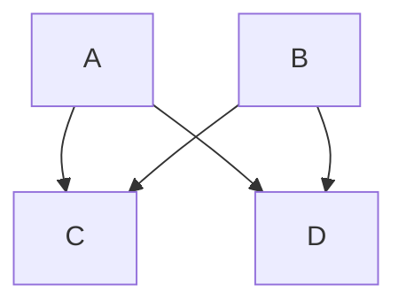
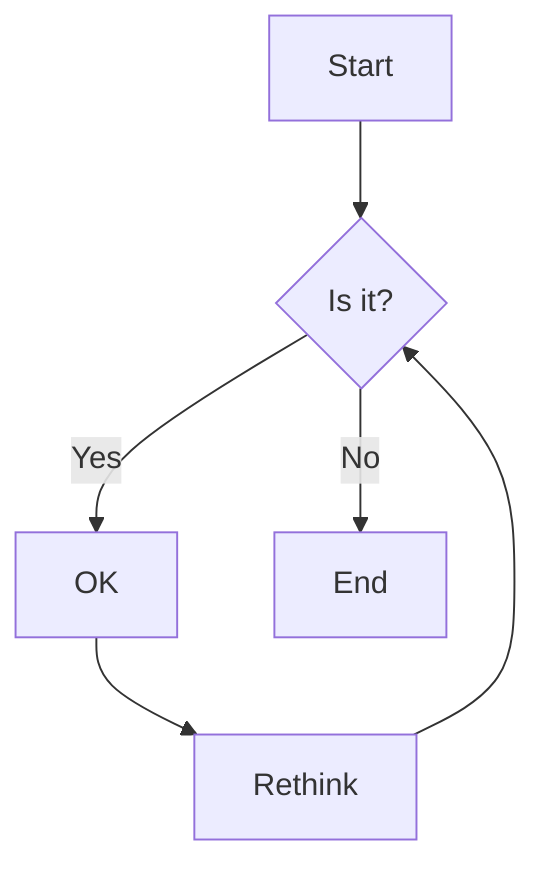

### Mermaid语法

流程图：graph或graph（github支持graph）

#### mermaid流程图

* 节点组织
    * TB - top to bottom
    * TD - top-down/ same as top to bottom
    * BT - bottom to top
    * RL - right to left
    * LR - left to right

* 节点nodes

#### 链接links

* 箭头链接arrow links

  
* 开放链接open links

  
* 虚线链接dotted links

* 加粗线链接thick links

  
#### 链接链

#### 链接长度

* 链接长度

