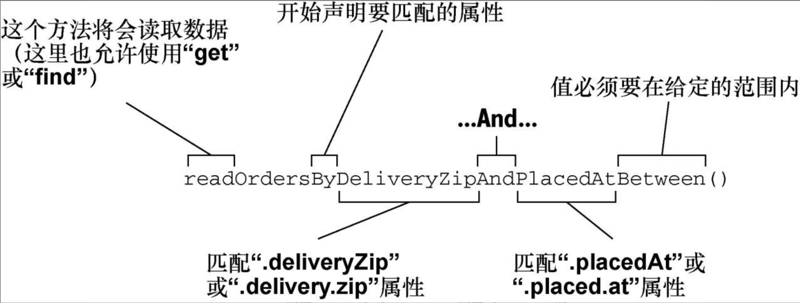

### JPA

#### 默认命名策略：ImprovedNamingStrategy

    即用下划线转换驼峰名。authorId  -> author_id

#### 领域特定语言DSL：Domain-Specific Language

    在特定领域下的上下文的语言。
    简单理解为JPA中指代repository方法。
    持久化细节通过repository方法签名描述。
    即Spring Data解析方法名称，基于被持久化的对象来推测方法的目的。
* repository方法是由一个动词(find/get/read/count)、一个可选的主题（Subject）、关键词By以及一个断言所组成的。如findByDeliveryZip：动词是find，断言是DeliveryZip，主题并没有指定，暗含的主题是Order。

* Spring Data解析repository方法签名来确定要执行的查询

  
#### Spring Data方法签名操作符

* IsAfter、After、IsGreaterThan、GreaterThan
* IsGreaterThanEqual、GreaterThanEqual
* IsBefore、Before、IsLessThan、LessThan
* IsLessThanEqual、LessThanEqual
* IsBetween、Between
* IsNull、Null
* IsNotNull、NotNull
* IsIn、In
* IsNotIn、NotIn
* IsStartingWith、StartingWith、StartsWith
* IsEndingWith、EndingWith、EndsWith
* IsContaining、Containing、Contains
* IsLike、Like
* IsNotLike、NotLike
* IsTrue、True
* IsFalse、False
* Is、Equals
*IsNot、Not
* IgnoringCase、IgnoresCase

#### Spring属性配置

