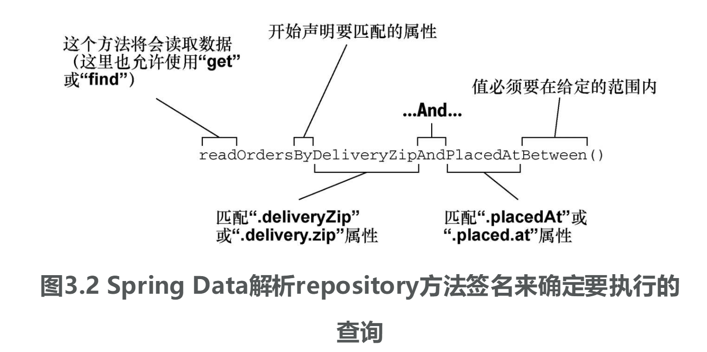
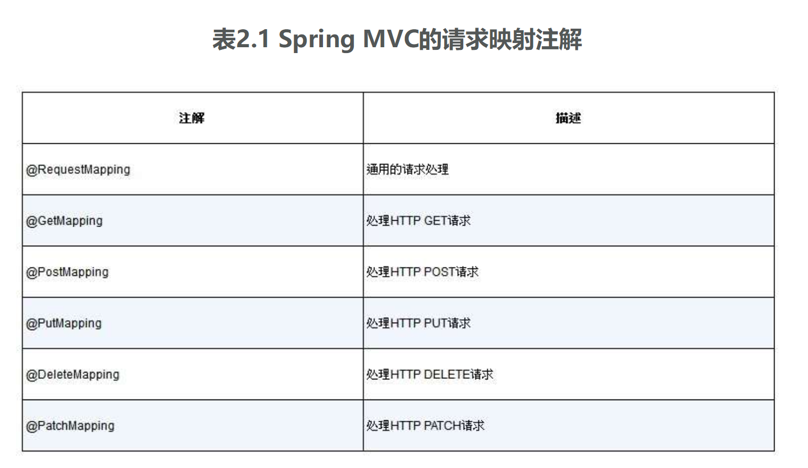
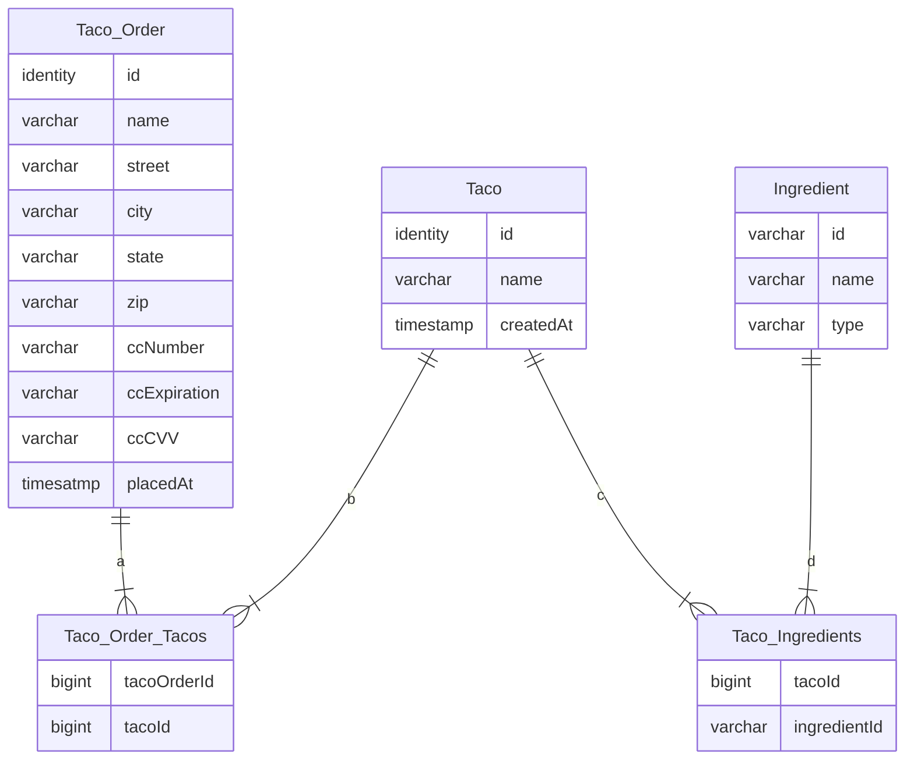

## Spring

### Keywords

#### 组件

    负责整个应用功能的一部分，也称为~~bean~~。

####  ~~不要~~

    ~~not work here!~~

####  *容器container*

    定义：由Spring提供，也称Spring应用上下文（Spring application context）,实体。
    作用：创建和管理应用组件。
    如何管理组件：通过依赖注入。

####  **依赖注入DI(dependency injection)**

    1. 实体/容器创建和维护所有组件并管理它们的生命周期。
    2. 实体将bean注入到需要它们的bean中。

####  ***自动配置(SpringBoot Auto Configuration)***

    自动配置≈自动装配+组件扫描

####  自动装配autowiring

    Spring能够自动为组件注入它们所依赖的其他bean。

####  组件扫描component scanning

    Spring能够自动发现应用路径下的组件，并将它们创建成Spring应用上下文中的bean。

####  控制器controller

    1. 处理HTTP请求
    2. 填充可选的数据模型并将请求传递给一个视图，以便于生成返回给浏览器的HTML。
    3. 直接将数据写入响应体(RESTful) 

### 试图

    将数据渲染到html中并在浏览器中展现

### 领域

    应用所要解决的主题范围（也就是会影响到对应用理解的理念和概念）
    如taco中组成这些设计的配料，顾客，顾客所下的订单

### 领域特定语言

    DSL(Domain-Specified Language)：通过方法签名描述。
    如findByDeliveryZip(String)

####  模板引擎
  > [Thymeleaf](https://www.thymeleaf.org/ 'Thymeleaf.org')
  >
  > [FreeMarker](https://freemarker.apache.org/ "FreeMarker.apache.org") 
  > 
  > [Vue?](https://vuejs.org/index.html 'Vue.org')

### 依赖注入方式

* XML配置

---

* Java配置

***

* 自动配置

---

### 注解

* @Configuration注解

      配置类，为容器提供bean。
      配置类中方法用@Bean注解进行标注，表明方法返回的对象会以bean的形式添加到容器中（默认bean ID与方法名称相同）。

* @Bean注解

      bean组件。

* @SpringBootConfiguration注解

      声明该类为配置类。属于@Configuration注解的特殊形式。

* @EnableAutoConfiguration注解

      启用Spring Boot的自动配置。

* @ComponentScan注解

      启用组件扫描。

* @SpringBootApplication注解
  > Spring Boot应用。该注解为组合注解。包含：
  > * @SpringBootConfiguration注解
  > * @EnableAutoConfiguration注解
  > * @ComponentScan注解

* @Controller注解

      让组件扫描将类识别为一个组件，并创建该类实例作为Spring上下文中的bean。

* @Component注解

      让组件扫描将类识别为一个组件，并创建该类实例作为Spring上下文中的bean。

* @Repository注解

      让组件扫描将类识别为一个组件，并创建该类实例作为Spring上下文中的bean。
      同时将标注类中的数据访问异常封装为Sprig的数据访问异常类型。

* @Service注解

      让组件扫描将类识别为一个组件，并创建该类实例作为Spring上下文中的bean。

* @Autowired注解

      将@Autowired标注的组件注入到相应的bean中。

* 构造型(stereotype)注解

  * @Controller
  * @Component
  * @Repository

* @RunWith(测试运行器)注解

      JUnit注解。提供一个测试运行器来指导JUnit如何运行测试。
      @RunWith(SpringRunner.class)：Spring提供测试运行器，将创建测试运行时所需的Spring应用上下文。
      SpringJUnit4ClassRunner:SpringRunner全称。别称SpringRunner于Spring4.3引入，以便于移除对特定JUnit版本的关联(如JUnit4)
      适用于JUnit4。

* @SpringBootTest注解

      告诉JUnit在启动测试时要添加上Spring Boot的功能
      包含@ExtendWith(SpringExtension.class)用于支持JUnit5，
      但Sprint Boot2.1.x后SpringBootTest注解包含ExtendWith注解，
      即Spring Boot2.1.x后使用JUnit时不再需要ExtendWith注解

* @GetMapping(URL)注解

      表明如果针对URL发送HTTP GET请求，被注解的方法将会处理请求。
      通常返回试图的逻辑名称

* @NotNull注解

      应用场景：基本类型（或包装类）或String
      说明：不能为null，可以为empty

* @NotBlank注解

      应用场景：只适用于String类型
      说明：不能为null且trim()之后size>0

* @NotEmpty注解

      应用场景：集合
      说明：不能为null或也不能为空
      补足：加了该注解的String类、Collection、Map、数组不能为null或长度为0的（String、Collection、Map的isEmpty()方法）。

* @NoArgsConstructor注解（Lombok注解）

      添加一个无参构造器（JPA）
      如果有final字段，应将force设置true以确保Lombok无参构造器会将final字段为null
      @NoArgsConstructor(access = AccessLevel.PRIVATE, force = true)

* @RequiredArgsConstructor

      Spring会自动添加一个有参构造器
      使用Lombok的NoArgsConstructor注解后会将默认有参构造器移除，所以要显示指定有参构造器

* @PrePersist注解

      用于为相应的生命周期指定回调方法(无参无返回)，不能用于属性注解
      
* @Table

      实体应该持久化到数据库中的指定表中

### Spring框架

#### Spring核心框架

    1. 提供了核心容器和依赖注入框架
    2. 其他特性
       a.Spring的Web框架：Spring MVC
       b.提供了对数据持久化的基础支持
       c.添加对反应式reactive风格编程的支持。包括Spring WebFlux新反应式Web框架

#### Spring Boot

    1. starter依赖 -> 依赖管理
    2. 自动配置
    3. 其他特性：
       a.Actuator：洞察应用运行时的内部工作状况。包括指标、线程dump信息、应用的健康状况亦即应用可用的环境属性。
       b.灵活的环境属性规范 -> 运行时洞察
       c.在核心框架的测试辅助功能之上提供了对测试的额外支持
       d.Spring Boot命令行接口CLI（基于Groovy脚本）

#### Spring Data
    
    将应用程序的数据repository定义为简单的Java接口
    使用：定义驱动存储和检索数据的方法时使用一种命名约定
    特点：能够处理多种不同类型的数据库
         a.关系型数据库JPA( JPA：Java Persistence API JAVA持久层API)
         b.文档数据库Mongo
         c.图形数据库Neo4j
         d.Redis key-value存储
         e.Cassandra数据库

#### Spring Security

    TODO：

#### Spring Integration和Spring Batch

    Spring Integration:实时集成
    Spring Batch:批处理集成（触发器触发数据梳理）

#### Spring Cloud
    不再将应用程序作为单个部署单元来开发，而是使用由微服务组成的多个独立部署单元来组合形成应用程序。

#### Spring MVC请求映射注解

[comment]: <> (** 构造型注解：stereotype @Repository:Spring组件扫描ComponentScan会自动发现类并将其初始化为Spring应用上下文中的bean，)

[comment]: <> (创建bean时，会通过@Autowired标注的构造器将JdbcTemplate注入进来 @Controller @Component)

[comment]: <> (@SessionAttribute @ModelAttribute)

[comment]: <> (4716442903549583)

[comment]: <> (JDBC：Java Database connectivity JPA：Java Persistence API持久层API Spring Data JPA：基于关系型数据库进行JPA持久化)

* 测试用ccNumber：370000000000002

