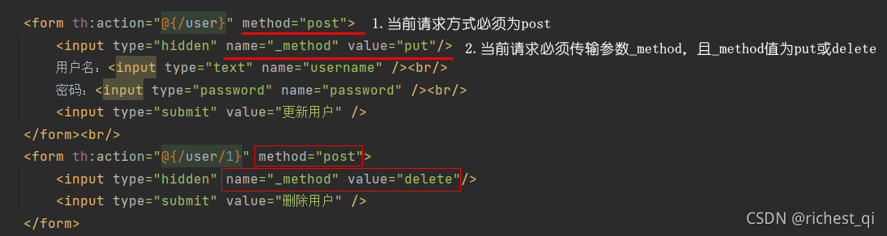

## DispatcherServlet

### 注册DispatcherServlet

1. 代码注册

```java
import org.springframework.web.WebApplicationInitializer;

public class MyWebApplicationInitializer implements WebApplicationInitializer {

    @Override
    public void onStartup(ServletContext container) {
        XmlWebApplicationContext appContext = new XmlWebApplicationContext();
        appContext.setConfigLocation("/WEB-INF/spring/dispatcher-config.xml");

        ServletRegistration.Dynamic registration = container.addServlet("dispatcher", new DispatcherServlet(appContext));
        registration.setLoadOnStartup(1);
        registration.addMapping("/");
    }
}
```

2. 配置文件注册
    
    1. 放在src下面
    
    2. 放在
   

### Put/Delete请求

由于浏览器只支持get和post，即使在form表单中设置method为put或delete，最后它们还是被当成get处理。
为了发送put请求和delete请求，Spring提供HiddenHttpMethodFilter。

#### 使用方法

1. web.xml中添加HiddenHttpMethodFilter过滤器

2. 如何使用

   1. 当前的请求方式必须为post。
   2. 当前请求必须传输参数_mothod，参数值为put或delete。
   
      
