## MyBatis

### MyBatis缓存

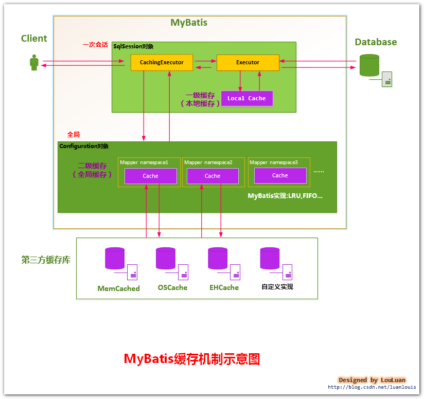

#### 一级缓存

SqlSession级别缓存，默认开启，同一session中相同的sql语句查询时，第二次以后的查询从缓存中获取(一级缓存最多缓存1024条SQL)

数据结构(map)

* key

  MapperID+offset+limit+Sql+所有的入参

* value  

缓存失效

1. session关闭，再开

2. DML(增、删、改)操作/提交事务

3. session.clearCache();

#### 二级缓存

mapper级别/namespace级别/SqlSessionFactory工厂级别，即在整个应用都有效，可在多个会话中有效

优缺点：
* 1. 缓存以namespace为单位，不同namespace操作互不影响
* 2. DML(insert添加，delete删除，update修改)操作会清空namespace下全部缓存
* 3. Mybatis Generator生成的代码，各个表都是独立的，每个表都有自己的namespace
* 4. 多表操作不推荐使用二级缓存，因为多表操作更新时会产生脏数据 
* 5. 二级缓存为表级缓存，开销大，可用一级缓存(使用HashMap存储)替换，效率更高

缓存失效

1. session未提交

  * commit/close:包含select

2. DML(增、删、改)操作/提交事务

##### 二级缓存配置

* MyBatis全局配置中启用二级缓存配置

* 在对应的Mapper.xml中配置cache结点

* 在对应的select查询结点中添加useCache=true

#### MyBatis注解

* @Select 查询数据注解

* @Insert 插入数据注解

* @Delete 删除数据注解

* @Update 修改数据注解

* @Options 选项配置

* @Results 手动映射配置

* @Result：@results中的具体的某一列的映射信息配置

#### MyBatis OGNL语法

「&#9834;」（10進数による指定）
「&#x266A;」（16進数による指定）

* &#xFF03;{}基于JDBC的PreparedStatement类，SQL语句参数使用?占位符，在运行阶段动态设置参数，但是?不能作为表名。
* 预编译语句对象的SQL语句只能操作DML和DQL 语句，不能操作DDL语句。
  
    * 1.&#xFF03;{}表示设置预编译的参数,就是?的参数,所以如果要不固定的表名不能使用#{},只能使用${}
    * 2.${}直接把值输出来,直接把参数拼接到SQL语句中.而#{}是使用?来代替. 所以${}是不安全的。
    * 3.${}只能获得参数池的值,而#{}可以获得方法的参数值,也可以获得参数池的值,如果使用${}获得参数池的值,这个参数必须要加上@Param。
    * 4.如果非必要情况,不要使用${}。

* ${}使用场景
    * 如果操作的涉及表名这些非参数的数据时，需要使用${}。
      因为基于JDBC的接口的原来的表名是不可以使用?的，?只能用于传入的参数。

#### SQL标签

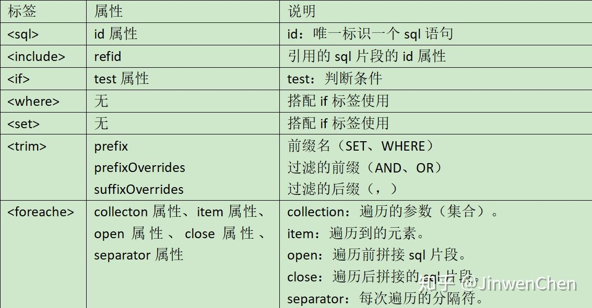

#### JdbcType与JavaType关系

|JDBC Type|Java Type|
|---|---|
CHAR|String  
VARCHAR|String  
LONGVARCHAR|String  
NUMERIC|java.math.BigDecimal  
DECIMAL|java.math.BigDecimal  
BIT| boolean  
BOOLEAN|boolean  
TINYINT|byte  
SMALLINT| short  
INTEGER|int  
BIGINT| long  
REAL|float  
FLOAT|  double  
DOUBLE| double  
BINARY| byte[]  
VARBINARY|byte[]  
LONGVARBINARY|byte[]  
DATE|java.sql.Date  
TIME|java.sql.Time  
TIMESTAMP|java.sql.Timestamp  
CLOB|Clob  
BLOB|Blob  
ARRAY|Array

#### JdbcType Wrapper

#### JdbcType Date

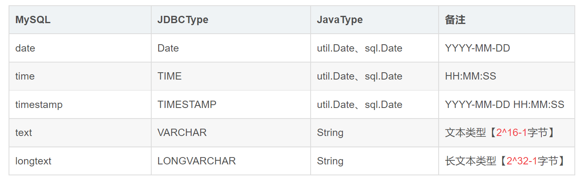

#### 参数类型别名映射

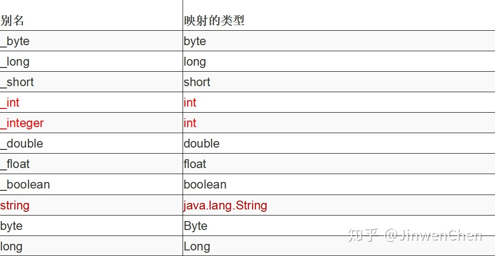

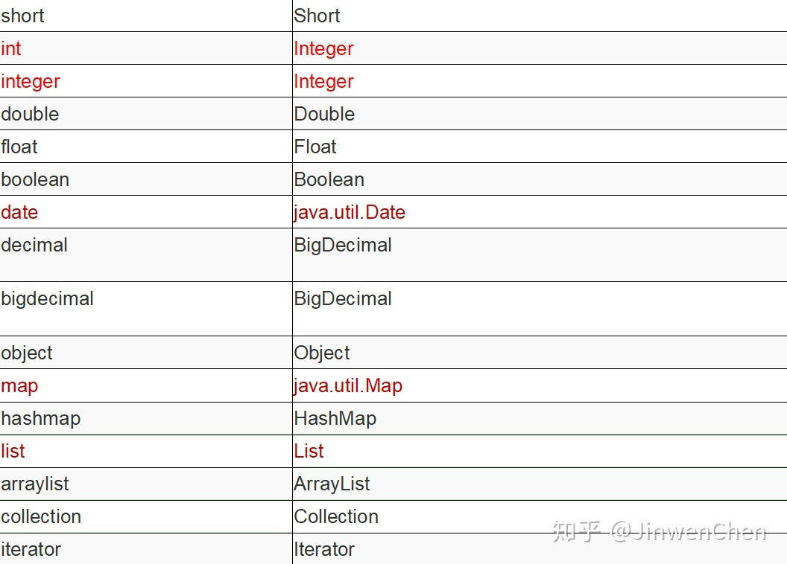

#### 配置文件settings标签

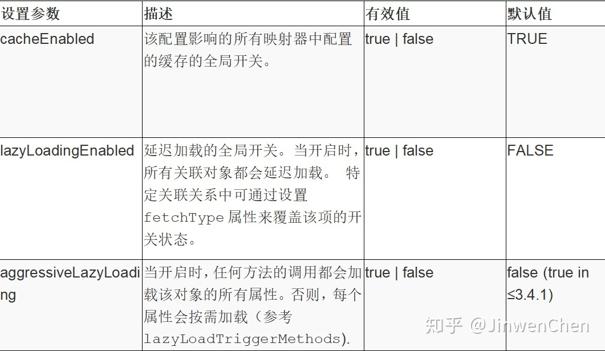

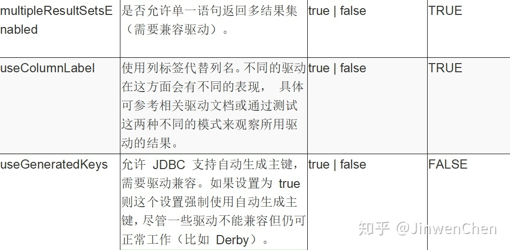

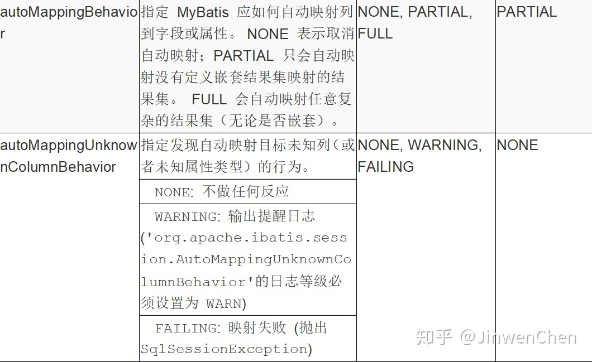

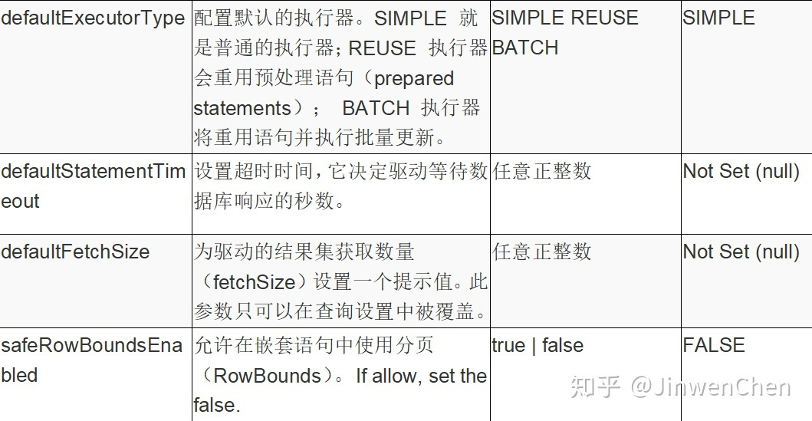

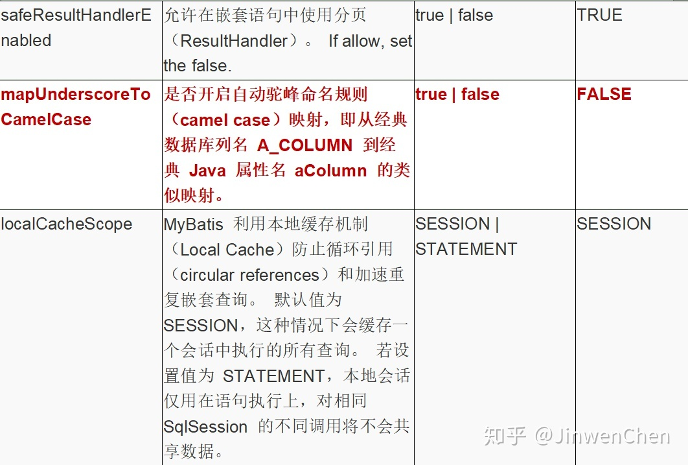

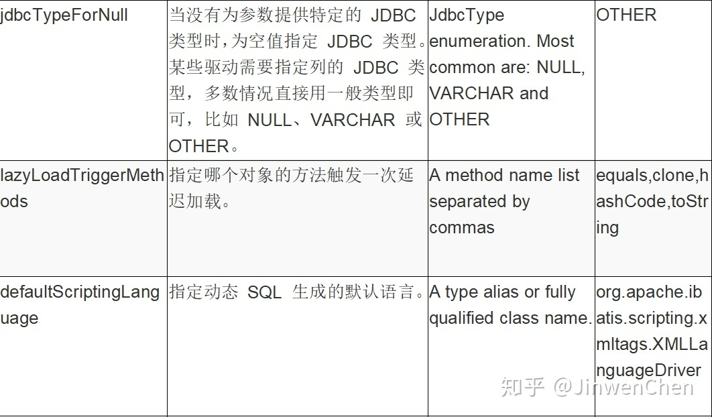

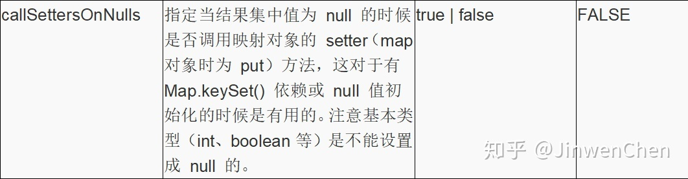

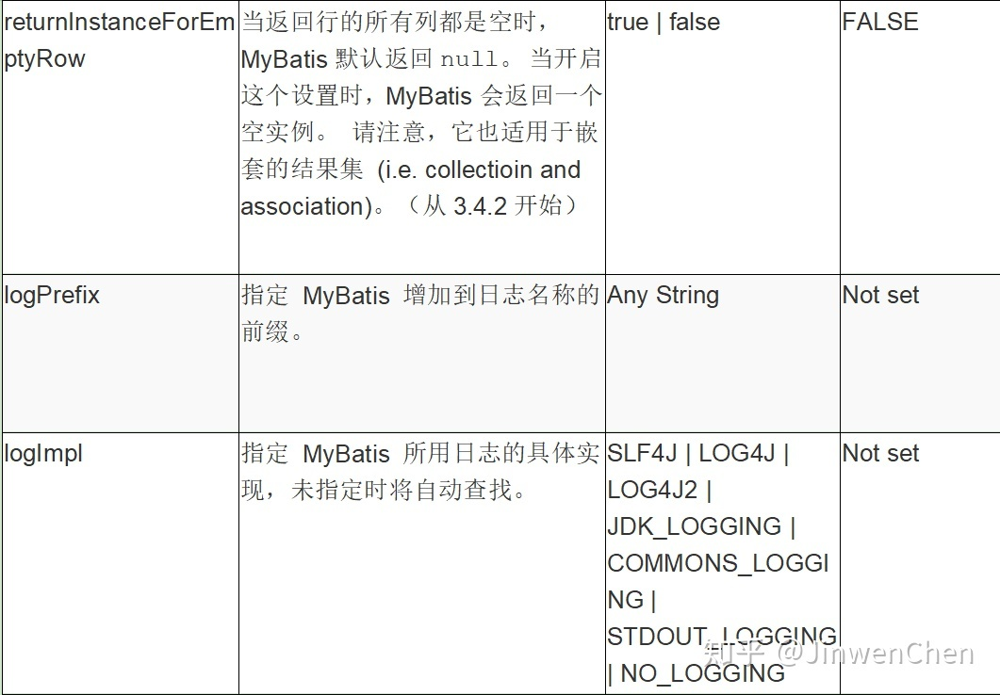

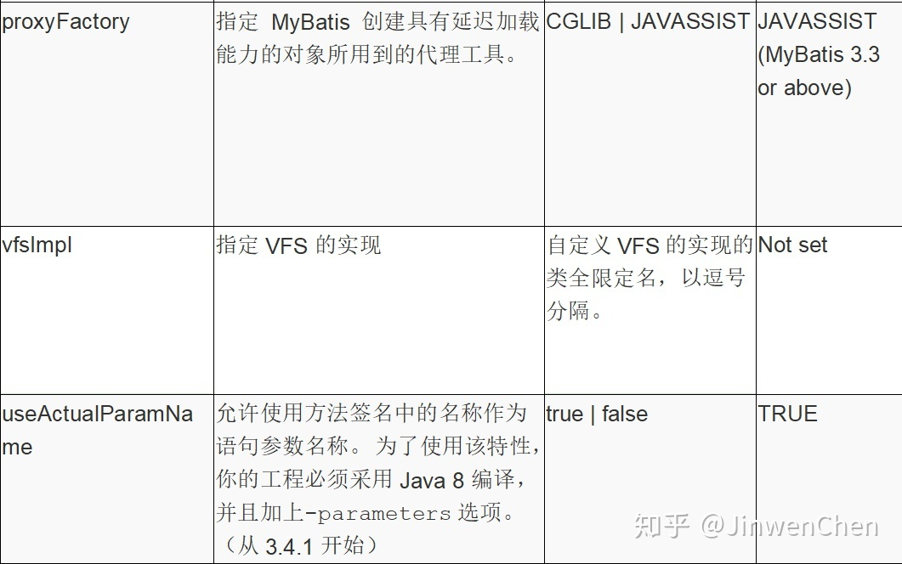

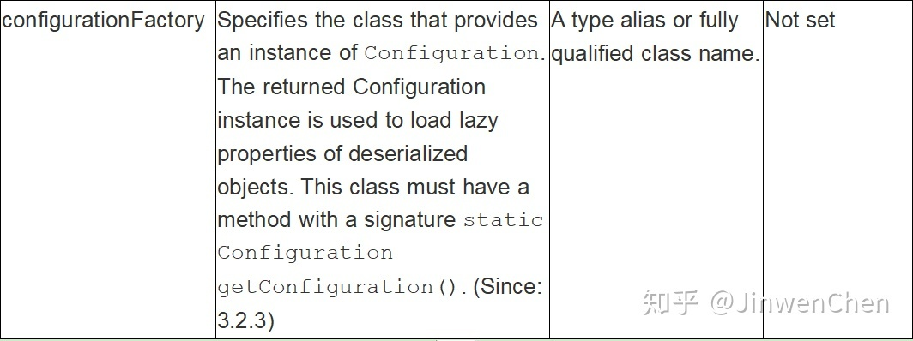